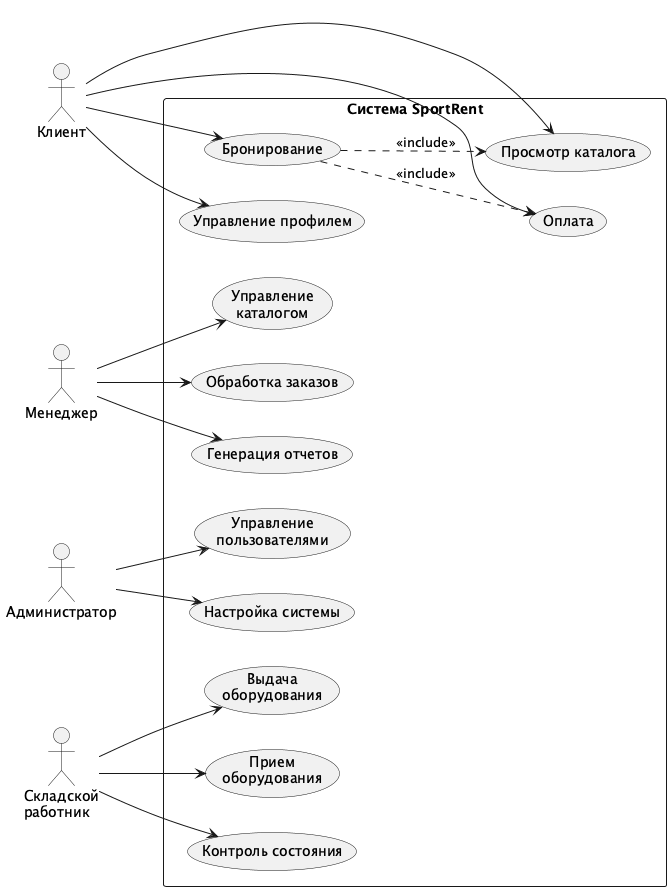
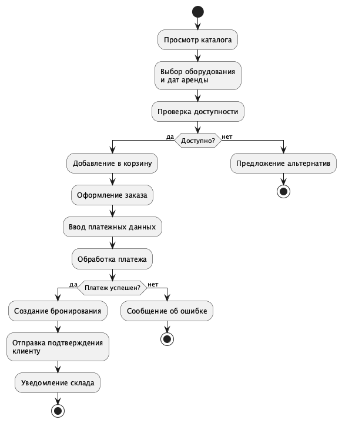
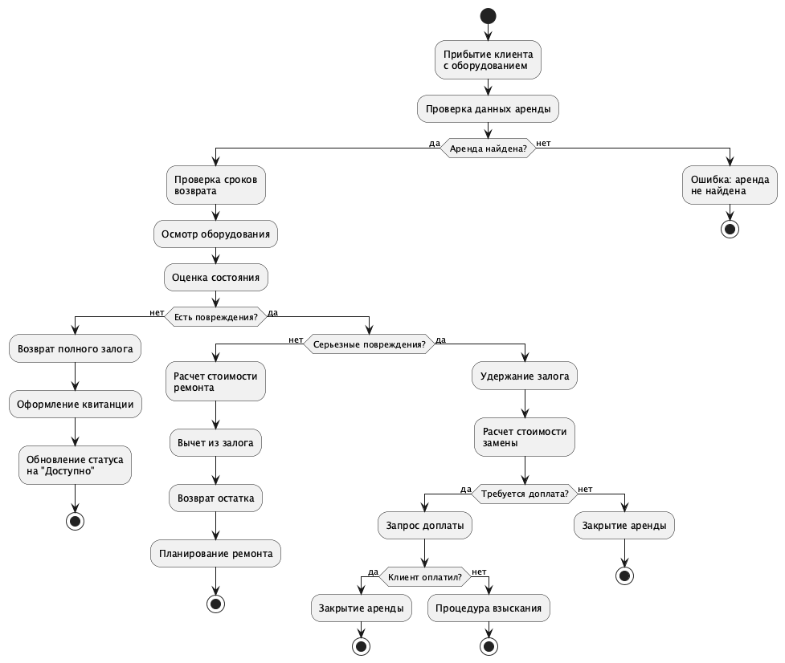

# Лабораторная работа №1: Формирование требований к системе SportRent

## Введение

::: {custom-style="Normal"}
В современном мире активный образ жизни и занятия спортом становятся все более популярными. Однако приобретение спортивного оборудования может быть дорогостоящим, особенно для тех, кто занимается спортом нерегулярно или хочет попробовать новый вид активности. Системы аренды спортивного оборудования решают эту проблему, предоставляя доступ к качественному инвентарю без необходимости его покупки.
:::

::: {custom-style="Normal"}
Информационная система «SportRent» спроектирована для автоматизации процессов аренды спортивного оборудования: от онлайн-бронирования и оплаты до управления инвентарем и обработки возвратов. Система призвана повысить эффективность бизнеса по аренде спортивного инвентаря и улучшить качество обслуживания клиентов.
:::

::: {custom-style="Normal"}
Целью практической работы является формирование требований к описанной выше системе. Заданием практической работы является описание объекта автоматизации, формулировка основных задач автоматизации объекта, описание основных параметров проектируемой информационной системы, описание путей достижения целей. Кроме того, необходимо сформулировать требования к информационной системе.
:::

## Общие сведения

### Полное наименование системы и ее условное обозначение

::: {custom-style="Normal"}
Наименование системы: SportRent - Система управления арендой спортивного оборудования.
:::

::: {custom-style="Normal"}
Условное обозначение: SR.
:::

### Номер договора

::: {custom-style="Normal"}
Шифр темы: ИС-СА.
:::

::: {custom-style="Normal"}
Номер контракта: №1/01-SR-2025 от 15.01.2025.
:::

### Наименование организаций – Заказчика и Разработчика

::: {custom-style="Normal"}
Заказчиком системы является РТУ МИРЭА.
:::

::: {custom-style="Normal"}
Адрес заказчика: Проспект Вернадского, д. 78
:::

::: {custom-style="Normal"}
Разработчиком системы является ООО "СпортТех".
:::

### Основания для разработки системы

::: {custom-style="Normal"}
Работа по созданию системы автоматизации процессов аренды спортивного оборудования для повышения эффективности бизнеса и улучшения качества обслуживания клиентов.
:::

### Плановые сроки начала и окончания работы по созданию системы

::: {custom-style="Normal"}
Плановый срок начала работ по созданию системы SportRent – 15 января 2025 года.
:::

::: {custom-style="Normal"}
Плановый срок окончания работ по созданию системы SportRent – 15 июля 2025 года.
:::

### Источники и порядок финансирования работ

::: {custom-style="Normal"}
Собственные средства разработчика и инвестиции заказчика.
:::

### Порядок оформления и предъявления заказчику результатов работ по созданию системы

::: {custom-style="Normal"}
Результаты работ передаются Заказчику в порядке, определенном контрактом в соответствии с Календарным планом работ контракта на основании Актов сдачи-приемки выполненных работ (этапа работ).
:::

::: {custom-style="Normal"}
Документация SR передается на бумажных (два экземпляра, один экземпляр после подписания Заказчиком должен быть возвращен Исполнителю) и на машинных носителях (DVD) (в двух экземплярах). Текстовые документы, передаваемые на машинных носителях, должны быть представлены в форматах PDF.
:::

::: {custom-style="Normal"}
Все материалы передаются с сопроводительными документами Исполнителя.
:::

### Перечень нормативно-технических документов, методических материалов, использованных при разработке ТЗ

::: {custom-style="Normal"}
При разработке автоматизированной системы и создании проектно-эксплуатационной документации Исполнитель должен руководствоваться требованиями следующих нормативных документов:
:::

::: {custom-style="Normal"}
ГОСТ 19.106-78. Единая система программной документации. Требования к программным документам, выполненным печатным способом.
:::

::: {custom-style="Normal"}
ГОСТ 34.602-2020 Техническое задание на создание автоматизированной системы
:::

::: {custom-style="Normal"}
ГОСТ Р 59793-2021. Информационные технологии. Комплекс стандартов на автоматизированные системы. Автоматизированные системы. Стадии создания.
:::

::: {custom-style="Normal"}
ГОСТ 34.201-2020. Информационные технологии. Комплекс стандартов на автоматизированные системы. Виды, комплектность и обозначение документов при создании автоматизированных систем.
:::

::: {custom-style="Normal"}
ГОСТ Р 59795-2021. Информационные технологии. Комплекс стандартов на автоматизированные системы. Автоматизированные системы. Требования к содержанию документов.
:::

::: {custom-style="Normal"}
ISO/IEC 25010:2011. Системная и программная инженерия - Требования и оценка качества систем и программного обеспечения (SQuaRE).
:::

### Определения, обозначения и сокращения

::: {custom-style="Normal"}
Аренда – временное предоставление спортивного оборудования клиенту на определенный период в обмен на плату.
:::

::: {custom-style="Normal"}
Оборудование – спортивный инвентарь, доступный для аренды (лыжи, сноуборды, велосипеды, ролики, коньки и т.д.).
:::

::: {custom-style="Normal"}
Бронирование – резервирование оборудования на определенный период клиентом.
:::

::: {custom-style="Normal"}
Инвентарь – полный перечень всех единиц оборудования с их текущим статусом и доступностью.
:::

::: {custom-style="Normal"}
Заказ – полная транзакция аренды, включающая выбор оборудования, период, оплату и детали доставки/получения.
:::

::: {custom-style="Normal"}
Залог – обеспечительный платеж, требуемый для гарантии возврата оборудования в надлежащем состоянии.
:::

::: {custom-style="Normal"}
Категория оборудования – классификация оборудования по типу (зимние виды спорта, велосипеды, водные виды спорта и т.д.).
:::

::: {custom-style="Normal"}
Период аренды – временной промежуток, на который арендуется оборудование (часы, дни, недели).
:::

::: {custom-style="Normal"}
Статус оборудования – текущее состояние оборудования (доступно, арендовано, на обслуживании, повреждено, списано).
:::

::: {custom-style="Normal"}
Профиль клиента – учетная запись пользователя, содержащая персональную информацию, историю аренд и предпочтения.
:::

::: {custom-style="Normal"}
БД (База Данных) – представленная в объективной форме совокупность самостоятельных материалов, систематизированных таким образом, чтобы эти материалы могли быть найдены и обработаны с помощью электронной вычислительной машины (ЭВМ).
:::

::: {custom-style="Normal"}
ИС (Информационная Система) – система, предназначенная для хранения, поиска и обработки информации, и соответствующие организационные ресурсы (человеческие, технические, финансовые и т.д.), которые обеспечивают и распространяют информацию.
:::

::: {custom-style="Normal"}
СУБД (Система Управления Базами Данных) – совокупность программных и лингвистических средств общего или специального назначения, обеспечивающих управление созданием и использованием баз данных.
:::

::: {custom-style="Normal"}
API (Application Programming Interface) – интерфейс программирования приложений.
:::

::: {custom-style="Normal"}
UI (User Interface) – пользовательский интерфейс.
:::

::: {custom-style="Normal"}
CRUD (Create, Read, Update, Delete) – создание, чтение, обновление, удаление - базовые операции с данными.
:::

### Описание бизнес-ролей

::: {custom-style="Normal"}
Клиент – конечный пользователь, арендующий спортивное оборудование. Клиенты могут просматривать каталог оборудования, создавать бронирования, обрабатывать платежи и управлять историей своих аренд. Клиентами могут быть как физические лица, так и организации.
:::

::: {custom-style="Normal"}
Менеджер – бизнес-оператор, ответственный за управление каталогом оборудования, ценовые стратегии, обработку заказов и бизнес-аналитику. Менеджеры обеспечивают бесперебойную работу бизнеса и удовлетворенность клиентов.
:::

::: {custom-style="Normal"}
Администратор – системный администратор с полным доступом к конфигурации системы, управлению пользователями, настройкам безопасности и техническому обслуживанию.
:::

::: {custom-style="Normal"}
Складской работник – персонал, ответственный за физическое обращение с оборудованием, включая выдачу оборудования клиентам, прием возвращенного оборудования, проверку состояния и ведение складских записей.
:::

## Назначение и цели создания (развития) системы

### Назначение системы

::: {custom-style="Normal"}
Система SportRent предназначена для автоматизации и оптимизации операций бизнеса по аренде спортивного оборудования путем предоставления комплексной цифровой платформы, которая связывает клиентов с поставщиками оборудования, оптимизирует процессы аренды и обеспечивает эффективное управление инвентарем и финансами.
:::

### Цели создания системы

::: {custom-style="Normal"}
Основными целями создания ИС являются:
:::

::: {custom-style="Normal"}
Автоматизация обслуживания клиентов - предоставить клиентам возможность самостоятельно просматривать, бронировать и оплачивать аренду оборудования онлайн 24/7
:::

::: {custom-style="Normal"}
Операционная эффективность - снизить объем ручной бумажной работы и административных расходов за счет автоматизированных процессов
:::

::: {custom-style="Normal"}
Оптимизация инвентаря - обеспечить видимость доступности оборудования, его местоположения и состояния в режиме реального времени
:::

::: {custom-style="Normal"}
Максимизация выручки - увеличить коэффициент использования оборудования за счет лучшего управления доступностью и динамического ценообразования
:::

::: {custom-style="Normal"}
Принятие решений на основе данных - предоставить комплексную аналитику и отчетность для бизнес-анализа
:::

::: {custom-style="Normal"}
Обеспечение качества - обеспечить отслеживание обслуживания оборудования и мониторинг состояния
:::

::: {custom-style="Normal"}
Удовлетворенность клиентов - улучшить клиентский опыт за счет удобного бронирования, прозрачного ценообразования и надежного сервиса
:::

## Характеристика объекта автоматизации

### Краткие сведения об объекте автоматизации

::: {custom-style="Normal"}
Объектом автоматизации является бизнес-процесс аренды спортивного оборудования. Система охватывает весь жизненный цикл аренды: от онлайн-каталога и бронирования до выдачи оборудования, возврата и аналитики. Целевыми пользователями являются клиенты (физические и юридические лица), желающие арендовать спортивное оборудование, а также персонал компании по аренде (менеджеры, администраторы, складские работники).
:::

### Сведения об условиях эксплуатации объекта автоматизации

::: {custom-style="Normal"}
Условия эксплуатации комплекса технических средств Системы должны соответствовать условиям эксплуатации группы 2 ГОСТ 21552-84 «Средства вычислительной техники. Общие технические требования, приемка, методы испытаний, маркировка, упаковка, транспортировка, хранение».
:::

::: {custom-style="Normal"}
Условия эксплуатации персональных компьютеров Системы соответствуют Гигиеническим требованиям к видео-дисплейным терминалам, персональным электронно-вычислительным машинам и организации работы (Санитарные правила и нормы. СанПиН 2.2.2.542-96).
:::

::: {custom-style="Normal"}
Исполнитель должен проверить соблюдение условий эксплуатации комплекса технических средств на этапе технического проектирования.
:::

## Требования к системе

### Требования к системе в целом

#### Требования к структуре и функционированию системы

::: {custom-style="Normal"}
Система имеет модульную структуру, включающую в себя следующие модули:
:::

::: {custom-style="Normal"}
модуль управления каталогом оборудования;
:::

::: {custom-style="Normal"}
модуль бронирования и заказов;
:::

::: {custom-style="Normal"}
модуль обработки платежей;
:::

::: {custom-style="Normal"}
модуль управления клиентами;
:::

::: {custom-style="Normal"}
модуль складского учета;
:::

::: {custom-style="Normal"}
модуль работы с базой данных;
:::

::: {custom-style="Normal"}
модуль отчетности и аналитики;
:::

::: {custom-style="Normal"}
модуль администрирования системы.
:::

::: {custom-style="Normal"}
Система должна выполнять следующие функции:
:::

::: {custom-style="Normal"}
осуществление поиска оборудования по различным критериям;
:::

::: {custom-style="Normal"}
онлайн-бронирование и управление заказами;
:::

::: {custom-style="Normal"}
интеграция с платежными системами;
:::

::: {custom-style="Normal"}
отслеживание доступности оборудования в режиме реального времени;
:::

::: {custom-style="Normal"}
управление пользователями и правами доступа;
:::

::: {custom-style="Normal"}
формирование отчетов и бизнес-аналитики;
:::

::: {custom-style="Normal"}
уведомление пользователей о статусе заказов;
:::

::: {custom-style="Normal"}
мониторинг состояния оборудования и планирование обслуживания.
:::

#### Требования к численности и квалификации персонала системы и режиму его работы

::: {custom-style="Normal"}
Для работы с системой от персонала не должно требоваться специальных технических навыков, за исключением общих навыков работы с персональным компьютером и стандартным веб-браузером.
:::

::: {custom-style="Normal"}
Для администраторов системы требуются базовые знания веб-технологий, систем управления базами данных и принципов информационной безопасности.
:::

::: {custom-style="Normal"}
Режим работы менеджеров и складского персонала определяется графиком работы организации. Режим работы клиентов не ограничен - система доступна 24/7.
:::

#### Показатели назначения

::: {custom-style="Normal"}
Система должна обеспечивать следующие показатели назначения:
:::

::: {custom-style="Normal"}
Время на полный запуск (или перезапуск) системы и компонентов системы должно составлять не более 10 минут.
:::

::: {custom-style="Normal"}
Коэффициент юзабилити не менее 90%.
:::

::: {custom-style="Normal"}
Коэффициент доступности системы не менее 99,5% в рабочее время.
:::

::: {custom-style="Normal"}
Коэффициент достоверности информации не менее 95%.
:::

::: {custom-style="Normal"}
Время обработки запроса на бронирование не более 5 секунд.
:::

::: {custom-style="Normal"}
Время генерации отчета не более 30 секунд для данных за год.
:::

::: {custom-style="Normal"}
REST API: 100 запросов в минуту при времени отклика не более 2 секунд.
:::

::: {custom-style="Normal"}
Поддержка не менее 100 одновременных пользователей без деградации производительности.
:::

#### Требования к надежности

::: {custom-style="Normal"}
Программное обеспечение не должно выходить из строя более чем на 5 минут за рабочий день.
:::

::: {custom-style="Normal"}
Для устойчивости к потере данных необходимо регулярно производить резервное копирование хранимой информации (ежедневно).
:::

::: {custom-style="Normal"}
Система должна автоматически восстанавливаться после временных сбоев без потери данных.
:::

::: {custom-style="Normal"}
Надежность должна обеспечиваться за счет:
:::

::: {custom-style="Normal"}
применения технических средств, системного и базового программного обеспечения, соответствующих классу решаемых задач;
:::

::: {custom-style="Normal"}
соблюдения правил эксплуатации и технического обслуживания программно-аппаратных средств;
:::

::: {custom-style="Normal"}
предварительного обучения пользователей;
:::

::: {custom-style="Normal"}
реализации механизмов транзакций и отката операций при сбоях.
:::

#### Требования к безопасности

::: {custom-style="Normal"}
Безопасность данных пользователей должна обеспечиваться:
:::

::: {custom-style="Normal"}
шифрованием передаваемых данных (HTTPS/TLS);
:::

::: {custom-style="Normal"}
хешированием паролей с использованием современных алгоритмов;
:::

::: {custom-style="Normal"}
защитой от SQL-инъекций, XSS-атак и других распространенных уязвимостей;
:::

::: {custom-style="Normal"}
реализацией многофакторной аутентификации для критичных операций;
:::

::: {custom-style="Normal"}
регулярным резервным копированием данных;
:::

::: {custom-style="Normal"}
ведением журнала аудита всех операций с данными.
:::

#### Требования к эргономике и технической эстетике

::: {custom-style="Normal"}
Взаимодействие пользователей с системой должно осуществляться посредством визуального графического интерфейса (GUI).
:::

::: {custom-style="Normal"}
Интерфейс системы должен быть:
:::

::: {custom-style="Normal"}
интуитивно понятным и удобным;
:::

::: {custom-style="Normal"}
адаптивным (корректно отображаться на различных устройствах);
:::

::: {custom-style="Normal"}
не перегруженным графическими элементами;
:::

::: {custom-style="Normal"}
обеспечивать быстрое отображение экранных форм (не более 3 секунд);
:::

::: {custom-style="Normal"}
соответствовать современным стандартам веб-дизайна;
:::

::: {custom-style="Normal"}
доступным для людей с ограниченными возможностями (WCAG 2.1 Level AA).
:::

#### Требования к эксплуатации, техническому обслуживанию, ремонту и хранению компонентов системы

::: {custom-style="Normal"}
Техническим обслуживанием, ремонтом и хранением сервера АС занимаются системные администраторы, специалисты по серверным и сетевым технологиям, а также мастера по ремонту компьютерного и другого технического оборудования.
:::

::: {custom-style="Normal"}
Система должна поддерживать обновление без остановки работы (zero-downtime deployment).
:::

#### Требования к защите информации от несанкционированного доступа

::: {custom-style="Normal"}
При работе с системой необходимо, чтобы:
:::

::: {custom-style="Normal"}
данные могли быть восстановлены в случае потери;
:::

::: {custom-style="Normal"}
информация компании и пользователей была защищена от доступа или модификации несанкционированными лицами;
:::

::: {custom-style="Normal"}
была реализована ролевая модель доступа (RBAC);
:::

::: {custom-style="Normal"}
велись журналы аудита всех операций с конфиденциальными данными;
:::

::: {custom-style="Normal"}
персональные данные обрабатывались в соответствии с требованиями законодательства (152-ФЗ).
:::

#### Требования по сохранности информации при авариях

::: {custom-style="Normal"}
Серверное программное обеспечение системы должно восстанавливать свое функционирование при перезапуске аппаратных средств.
:::

::: {custom-style="Normal"}
Для обеспечения сохранности данных требуется:
:::

::: {custom-style="Normal"}
ежедневное автоматическое резервное копирование;
:::

::: {custom-style="Normal"}
хранение резервных копий на отдельном физическом носителе;
:::

::: {custom-style="Normal"}
возможность восстановления системы из резервной копии в течение 4 часов.
:::

#### Требования по стандартизации и унификации

::: {custom-style="Normal"}
Для реализации системы должны использоваться:
:::

::: {custom-style="Normal"}
языки HTML5, CSS3 для клиентской части;
:::

::: {custom-style="Normal"}
современные JavaScript-фреймворки (React, Vue.js или Angular);
:::

::: {custom-style="Normal"}
серверная часть на одном из языков: Python, Node.js, Java или C#;
:::

::: {custom-style="Normal"}
реляционная СУБД (PostgreSQL, MySQL или MS SQL Server);
:::

::: {custom-style="Normal"}
стандарты W3C для веб-разработки;
:::

::: {custom-style="Normal"}
RESTful API для взаимодействия клиент-сервер.
:::

#### Дополнительные требования

::: {custom-style="Normal"}
Дополнительные требования не предъявляются.
:::

### Требования к функциям (задачам), выполняемым системой

::: {custom-style="Table name"}
Функциональные требования к системе по ролям
:::

::: {custom-style="Table"}
| ID | Роль | Описание требования | Приоритет |
|----|------|---------------------|-----------|
| FR-01 | Клиент | Система должна позволять клиентам регистрировать учетные записи с подтверждением по email | Высокий |
| FR-02 | Клиент | Система должна предоставлять возможность просмотра каталога оборудования с фильтрацией по категориям, цене и доступности | Высокий |
| FR-03 | Клиент | Система должна позволять осуществлять поиск оборудования по названию, типу или характеристикам | Средний |
| FR-04 | Клиент | Система должна предоставлять возможность просмотра детальной информации об оборудовании, включая фото, характеристики и цены | Высокий |
| FR-05 | Клиент | Система должна позволять выбирать даты аренды и проверять доступность оборудования в режиме реального времени | Высокий |
| FR-06 | Клиент | Система должна предоставлять возможность добавления нескольких единиц оборудования в корзину бронирования | Средний |
| FR-07 | Клиент | Система должна рассчитывать общую стоимость аренды, включая стоимость оборудования, залог и страховку | Высокий |
| FR-08 | Клиент | Система должна позволять обрабатывать онлайн-платежи через интегрированные платежные шлюзы | Высокий |
| FR-09 | Клиент | Система должна предоставлять возможность просмотра истории бронирований и текущих активных аренд | Средний |
| FR-10 | Клиент | Система должна позволять отменять бронирования в соответствии с политикой отмены | Средний |
| FR-11 | Клиент | Система должна предоставлять возможность оставлять отзывы и оценки арендованному оборудованию | Низкий |
| FR-12 | Клиент | Система должна позволять получать email и SMS уведомления о статусе бронирования | Средний |
| FR-13 | Менеджер | Система должна предоставлять возможность добавления, редактирования и удаления единиц оборудования из каталога | Высокий |
| FR-14 | Менеджер | Система должна позволять устанавливать и изменять ценовые правила, включая дневные и недельные тарифы | Высокий |
| FR-15 | Менеджер | Система должна предоставлять возможность загрузки и управления фотографиями и документацией оборудования | Средний |
| FR-16 | Менеджер | Система должна позволять просматривать и обрабатывать ожидающие заказы на аренду | Высокий |
| FR-17 | Менеджер | Система должна предоставлять возможность одобрения или отклонения запросов на аренду на основе доступности | Высокий |
| FR-18 | Менеджер | Система должна позволять создавать рекламные предложения и коды скидок | Средний |
| FR-19 | Менеджер | Система должна предоставлять возможность генерации бизнес-отчетов по выручке, использованию и метрикам клиентов | Высокий |
| FR-20 | Менеджер | Система должна позволять просматривать и отвечать на отзывы и жалобы клиентов | Средний |
| FR-21 | Менеджер | Система должна предоставлять возможность настройки политик аренды, включая правила залога и условия отмены | Средний |
| FR-22 | Администратор | Система должна позволять создавать, изменять и деактивировать учетные записи пользователей | Высокий |
| FR-23 | Администратор | Система должна предоставлять возможность назначения и управления ролевыми правами доступа | Высокий |
| FR-24 | Администратор | Система должна позволять настраивать общесистемные параметры и настройки | Высокий |
| FR-25 | Администратор | Система должна предоставлять возможность просмотра журналов активности системы и аудита | Высокий |
| FR-26 | Администратор | Система должна позволять выполнять резервное копирование и восстановление базы данных | Высокий |
| FR-27 | Администратор | Система должна предоставлять возможность настройки интеграций с внешними системами | Средний |
| FR-28 | Складской работник | Система должна позволять просматривать запланированные выдачи оборудования на день | Высокий |
| FR-29 | Складской работник | Система должна предоставлять возможность фиксации выдачи оборудования клиентам с цифровыми подписями | Высокий |
| FR-30 | Складской работник | Система должна позволять обрабатывать возвраты оборудования и проводить проверки состояния | Высокий |
| FR-31 | Складской работник | Система должна предоставлять возможность обновления статуса оборудования (доступно, на обслуживании, повреждено) | Высокий |
| FR-32 | Складской работник | Система должна позволять фиксировать работы по обслуживанию и связанные расходы | Средний |
| FR-33 | Складской работник | Система должна предоставлять возможность генерации инвентарных отчетов и отслеживания местоположения оборудования | Средний |
:::

### Функциональная структура системы

::: {custom-style="Picture"}

:::

::: {custom-style="Picture name"}
Диаграмма вариантов использования системы SportRent
:::

::: {custom-style="Normal"}
Диаграмма вариантов использования иллюстрирует основные взаимодействия между акторами системы (Клиент, Менеджер, Администратор, Складской работник) и функциональностью системы.
:::

::: {custom-style="Normal"}
Связи между акторами и вариантами использования:
:::

::: {custom-style="Normal"}
Клиент взаимодействует с функциями просмотра каталога, бронирования, оплаты и управления профилем
:::

::: {custom-style="Normal"}
Менеджер управляет каталогом, обрабатывает заказы и генерирует отчеты
:::

::: {custom-style="Normal"}
Администратор управляет пользователями и настройками системы
:::

::: {custom-style="Normal"}
Складской работник работает с выдачей и приемом оборудования, контролем состояния
:::

::: {custom-style="Picture"}

:::

::: {custom-style="Picture name"}
Диаграмма деятельности: процесс бронирования оборудования
:::

::: {custom-style="Normal"}
Диаграмма отображает полный поток бронирования оборудования с точки зрения клиента, включая выбор оборудования, проверку доступности, обработку платежа и подтверждение бронирования.
:::

::: {custom-style="Picture"}

:::

::: {custom-style="Picture name"}
Диаграмма деятельности: процесс выдачи оборудования
:::

::: {custom-style="Normal"}
Диаграмма показывает рабочий процесс выдачи оборудования на складе, включая верификацию клиента, проверку состояния оборудования и подтверждение выдачи.
:::

::: {custom-style="Picture"}

:::

::: {custom-style="Picture name"}
Диаграмма деятельности: процесс возврата оборудования
:::

::: {custom-style="Normal"}
Диаграмма иллюстрирует рабочий процесс возврата оборудования, включая проверку состояния, оценку повреждений, обработку залога и закрытие аренды.
:::

### Требования к видам обеспечения

#### Требования к математическому обеспечению системы

::: {custom-style="Normal"}
Математическое обеспечение системы должно обеспечивать реализацию перечисленных в данном ТЗ функций, а также выполнение операций конфигурирования, программирования, управления базами данных и документирования.
:::

::: {custom-style="Normal"}
Алгоритмы должны быть разработаны с учетом возможности получения некорректной входной информации и предусматривать соответствующую реакцию на такие события.
:::

#### Требования к информационному обеспечению системы

::: {custom-style="Normal"}
Состав, структура и способы организации данных в системе должны быть определены на этапе технического проектирования.
:::

::: {custom-style="Normal"}
Данные, используемые системой, должны храниться в реляционной СУБД. Структура базы данных определяется с учетом нормализации и оптимизации производительности.
:::

::: {custom-style="Normal"}
Информационный обмен между серверной и клиентской частями системы должен осуществляться по протоколу HTTP/HTTPS с использованием формата JSON.
:::

#### Требования к лингвистическому обеспечению системы

::: {custom-style="Normal"}
Система SportRent должна быть реализована на русском языке. Должна быть предусмотрена возможность добавления поддержки английского языка через механизм локализации.
:::

::: {custom-style="Normal"}
Система ввода-вывода должна поддерживать русский язык.
:::

#### Требования к программному обеспечению системы

::: {custom-style="Normal"}
Программное обеспечение клиентской части должно удовлетворять следующим требованиям:
:::

::: {custom-style="Normal"}
веб-браузер: Google Chrome 90+, Mozilla Firefox 88+, Safari 14+, Microsoft Edge 90+;
:::

::: {custom-style="Normal"}
включенная поддержка JavaScript и cookies;
:::

::: {custom-style="Normal"}
разрешение экрана не менее 1024x768 пикселей.
:::

::: {custom-style="Normal"}
Программное обеспечение серверной части:
:::

::: {custom-style="Normal"}
операционная система: Linux (Ubuntu 20.04+, CentOS 8+) или Windows Server 2019+;
:::

::: {custom-style="Normal"}
веб-сервер: Nginx 1.18+ или Apache 2.4+;
:::

::: {custom-style="Normal"}
СУБД: PostgreSQL 12+ или MySQL 8.0+;
:::

::: {custom-style="Normal"}
среда выполнения для серверного языка программирования.
:::

#### Требования к техническому обеспечению системы

::: {custom-style="Normal"}
Платформа, на которой будет развернута серверная часть системы, должна удовлетворять следующим минимальным требованиям:
:::

::: {custom-style="Normal"}
не менее 8 GB оперативной памяти;
:::

::: {custom-style="Normal"}
не менее 100 GB свободного места на жестком диске (SSD предпочтительно);
:::

::: {custom-style="Normal"}
ОС на базе Linux или ОС Windows Server;
:::

::: {custom-style="Normal"}
поддерживаемый протокол передачи данных HTTP/HTTPS, скорость передачи данных не менее 100 Мбит/с;
:::

::: {custom-style="Normal"}
процессор с тактовой частотой не менее 2.5 GHz (4 ядра).
:::

::: {custom-style="Normal"}
Требования к клиентским устройствам:
:::

::: {custom-style="Normal"}
персональный компьютер, планшет или смартфон с современным веб-браузером;
:::

::: {custom-style="Normal"}
подключение к интернету со скоростью не менее 2 Мбит/с.
:::

#### Требования к метрологическому обеспечению системы

::: {custom-style="Normal"}
Требования к метрологическому обеспечению не предъявляются.
:::

#### Требования к организационному обеспечению системы

::: {custom-style="Normal"}
Требования к организационному обеспечению не предъявляются.
:::

#### Требования к методическому обеспечению системы

::: {custom-style="Normal"}
Необходимо разработать следующие типы документации:
:::

::: {custom-style="Normal"}
руководство администратора системы;
:::

::: {custom-style="Normal"}
руководство пользователя для клиентов;
:::

::: {custom-style="Normal"}
руководство пользователя для менеджеров;
:::

::: {custom-style="Normal"}
руководство пользователя для складских работников;
:::

::: {custom-style="Normal"}
техническую документацию API.
:::

## Состав и содержание работ по созданию (развитию) системы

::: {custom-style="Normal"}
Разработка системы предполагается по укрупненному календарному плану, приведенному в таблице ниже.
:::

::: {custom-style="Table name"}
Календарный план работ по созданию АС SportRent
:::

::: {custom-style="Table"}
| Этапы работ | Содержание работ | Сроки |
|-------------|------------------|-------|
| 1. Исследование и обоснование создания АС | Обследование объекта автоматизации, включая сбор сведений о зарубежных и отечественных аналогах | 15.01.2025 - 25.01.2025 |
| 2. Составление технического задания | Разработка функциональных и нефункциональных требований к системе | 26.01.2025 - 10.02.2025 |
| 3. Эскизное проектирование | Разработка предварительных решений по выбранному варианту АС и отдельным видам обеспечения | 11.02.2025 - 25.02.2025 |
| 4. Техническое проектирование | Разработка диаграмм и проектной документации. Разработка макетов интерфейса. Проектирование базы данных | 26.02.2025 - 25.03.2025 |
| 5. Разработка программной части | Разработка модулей каталога оборудования, бронирования, платежей, управления клиентами, складского учета, отчетности, администрирования | 26.03.2025 - 25.05.2025 |
| 6. Предварительные комплексные испытания | Проверка работоспособности системы в условиях, приближенных к реальным | 26.05.2025 - 05.06.2025 |
| 7. Опытная эксплуатация | Эксплуатация с привлечением ограниченного количества пользователей. Устранение замечаний, выявленных при эксплуатации | 06.06.2025 - 25.06.2025 |
| 8. Ввод в промышленную эксплуатацию | Приемка АС в промышленную эксплуатацию (внедрение АС) | 26.06.2025 - 15.07.2025 |
:::

## Порядок контроля и приемки системы

::: {custom-style="Normal"}
В соответствии с разделом предыдущим необходимо на каждой стадии создания системы установить контроль и приемку результатов работ.
:::

::: {custom-style="Normal"}
На стадии разработки программной части происходит прием готовой версии программного продукта, а остальные результаты работ представляются в виде документов согласно календарному плану.
:::

::: {custom-style="Normal"}
Приемка этапа включает в себя рассмотрение и оценку объема работ и предоставленной технической документации в соответствии с требованиями технического задания.
:::

::: {custom-style="Normal"}
Организацию и проведение приемки системы должен осуществлять заказчик, а приемка системы должна производиться только после того, как будут выполнены все задачи системы.
:::

::: {custom-style="Normal"}
Заказчик обязан предоставить материальную часть (технические средства), проектную документацию и специально выделенный персонал.
:::

::: {custom-style="Normal"}
Последним этапом при приемке системы является составление акта приемки.
:::

## Требования к составу и содержанию работ по подготовке объекта автоматизации к вводу системы в действие

::: {custom-style="Normal"}
Для обеспечения готовности объекта к вводу системы в действие провести комплекс мероприятий:
:::

::: {custom-style="Normal"}
приобрести компоненты программного обеспечения, заключить договора на их лицензионное использование;
:::

::: {custom-style="Normal"}
завершить работы по установке технических средств;
:::

::: {custom-style="Normal"}
провести диагностику устойчивости сети к нагрузкам;
:::

::: {custom-style="Normal"}
провести обучение сотрудников.
:::

### Приведение поступающей в систему информации к виду, пригодному для обработки с помощью ЭВМ

::: {custom-style="Normal"}
Информация вводится пользователем в разработанные экранные формы компонентов системы.
:::

### Изменения, которые необходимо осуществить в объекте автоматизации

::: {custom-style="Normal"}
Изменений не требуется.
:::

### Создание условий функционирования объекта автоматизации

::: {custom-style="Normal"}
Для функционирования создаваемой системы требуется платформа, технические характеристики которой соответствуют предъявленным в разделе требований к техническому обеспечению.
:::

### Создание необходимых для функционирования системы подразделений и служб

::: {custom-style="Normal"}
Для функционирования системы не требуется дополнительных подразделений и служб.
:::

### Сроки и порядок комплектования штатов и обучения персонала

::: {custom-style="Normal"}
Комплектование штатов подразделений и служб, необходимых для функционирования системы, а также подготовка их сотрудников должны быть завершены до начала опытной эксплуатации системы.
:::

## Требования к документированию

::: {custom-style="Normal"}
Проектная документация должна быть разработана в соответствии с ГОСТ 34.201-2020 и ГОСТ 7.32-2017.
:::

::: {custom-style="Normal"}
Отчетные материалы должны включать в себя текстовые материалы (представленные в виде бумажной копии и на цифровом носителе в формате MS Word) и графические материалы.
:::

::: {custom-style="Normal"}
Предоставить документы:
:::

::: {custom-style="Normal"}
схема функциональной структуры автоматизируемой деятельности;
:::

::: {custom-style="Normal"}
описание технологического процесса обработки данных;
:::

::: {custom-style="Normal"}
описание информационного обеспечения;
:::

::: {custom-style="Normal"}
описание программного обеспечения АС;
:::

::: {custom-style="Normal"}
схема логической структуры БД;
:::

::: {custom-style="Normal"}
руководство пользователя;
:::

::: {custom-style="Normal"}
описание контрольного примера (по ГОСТ 24.102);
:::

::: {custom-style="Normal"}
протокол испытаний (по ГОСТ 24.102).
:::

## Источники разработки

::: {custom-style="Normal"}
ГОСТ 34.602-2020. Информационные технологии. Комплекс стандартов на автоматизированные системы. Техническое задание на создание автоматизированной системы.
:::

::: {custom-style="Normal"}
ГОСТ Р 59793-2021. Информационные технологии. Комплекс стандартов на автоматизированные системы. Автоматизированные системы. Стадии создания.
:::

::: {custom-style="Normal"}
ГОСТ 34.201-2020. Информационные технологии. Комплекс стандартов на автоматизированные системы. Виды, комплектность и обозначение документов при создании автоматизированных систем.
:::

::: {custom-style="Normal"}
ГОСТ Р 59795-2021. Информационные технологии. Комплекс стандартов на автоматизированные системы. Автоматизированные системы. Требования к содержанию документов.
:::

::: {custom-style="Normal"}
ГОСТ 19.106-78. Единая система программной документации. Требования к программным документам, выполненным печатным способом.
:::

::: {custom-style="Normal"}
ГОСТ 19.105-78. Единая система программной документации. Общие требования к программным документам.
:::

::: {custom-style="Normal"}
ISO/IEC 25010:2011. Системная и программная инженерия - Требования и оценка качества систем и программного обеспечения (SQuaRE).
:::

::: {custom-style="Normal"}
Karl Wiegers, Joy Beatty. "Software Requirements, 3rd Edition", Microsoft Press.
:::
