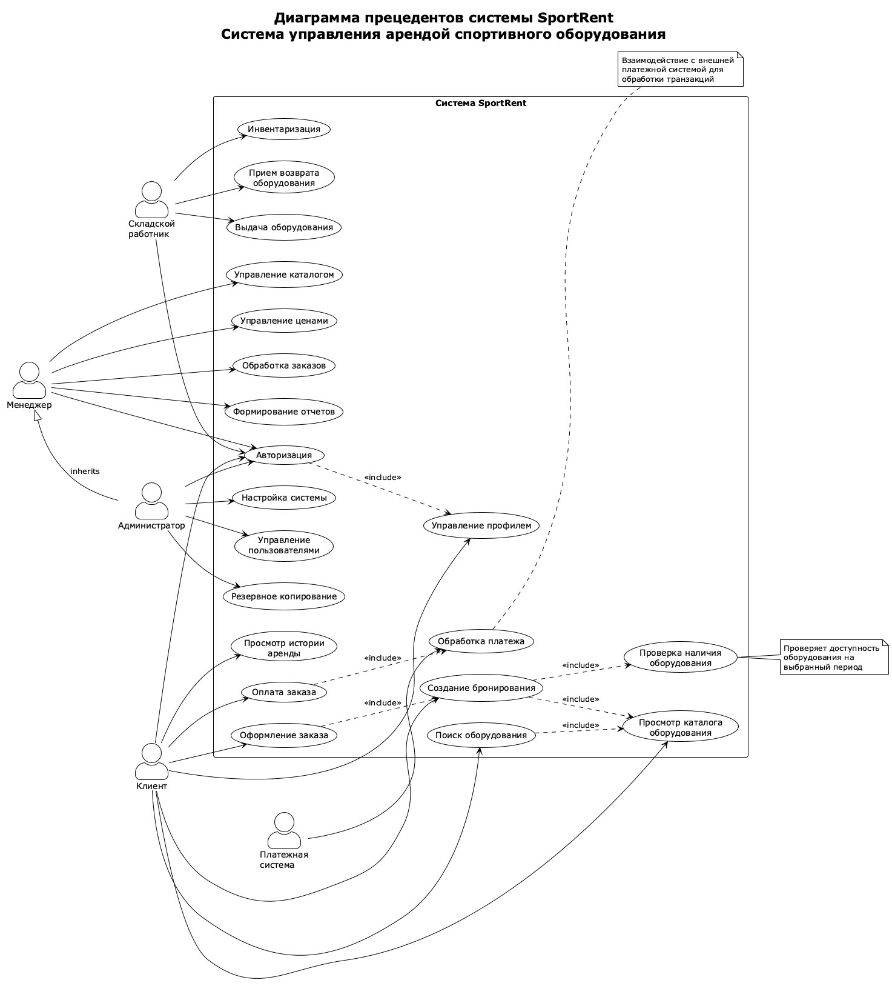

# Практическая работа № 2

## Проектирование диаграммы прецедентов информационной системы в нотации UML

**Выполнил:** [ФИО студента]
**Группа:** [Номер группы]
**Дата:** 02.11.2025

---

## 1. Цель работы

Основная цель работы – создать диаграмму прецедентов (use case) для информационной системы **SportRent** (система управления арендой спортивного оборудования). В процессе достижения цели получены навыки создания и использования диаграмм UML.

---

## 2. Теоретическая часть

### 2.1. Назначение диаграммы прецедентов

Диаграмма прецедентов (use case diagram) создается для описания общих функциональных требований к системе. Она помогает определить пользователей, границы проектируемой информационной системы и ее интерфейсы.

С помощью диаграммы прецедентов можно:
- Определить действующих субъектов системы
- Установить границы системы
- Описать функциональные требования
- Создать основу для тестов и документации
- Обеспечить эффективную коммуникацию между участниками проекта

**Важно:** Диаграмма прецедентов отвечает на вопрос **«ЧТО»** делает система, а не **«КАК»** она это делает.

### 2.2. Основные элементы диаграммы прецедентов

#### Actor (Действующий субъект)
Участник системы, который взаимодействует с ней. Может быть человеком, внешней системой, устройством или организацией. Графически изображается в виде фигурки человека.

#### Use Case (Прецедент)
Графическое описание набора последовательных событий, выполнение которых приводит к результату, наблюдаемому участником. Графически изображается в виде эллипса с названием внутри.

#### Связи между элементами

**Association (Ассоциация)** — связь между действующим субъектом и прецедентом, показывающая их взаимодействие.

**Include (Включение)** — связь между прецедентами, обозначающая обязательное включение функционала одного прецедента в другой. Обозначается стрелкой со стереотипом <<include>>.

**Extend (Расширение)** — связь между прецедентами, обозначающая необязательное расширение функционала. Обозначается стрелкой со стереотипом <<extend>>.

**Generalization (Обобщение)** — иерархическая связь наследования между субъектами или прецедентами.

#### Note (Комментарий)
Текстовые пояснения к элементам диаграммы.

---

## 3. Практическая часть

### 3.1. Описание системы SportRent

**SportRent** — информационная система для автоматизации процессов аренды спортивного оборудования.

**Основные цели системы:**
- Автоматизация процессов бронирования, аренды и возврата
- Отслеживание наличия и статуса оборудования в реальном времени
- Упрощение взаимодействия между клиентами и администрацией
- Оптимизация использования оборудования

**Ключевые модули:**
1. Управление каталогом оборудования
2. Бронирование и заказы
3. Обработка платежей
4. Управление клиентами
5. Складской учет
6. Операции с базой данных
7. Отчетность и аналитика
8. Системное администрирование

### 3.2. Действующие субъекты (Actors)

В системе SportRent определены следующие действующие субъекты:

**1. Клиент** — основной пользователь системы, арендующий оборудование
- Регистрация и авторизация
- Просмотр и поиск оборудования
- Создание бронирований
- Оформление и оплата заказов
- Просмотр истории аренды

**2. Менеджер** — сотрудник, управляющий бизнес-процессами
- Управление каталогом и ценами
- Обработка заказов
- Формирование отчетов и аналитика

**3. Складской работник** — сотрудник, отвечающий за выдачу и прием оборудования
- Выдача оборудования клиентам
- Прием возврата оборудования
- Инвентаризация и учет

**4. Администратор** — технический специалист с полным доступом
- Управление пользователями
- Настройка системы и безопасность
- Мониторинг и резервное копирование
- Наследует права менеджера

**5. Платежная система** — внешний субъект для обработки платежей

### 3.3. Диаграмма прецедентов системы SportRent

*Рисунок 1 – Диаграмма прецедентов системы SportRent*

На диаграмме представлено **49 прецедентов**, сгруппированных по функциональным модулям:
- Аутентификация и управление профилем (3 прецедента)
- Работа с каталогом оборудования (4 прецедента)
- Бронирование и заказы (10 прецедентов)
- История и отзывы (2 прецедента)
- Управление каталогом (6 прецедентов)
- Обработка заказов (2 прецедента)
- Отчетность и аналитика (5 прецедентов)
- Складские операции (8 прецедентов)
- Администрирование (9 прецедентов)

### 3.4. Основные прецеденты системы

#### Модуль аутентификации
- **UC01 - Регистрация** — создание новой учетной записи клиента
- **UC02 - Авторизация** — вход в систему (включает UC03)
- **UC03 - Управление профилем** — редактирование личных данных

#### Модуль каталога оборудования
- **UC04 - Просмотр каталога оборудования** — базовая функция
- **UC05 - Поиск оборудования** — включает UC04 и UC06
- **UC06 - Фильтрация по категориям** — отбор по типу
- **UC07 - Просмотр детальной информации** — расширяет UC04 (<<extend>>)

#### Модуль бронирования и заказов
- **UC08 - Создание бронирования** — включает UC04, UC09, UC10
- **UC09 - Выбор периода аренды**
- **UC10 - Проверка наличия оборудования**
- **UC11 - Оформление заказа** — включает UC08, UC12
- **UC12 - Расчет стоимости**
- **UC13 - Оплата заказа** — включает UC14, UC15
- **UC14 - Обработка платежа** — взаимодействие с внешней системой
- **UC15 - Подтверждение заказа**
- **UC16 - Отмена бронирования** — расширяет UC08 (<<extend>>)

#### Модуль складских операций
- **UC32 - Выдача оборудования** — включает UC33, UC34
- **UC33 - Проверка документов клиента**
- **UC34 - Регистрация выдачи**
- **UC35 - Прием возврата оборудования** — включает UC36, UC37
- **UC36 - Проверка состояния оборудования**
- **UC37 - Регистрация возврата**
- **UC38 - Обновление складских записей**
- **UC39 - Инвентаризация**

#### Модуль администрирования
- **UC40 - Управление пользователями** — включает UC41, UC42, UC43
- **UC41 - Создание пользователя**
- **UC42 - Редактирование пользователя**
- **UC43 - Удаление пользователя**
- **UC44 - Управление ролями и правами**
- **UC45 - Настройка системы**
- **UC46 - Управление безопасностью**
- **UC47 - Резервное копирование**
- **UC48 - Просмотр логов системы**
- **UC49 - Мониторинг системы**

### 3.5. Связи между прецедентами

#### Связи включения (<<include>>)
Используются для обязательных зависимостей между прецедентами:
- Авторизация (UC02) включает Управление профилем (UC03)
- Создание бронирования (UC08) включает Проверку наличия (UC10)
- Оплата заказа (UC13) включает Обработку платежа (UC14)
- Выдача оборудования (UC32) включает Проверку документов (UC33)

#### Связи расширения (<<extend>>)
Используются для опциональных расширений:
- Просмотр детальной информации (UC07) расширяет Просмотр каталога (UC04)
- Оценка оборудования (UC18) расширяет Просмотр истории (UC17)
- Отмена бронирования (UC16) расширяет Создание бронирования (UC08)

#### Связи обобщения (Generalization)
- Администратор наследует права Менеджера, получая доступ ко всем его функциям

### 3.6. Описание основных бизнес-процессов

#### Процесс 1: Аренда оборудования клиентом

**Основной сценарий:**

1. **Регистрация/Авторизация** (UC01, UC02)
   - Новый клиент создает учетную запись
   - Существующий клиент входит в систему

2. **Поиск и выбор оборудования** (UC04, UC05, UC06, UC07)
   - Просмотр каталога
   - Использование поиска и фильтров
   - Просмотр детальной информации

3. **Бронирование** (UC08, UC09, UC10)
   - Выбор оборудования и периода аренды
   - Автоматическая проверка доступности

4. **Оформление и оплата** (UC11, UC12, UC13, UC14, UC15)
   - Создание заказа с расчетом стоимости
   - Проведение платежа через внешнюю систему
   - Подтверждение заказа

5. **Получение оборудования** (UC32, UC33, UC34)
   - Проверка документов складским работником
   - Регистрация выдачи в системе

6. **Возврат оборудования** (UC35, UC36, UC37, UC38)
   - Проверка состояния оборудования
   - Регистрация возврата
   - Обновление складских записей

7. **После аренды** (UC17, UC18)
   - Просмотр истории аренды
   - Оставление отзыва (опционально)

**Альтернативный сценарий:**
- Отмена бронирования (UC16) до оплаты заказа

#### Процесс 2: Управление каталогом менеджером

1. Авторизация в системе (UC02)
2. Управление каталогом оборудования (UC19-UC23)
   - Добавление нового оборудования
   - Редактирование существующего
   - Удаление оборудования
   - Управление категориями
3. Управление ценами (UC24)
4. Обработка заказов (UC25, UC26)
5. Формирование отчетов и аналитика (UC27-UC31)

#### Процесс 3: Администрирование системы

1. Авторизация (UC02)
2. Управление пользователями (UC40-UC43)
3. Управление ролями и правами (UC44)
4. Настройка системы и безопасности (UC45, UC46)
5. Резервное копирование (UC47)
6. Мониторинг и просмотр логов (UC48, UC49)
7. Выполнение функций менеджера (благодаря наследованию)

---

## 4. Глоссарий терминов

**Actor (Действующий субъект)** — участник системы, взаимодействующий с ней

**Use Case (Прецедент)** — описание последовательности действий системы для достижения цели

**Association (Ассоциация)** — связь между субъектом и прецедентом

**Include (Включение)** — обязательное включение одного прецедента в другой

**Extend (Расширение)** — необязательное расширение функционала прецедента

**Generalization (Обобщение)** — иерархическая связь наследования

**Бронирование** — резервирование оборудования на период

**Заказ** — подтвержденная и оплаченная аренда

**Каталог оборудования** — список доступного для аренды оборудования

**Инвентаризация** — сверка фактического наличия с данными системы

**Тариф** — стоимость аренды за период времени

**Статус заказа** — текущее состояние заказа

**Роль** — набор прав доступа пользователя в системе

**Комплектность** — полный набор компонентов оборудования

---

## 5. Ответы на контрольные вопросы

**1. Для чего создается диаграмма прецедентов?**

Диаграмма прецедентов создается для описания общих функциональных требований к системе. Она помогает визуализировать функции системы и определить, кто будет с ней взаимодействовать. Это основной инструмент для определения границ системы на ранних этапах проектирования.

**2. Что позволяет определить использование диаграммы прецедентов?**

Диаграмма прецедентов позволяет определить:
- Пользователей системы (действующих субъектов)
- Границы проектируемой системы
- Интерфейсы системы
- Функциональные требования

Также она помогает создавать тесты, документацию и облегчает коммуникацию в команде.

**3. Назовите главный элемент диаграммы прецедентов.**

Главными элементами являются:
- **Actor (Действующий субъект)** — участник, взаимодействующий с системой
- **Use Case (Прецедент)** — функция системы

Оба элемента одинаково важны: без субъектов нет взаимодействия, без прецедентов нет функционала.

**4. Что такое прецедент?**

**Прецедент (use case)** — графическое описание набора последовательных событий, выполнение которых системой приводит к результату, наблюдаемому участником. Прецедент описывает функцию системы с точки зрения пользователя.

Графически изображается эллипсом с названием внутри.

**5. На какой вопрос должна отвечать диаграмма прецедентов?**

Диаграмма прецедентов должна отвечать на вопрос **«ЧТО»** делает система. Она показывает, **что** происходит, какие функции выполняются и какие результаты достигаются, но **не** описывает, **как** это реализовано.

**6. Для чего необходимы связи на диаграмме прецедентов?**

Связи необходимы для отображения:
- **Ассоциаций** — кто использует какие функции
- **Зависимостей между прецедентами** — как функции связаны
- **Иерархических отношений** — обобщение субъектов или прецедентов

Связи помогают избежать дублирования и упрощают диаграмму.

**7. Назовите два типа связей прецедентов UML.**

Два основных типа связей:

1. **Включение (<<include>>)** — один прецедент обязательно включает функционал другого
2. **Расширение (<<extend>>)** — один прецедент необязательно расширяет функционал другого

Дополнительно: **обобщение (generalization)** — иерархическая связь наследования.

---

## 6. Выводы

В ходе выполнения практической работы №2 была создана детальная диаграмма прецедентов для информационной системы SportRent.

**Основные результаты:**

1. **Определены 5 действующих субъектов:** Клиент, Менеджер, Складской работник, Администратор, Платежная система. Установлены иерархические отношения (Администратор наследует права Менеджера).

2. **Идентифицировано 49 прецедентов**, охватывающих 8 функциональных модулей системы: аутентификацию, каталог, бронирование, платежи, складские операции, управление, отчетность, администрирование.

3. **Установлены связи между прецедентами:** включения (<<include>>), расширения (<<extend>>) и обобщения (generalization).

4. **Описаны основные бизнес-процессы:** аренда оборудования клиентом, управление каталогом, складские операции, администрирование.

5. **Создан глоссарий** из 14 терминов для единого понимания ключевых концепций.

6. **Даны ответы на контрольные вопросы**, демонстрирующие понимание теоретических основ диаграмм прецедентов.

**Практическая значимость:**

Созданная диаграмма показывает, **что** должна делать система SportRent и служит основой для:
- Детального проектирования системы
- Разработки пользовательских интерфейсов
- Создания тестовых сценариев
- Написания документации
- Оценки трудозатрат

Диаграмма является полноценным описанием функциональных требований к системе SportRent и может использоваться на следующих этапах разработки.

**Приобретенные навыки:**
- Создание диаграмм прецедентов в PlantUML
- Определение действующих субъектов и прецедентов
- Установление связей между элементами диаграммы
- Описание бизнес-процессов информационных систем
- Применение нотации UML для моделирования требований

---

**Дата выполнения:** 02.11.2025
**Подпись студента:** _______________
