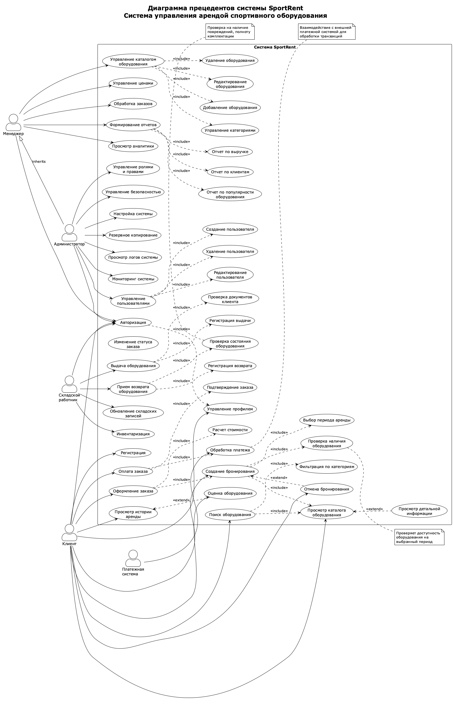

Практическая работа № 2. Проектирование диаграммы
прецедентов информационной системы в нотации UML
Цель работы
Основная цель работы – создать диаграмму прецедентов (use case) для
одного из классов или прецедентов проектируемой информационной системы.
В процессе достижения цели студенты получают навыки создания и использо-
вания диаграмм UML.
Ход работы
1. Ознакомиться с теоретической частью.
2. Выполнить практическое задание.
3. Оформить отчет.
   Теоретическая часть
   Диаграмма прецедентов (также use case или диаграмма вариантов исполь-
   зования) создается для описания общих функциональных требований к систе-
   ме. Углубленное проектирование системы требует более детального описания,
   которое создается, в частности, с помощью диаграмм вариантов использования
   и в диаграммах, описывающих поток событий.
   Использование диаграммы вариантов использования в процессе проекти-
   рования информационной системы позволяет определить: пользователей и гра-
   ницы проектируемой информационной системы; интерфейс системы. С помо-
   щью диаграммы use case удобно общаться проектировщикам и разработчикам.
   С ее помощью можно создавать тесты и пользовательскую документацию.
   Причем диаграмму прецедентов можно использовать как при объектно-
   ориентированном, так и при структурном подходе к проектированию.
   Основными элементами диаграмм вариантов использования являются
   «активный субъект» или actor. Actor следует переводить с английского как
   участник, исполнитель, действующее лицо или действующий субъект, а не ак-
   тѐр! Согласно приведѐнному переводу, это субъект (человек, функция, модуль
   ИС, внешняя система, подсистема, организация, класс и т. п.), который взаимо-
   Издательство АНО ДПО «Межрегиональный центр инновационных технологий в образовании» ~24~
   А. А. Лобанов, Ю. С. Лобанова,
   Проектирование информационных систем
   Е. Н. Абраш, Н. В. Братусь
   действует с проектируемой нами системой. Под взаимодействием понимается
   любое воздействие субъектов друг на друга, которое изменяет поведение или
   состояние проектируемой нами системы.
   Вариант использования (прецедент или use case) – графическое описание
   некоторого набора последовательных событий (включая варианты этих собы-
   тий), выполнение системой которых приводит к тому результату, который
   наблюдает участник. Важно, что с помощью прецедентов можно описать что
   происходит в системе. Use cases не отвечают на вопрос «как», т. е. при этом не
   описывается каким образом достигается результат, а показывается «что» про-
   исходит. Графически варианты использования (прецеденты) принято обозна-
   чать как эллипс. Внутри эллипса приводят название. Название блока должно
   отражать суть функций проектируемой системы при взаимодействии между ак-
   тивным субъектом и системой. Каждый прецедент подразумевает определен-
   ный поток событий, который происходит по мере выполнения описываемой
   функции системы. Как было отмечено ранее, описание потока событий должно
   определять, ЧТО должно быть осуществлено, а не то, КАК это должно быть
   осуществлено.
   Между actor'ом (активным субъектом) и прецедентом на схеме должна
   быть показана ассоциативная связь (association relationship). Связь необходима
   на схеме для того, чтобы показывать взаимодействие субъекта с системой в
   рамках предлагаемого варианта использования. Направление связи указывает
   на инициатора взаимодействия. Инициатором может быть, как субъект, так и
   система. Связи также могут быть установлены между вариантами использова-
   ния. Диаграммы UML предлагают два типа связей − включающие (inclusive) и
   расширяющие (extensive). Отношение включения показывает, что некоторый
   прецедент включает в себя сценарий другого прецедента, причем составные ча-
   сти обязательно входят в состав общего прецедента. Отношение расширения –
   выборочное отношение включения; составные элементы необязательно входят
   в общий вариант использования (тем самым расширяя его функционал). Кроме
   Издательство АНО ДПО «Межрегиональный центр инновационных технологий в образовании» ~25~
   А. А. Лобанов, Ю. С. Лобанова,
   Проектирование информационных систем
   Е. Н. Абраш, Н. В. Братусь
   того, имеется связь обобщения (generalization relationship), которая означает,
   что действующий субъект (вариант использования) может быть обобщен до
   другого субъекта (варианта использования). Частный случай имеет тот же
   функционал, что и общий. Данная связь помогает избежать дублирования вари-
   антов использования и многочисленного пересечения линий отношений.
   Ход выполнения работы
   Создание use case диаграммы с наименованием «Покупка товара со скла-
   да». Можно использовать любые удобные для студента CASE-средства, напри-
   мер, draw.io3
   .
   Анализ активных субъектов, взаимодействие которых с проектируемой
   системой необходимо отразить на диаграмме.
   Создание действующих субъектов. Например, Менеджер, Бухгалтер,
   Кладовщик и т. п.
   Создание прецедентов. Например, Оформление заказа, Оформление счѐ-
   та, Оформление накладной, Выдача товара и т. д.
   Создание комментариев, призванных пояснять созданные взаимодей-
   ствия.
   Расстановка связей, обозначающих зависимости. В процессе этой работы
   автор диаграммы должен продумать отношения и зависимости между нарисо-
   ванными прецедентами.
   Ниже, в табл. 3, представлены основные элементы и связи use case диа-
   грамм.
   3 https://app.diagrams.net/
   Издательство АНО ДПО «Межрегиональный центр инновационных технологий в образовании» ~26~
   А. А. Лобанов, Ю. С. Лобанова,
   Е. Н. Абраш, Н. В. Братусь
   Проектирование информационных систем
   Таблица 3 – Основные элементы и связи диаграмм прецедентов
   Элемент Описание
   Actor – участник, действующий субъект
   Прецедент (вариант использования) – со-
   бытия, которые могут происходить в системе
   Обозначение комментария к прецеденту
   Ассоциация между субъектом и прецедентом
   Отношение обобщения
   Включающее отношение
   Расширяющее отношение
   В draw.io основные элементы для построения диаграммы прецедентов
   можно найти после открытия проекта слева в разделах «General» и «UML».
   В результате должна быть получена диаграмма, похожая на представлен-
   ную на рис. 2:
   Издательство АНО ДПО «Межрегиональный центр инновационных технологий в образовании» ~27~
   А. А. Лобанов, Ю. С. Лобанова,
   Е. Н. Абраш, Н. В. Братусь
   Проектирование информационных систем
   Рисунок 2 – Пример use case диаграммы
   Кроме диаграммы должно быть создано подробное текстовое описание
   процессов, описанных на диаграмме. Необходимые термины должны быть вы-
   несены в общий глоссарий.
   Также на рис. 3 представлен пример диаграммы прецедентов системы ав-
   томатизации покупки билетов в кинотеатре, построенной в draw.io:
   Рисунок 3 – Диаграмма прецедентов системы покупки билетов в кинотеатре
   Издательство АНО ДПО «Межрегиональный центр инновационных технологий в образовании» ~28~
   А. А. Лобанов, Ю. С. Лобанова,
   Е. Н. Абраш, Н. В. Братусь
   Проектирование информационных систем
   Действующие субъекты: пользователь, модератор.
   Прецеденты: просмотр фильмов на сайте, обращение в поддержку, бро-
   нирование билета на нужный фильм и т. д.
   Существование расширяющих, включающих и обобщающих отношений
   между прецедентами, а также ассоциаций между субъектом и прецедентом.
   Например, прецедент «Просмотр фильмов на сайте» расширяют «Просмотр опи-
   сания к фильму» и «Просмотр трейлера», а «Бронирование билета на нужный
   фильм» включает в себя «Выбор свободного места». Вариант «Оплата билета»
   состоит из оплаты наличными или картой при помощи обобщающих связей.
   Контрольные вопросы к практической работе № 2
1. Для чего создается диаграмма прецедентов?
2. Что позволяет определить использование диаграммы прецедентов в
   процессе проектирования информационной системы?
3. Назовите главный элемент диаграммы прецедентов.
4. Дайте определение, что такое «прецедент» или «вариант использова-
   ния» в рамках диаграммы прецедентов UML.
5. На какой вопрос должна отвечать созданная диаграмма прецедентов?
6. Для чего необходимы связи на диаграмме прецедентов UML, что они
   показывают?
7. Назовите два типа связей прецедентов UML.

---

## Практическое задание: Диаграмма прецедентов системы SportRent

### Описание работы

В рамках практической работы создана диаграмма прецедентов для информационной системы **SportRent** — системы управления арендой спортивного оборудования.

### Созданная диаграмма прецедентов

*Рисунок 4 – Диаграмма прецедентов системы SportRent*

Исходный код диаграммы: [use-case-diagram.puml](use-case-diagram.puml)

### Описание действующих субъектов (Actors)

Система SportRent включает следующих действующих субъектов:

#### 1. **Клиент**
Основной пользователь системы, который взаимодействует с системой для аренды спортивного оборудования.

**Функции:**
- Регистрация и авторизация в системе
- Управление своим профилем
- Просмотр и поиск оборудования в каталоге
- Создание бронирований
- Оформление и оплата заказов
- Просмотр истории аренды
- Оценка арендованного оборудования
- Отмена бронирований

#### 2. **Менеджер**
Сотрудник организации, отвечающий за управление бизнес-процессами системы.

**Функции:**
- Авторизация в системе
- Управление каталогом оборудования (добавление, редактирование, удаление)
- Управление категориями оборудования
- Управление ценообразованием
- Обработка заказов и изменение их статусов
- Формирование бизнес-отчетов (по выручке, популярности оборудования, клиентам)
- Просмотр аналитики

#### 3. **Складской работник**
Сотрудник, ответственный за физическую выдачу и прием оборудования.

**Функции:**
- Авторизация в системе
- Выдача оборудования клиентам (с проверкой документов и регистрацией выдачи)
- Прием возврата оборудования (с проверкой состояния и регистрацией возврата)
- Обновление складских записей
- Проведение инвентаризации

#### 4. **Администратор**
Технический специалист с полным доступом к системе.

**Функции:**
- Авторизация в системе
- Управление пользователями системы (создание, редактирование, удаление)
- Управление ролями и правами доступа
- Настройка конфигурации системы
- Управление безопасностью
- Резервное копирование данных
- Просмотр системных логов
- Мониторинг работы системы

**Особенность:** Администратор наследует права Менеджера (отношение обобщения), что позволяет ему выполнять все функции менеджера в дополнение к административным задачам.

#### 5. **Платежная система** (внешний субъект)
Внешняя система для обработки финансовых транзакций.

**Функции:**
- Обработка платежей от клиентов

### Описание основных прецедентов (Use Cases)

#### Модуль аутентификации и управления профилем

**UC01 - Регистрация**
- Создание новой учетной записи клиента в системе
- Ввод персональных данных, контактной информации

**UC02 - Авторизация**
- Вход в систему с использованием учетных данных
- Включает управление профилем (UC03)

**UC03 - Управление профилем**
- Просмотр и редактирование личных данных
- Изменение пароля, контактной информации

#### Модуль работы с каталогом оборудования

**UC04 - Просмотр каталога оборудования**
- Отображение доступного спортивного оборудования
- Базовая функция для всех операций с каталогом

**UC05 - Поиск оборудования**
- Поиск по названию, характеристикам
- Включает просмотр каталога (UC04) и фильтрацию по категориям (UC06)

**UC06 - Фильтрация по категориям**
- Отбор оборудования по типу спорта, категории

**UC07 - Просмотр детальной информации**
- Подробные характеристики, фотографии, отзывы
- Расширяет функционал просмотра каталога (отношение <<extend>>)

#### Модуль бронирования и заказов

**UC08 - Создание бронирования**
- Резервирование оборудования на определенный период
- Включает: просмотр каталога (UC04), выбор периода аренды (UC09), проверку наличия (UC10)

**UC09 - Выбор периода аренды**
- Указание даты начала и окончания аренды

**UC10 - Проверка наличия оборудования**
- Автоматическая проверка доступности на выбранный период

**UC11 - Оформление заказа**
- Создание заказа на основе бронирования
- Включает: создание бронирования (UC08) и расчет стоимости (UC12)

**UC12 - Расчет стоимости**
- Вычисление общей стоимости аренды с учетом периода и тарифов

**UC13 - Оплата заказа**
- Процесс оплаты клиентом
- Включает: обработку платежа через внешнюю систему (UC14) и подтверждение заказа (UC15)

**UC14 - Обработка платежа**
- Взаимодействие с платежной системой для проведения транзакции

**UC15 - Подтверждение заказа**
- Фиксация успешно оплаченного заказа

**UC16 - Отмена бронирования**
- Отмена резервирования до оформления заказа
- Расширяет создание бронирования (отношение <<extend>>)

#### Модуль работы с историей и отзывами

**UC17 - Просмотр истории аренды**
- Отображение всех предыдущих аренд клиента

**UC18 - Оценка оборудования**
- Оставление отзыва и рейтинга после использования
- Расширяет просмотр истории (отношение <<extend>>)

#### Модуль управления каталогом (для менеджера)

**UC19 - Управление каталогом оборудования**
- Комплексная функция управления
- Включает: добавление (UC20), редактирование (UC21), удаление (UC22) оборудования и управление категориями (UC23)

**UC20 - Добавление оборудования**
- Внесение нового оборудования в систему

**UC21 - Редактирование оборудования**
- Изменение характеристик, описания, фотографий

**UC22 - Удаление оборудования**
- Удаление оборудования из каталога

**UC23 - Управление категориями**
- Создание и редактирование категорий оборудования

**UC24 - Управление ценами**
- Установка и изменение тарифов аренды

#### Модуль обработки заказов (для менеджера)

**UC25 - Обработка заказов**
- Просмотр и управление текущими заказами

**UC26 - Изменение статуса заказа**
- Обновление состояния заказа (новый, подтвержден, выдан, завершен и т.д.)

#### Модуль отчетности и аналитики

**UC27 - Формирование отчетов**
- Генерация различных отчетов
- Включает: отчет по выручке (UC28), по популярности оборудования (UC29), по клиентам (UC30)

**UC28 - Отчет по выручке**
- Финансовая аналитика доходов

**UC29 - Отчет по популярности оборудования**
- Статистика востребованности различных видов оборудования

**UC30 - Отчет по клиентам**
- Анализ активности и предпочтений клиентов

**UC31 - Просмотр аналитики**
- Интерактивные дашборды с ключевыми метриками

#### Модуль складских операций

**UC32 - Выдача оборудования**
- Физическая передача оборудования клиенту
- Включает: проверку документов клиента (UC33) и регистрацию выдачи (UC34)

**UC33 - Проверка документов клиента**
- Верификация личности и права на получение

**UC34 - Регистрация выдачи**
- Фиксация факта выдачи в системе

**UC35 - Прием возврата оборудования**
- Принятие оборудования от клиента
- Включает: проверку состояния оборудования (UC36) и регистрацию возврата (UC37)

**UC36 - Проверка состояния оборудования**
- Осмотр на предмет повреждений, проверка комплектности

**UC37 - Регистрация возврата**
- Фиксация возврата и освобождение оборудования для новых аренд

**UC38 - Обновление складских записей**
- Актуализация информации о наличии и местоположении оборудования

**UC39 - Инвентаризация**
- Периодическая сверка фактического наличия с данными системы

#### Модуль администрирования

**UC40 - Управление пользователями**
- Комплексная функция работы с пользователями
- Включает: создание (UC41), редактирование (UC42), удаление (UC43) пользователей

**UC41 - Создание пользователя**
- Добавление новых сотрудников в систему

**UC42 - Редактирование пользователя**
- Изменение данных и ролей сотрудников

**UC43 - Удаление пользователя**
- Деактивация учетных записей

**UC44 - Управление ролями и правами**
- Настройка прав доступа для различных ролей

**UC45 - Настройка системы**
- Конфигурирование параметров работы системы

**UC46 - Управление безопасностью**
- Настройка политик безопасности, мониторинг угроз

**UC47 - Резервное копирование**
- Создание и восстановление бэкапов данных

**UC48 - Просмотр логов системы**
- Анализ журналов событий для диагностики проблем

**UC49 - Мониторинг системы**
- Отслеживание производительности и доступности системы

### Описание связей между прецедентами

#### Связи ассоциации (Association)
Показывают взаимодействие действующих субъектов с прецедентами. На диаграмме представлены линиями между actors и use cases. Например:
- Клиент ассоциирован с регистрацией, авторизацией, просмотром каталога и др.
- Менеджер ассоциирован с управлением каталогом, ценами, формированием отчетов
- Складской работник ассоциирован с выдачей и приемом оборудования

#### Связи включения (<<include>>)
Обозначают обязательное включение одного прецедента в другой. Используются для избежания дублирования и выделения общих функций:

**Примеры:**
- **UC02 (Авторизация) включает UC03 (Управление профилем)** — после входа пользователь всегда получает доступ к своему профилю
- **UC05 (Поиск оборудования) включает UC04 (Просмотр каталога) и UC06 (Фильтрация по категориям)** — поиск использует базовые функции каталога
- **UC08 (Создание бронирования) включает UC04, UC09, UC10** — бронирование требует просмотра каталога, выбора периода и проверки наличия
- **UC11 (Оформление заказа) включает UC08 и UC12** — заказ создается на основе бронирования с расчетом стоимости
- **UC13 (Оплата заказа) включает UC14 и UC15** — оплата обязательно включает обработку платежа и подтверждение
- **UC19 (Управление каталогом) включает UC20, UC21, UC22, UC23** — управление объединяет все операции с оборудованием
- **UC27 (Формирование отчетов) включает UC28, UC29, UC30** — отчеты состоят из различных типов аналитики
- **UC32 (Выдача оборудования) включает UC33 и UC34** — выдача требует проверки документов и регистрации
- **UC35 (Прием возврата) включает UC36 и UC37** — возврат включает проверку состояния и регистрацию
- **UC40 (Управление пользователями) включает UC41, UC42, UC43** — управление охватывает все операции с пользователями

#### Связи расширения (<<extend>>)
Обозначают необязательное расширение функционала базового прецедента:

**Примеры:**
- **UC07 (Просмотр детальной информации) расширяет UC04 (Просмотр каталога)** — пользователь может, но не обязан просматривать детали
- **UC18 (Оценка оборудования) расширяет UC17 (Просмотр истории)** — клиент может оставить отзыв, но это необязательно
- **UC16 (Отмена бронирования) расширяет UC08 (Создание бронирования)** — отмена возможна, но не является обязательной частью бронирования

#### Связи обобщения (Generalization)
Показывают иерархические отношения, когда один субъект или прецедент является частным случаем другого:

**Пример:**
- **Администратор наследует права Менеджера** — администратор может выполнять все функции менеджера плюс дополнительные административные задачи

### Текстовое описание основных бизнес-процессов

#### Процесс 1: Аренда оборудования клиентом

**Основной сценарий:**

1. **Регистрация/Авторизация**
   - Новый клиент регистрируется в системе (UC01), указывая личные данные
   - Существующий клиент авторизуется (UC02)

2. **Поиск оборудования**
   - Клиент просматривает каталог оборудования (UC04)
   - Использует поиск (UC05) и фильтры по категориям (UC06)
   - При необходимости просматривает детальную информацию (UC07) о понравившемся оборудовании

3. **Бронирование**
   - Клиент создает бронирование (UC08)
   - Выбирает период аренды (UC09)
   - Система автоматически проверяет наличие оборудования (UC10) на указанные даты

4. **Оформление и оплата**
   - Клиент оформляет заказ (UC11) на основе бронирования
   - Система рассчитывает стоимость (UC12)
   - Клиент производит оплату заказа (UC13)
   - Платежная система обрабатывает платеж (UC14)
   - Система подтверждает заказ (UC15)

5. **Получение оборудования**
   - Клиент приходит на склад
   - Складской работник выдает оборудование (UC32):
     - Проверяет документы клиента (UC33)
     - Регистрирует выдачу в системе (UC34)

6. **Возврат оборудования**
   - По окончании срока аренды клиент возвращает оборудование
   - Складской работник принимает возврат (UC35):
     - Проверяет состояние оборудования (UC36)
     - Регистрирует возврат в системе (UC37)
   - Обновляются складские записи (UC38)

7. **После аренды**
   - Клиент может просмотреть историю аренды (UC17)
   - Может оставить оценку оборудования (UC18)

**Альтернативный сценарий:**
- Клиент может отменить бронирование (UC16) до оплаты заказа

#### Процесс 2: Управление каталогом менеджером

**Основной сценарий:**

1. **Вход в систему**
   - Менеджер авторизуется в системе (UC02)

2. **Работа с каталогом**
   - Менеджер управляет каталогом оборудования (UC19):
     - Добавляет новое оборудование (UC20) — название, описание, характеристики, фото
     - Редактирует существующее оборудование (UC21) — обновление информации, корректировка характеристик
     - Удаляет оборудование (UC22) — снятие с продажи
     - Управляет категориями (UC23) — создание новых категорий, изменение структуры

3. **Управление ценами**
   - Менеджер устанавливает и изменяет тарифы (UC24)
   - Создает специальные предложения, сезонные скидки

4. **Обработка заказов**
   - Менеджер просматривает поступающие заказы (UC25)
   - Изменяет статусы заказов (UC26) по мере их обработки

5. **Аналитика**
   - Менеджер формирует различные отчеты (UC27):
     - Отчет по выручке (UC28) — финансовые показатели за период
     - Отчет по популярности оборудования (UC29) — топ арендуемого оборудования
     - Отчет по клиентам (UC30) — анализ клиентской базы
   - Просматривает аналитику (UC31) в интерактивных дашбордах

#### Процесс 3: Складские операции

**Основной сценарий:**

1. **Вход в систему**
   - Складской работник авторизуется (UC02)

2. **Выдача оборудования**
   - При приходе клиента работник выдает оборудование (UC32):
     - Проверяет документы клиента (UC33) — паспорт, подтверждение заказа
     - Выдает оборудование и комплектующие
     - Регистрирует выдачу в системе (UC34)

3. **Прием возврата**
   - При возврате работник принимает оборудование (UC35):
     - Проверяет состояние оборудования (UC36):
       - Осмотр на повреждения
       - Проверка комплектности
       - Оценка необходимости ремонта или чистки
     - Регистрирует возврат в системе (UC37)

4. **Учет**
   - Работник обновляет складские записи (UC38)
   - Фиксирует местоположение оборудования
   - Отмечает оборудование, требующее обслуживания

5. **Инвентаризация**
   - Периодически проводит инвентаризацию (UC39)
   - Сверяет фактическое наличие с данными системы
   - Выявляет расхождения и устраняет их

#### Процесс 4: Администрирование системы

**Основной сценарий:**

1. **Вход в систему**
   - Администратор авторизуется (UC02)

2. **Управление пользователями**
   - Администратор управляет пользователями системы (UC40):
     - Создает учетные записи (UC41) для новых сотрудников
     - Редактирует данные пользователей (UC42)
     - Удаляет/деактивирует пользователей (UC43) при увольнении
   - Управляет ролями и правами доступа (UC44)

3. **Настройка системы**
   - Администратор настраивает параметры системы (UC45)
   - Управляет политиками безопасности (UC46)

4. **Обслуживание**
   - Выполняет резервное копирование (UC47) данных
   - Просматривает логи системы (UC48) для диагностики проблем
   - Мониторит работу системы (UC49)

5. **Бизнес-функции**
   - Благодаря наследованию от роли Менеджера, администратор также может:
     - Управлять каталогом (UC19)
     - Обрабатывать заказы (UC25)
     - Формировать отчеты (UC27)

### Глоссарий терминов

**Actor (Действующий субъект)** — участник системы, который взаимодействует с ней. Может быть человеком, внешней системой или устройством.

**Use Case (Прецедент, Вариант использования)** — описание последовательности действий, которые система выполняет для достижения определенной цели.

**Association (Ассоциация)** — связь между действующим субъектом и прецедентом, показывающая их взаимодействие.

**Include (Включение)** — тип связи между прецедентами, при котором один прецедент обязательно включает функционал другого.

**Extend (Расширение)** — тип связи, при котором один прецедент необязательно расширяет функционал другого.

**Generalization (Обобщение)** — связь наследования, показывающая, что один субъект или прецедент является частным случаем другого.

**Бронирование** — резервирование оборудования на определенный период времени.

**Заказ** — подтвержденная и оплаченная аренда оборудования.

**Каталог оборудования** — структурированный список всего доступного для аренды спортивного оборудования.

**Складские записи** — учетные данные о местонахождении, состоянии и доступности оборудования на складе.

**Инвентаризация** — процесс сверки фактического наличия оборудования с данными в системе.

**Аналитика** — анализ данных о работе системы для принятия бизнес-решений.

**Тариф** — стоимость аренды оборудования за определенный период времени.

**Статус заказа** — текущее состояние заказа (новый, подтвержден, оплачен, выдан, завершен, отменен).

**Платежная система** — внешний сервис для обработки финансовых транзакций.

**Роль** — набор прав доступа, определяющий возможности пользователя в системе.

**Комплектность** — полный набор компонентов и аксессуаров, входящих в комплект оборудования.

### Ответы на контрольные вопросы

**1. Для чего создается диаграмма прецедентов?**

Диаграмма прецедентов создается для описания общих функциональных требований к системе. Она помогает визуализировать, какие функции должна выполнять система и кто будет с ней взаимодействовать. Это один из основных инструментов для определения границ системы и ее взаимодействия с внешними субъектами на ранних этапах проектирования.

**2. Что позволяет определить использование диаграммы прецедентов в процессе проектирования информационной системы?**

Использование диаграммы прецедентов позволяет определить:
- Пользователей системы (действующих субъектов)
- Границы проектируемой информационной системы
- Интерфейсы системы и точки взаимодействия с внешним миром
- Функциональные требования к системе

Кроме того, диаграмма помогает создавать тесты, пользовательскую документацию и облегчает общение между проектировщиками и разработчиками.

**3. Назовите главный элемент диаграммы прецедентов.**

Главными элементами диаграммы прецедентов являются:
- **Actor (Действующий субъект)** — участник, который взаимодействует с системой
- **Use Case (Прецедент)** — вариант использования системы, описывающий ее функции

Оба элемента одинаково важны: без действующих субъектов нет взаимодействия, а без прецедентов нет функционала.

**4. Дайте определение, что такое «прецедент» или «вариант использования» в рамках диаграммы прецедентов UML.**

**Прецедент (вариант использования, use case)** — это графическое описание некоторого набора последовательных событий (включая варианты этих событий), выполнение системой которых приводит к тому результату, который наблюдает участник. Прецедент описывает функцию системы с точки зрения пользователя и показывает, какую ценность система приносит действующему субъекту.

Графически прецедент изображается в виде эллипса с названием внутри, которое отражает суть функции системы.

**5. На какой вопрос должна отвечать созданная диаграмма прецедентов?**

Диаграмма прецедентов должна отвечать на вопрос **«ЧТО»** делает система. Она показывает, **что** происходит в системе, какие функции она выполняет и какие результаты достигаются, но **не** описывает, **как** (каким образом) эти результаты достигаются. Детали реализации описываются на других этапах проектирования с помощью других типов диаграмм.

**6. Для чего необходимы связи на диаграмме прецедентов UML, что они показывают?**

Связи на диаграмме прецедентов необходимы для того, чтобы показать:

- **Ассоциации** — взаимодействие между действующими субъектами и прецедентами (кто что использует)
- **Зависимости между прецедентами** — как прецеденты связаны друг с другом
- **Иерархические отношения** — обобщение субъектов или прецедентов

Связи помогают избежать дублирования, упрощают диаграмму и показывают логическую структуру функционала системы.

**7. Назовите два типа связей прецедентов UML.**

Два основных типа связей между прецедентами в UML:

1. **Включение (<<include>>)** — связь, показывающая, что один прецедент обязательно включает в себя функционал другого прецедента. Составные части обязательно входят в состав общего прецедента.

2. **Расширение (<<extend>>)** — связь, показывающая, что один прецедент может необязательно расширять функционал другого прецедента. Составные элементы необязательно входят в общий вариант использования, тем самым опционально расширяя его функционал.

Дополнительно существует связь **обобщения (generalization)**, которая показывает иерархические отношения между субъектами или прецедентами.

### Выводы

В ходе выполнения практической работы №2 была создана детальная диаграмма прецедентов для информационной системы SportRent — системы управления арендой спортивного оборудования.

**Основные результаты работы:**

1. **Определены действующие субъекты:** Клиент, Менеджер, Складской работник, Администратор и внешняя Платежная система. Установлены иерархические отношения (Администратор наследует права Менеджера).

2. **Идентифицировано 49 прецедентов**, охватывающих все основные функциональные модули системы:
   - Аутентификация и управление профилем
   - Работа с каталогом оборудования
   - Бронирование и оформление заказов
   - Платежи
   - Складские операции
   - Управление каталогом
   - Отчетность и аналитика
   - Администрирование

3. **Установлены связи между прецедентами:**
   - Связи включения (<<include>>) для обязательных зависимостей
   - Связи расширения (<<extend>>) для опциональных функций
   - Связи обобщения (generalization) для иерархии ролей

4. **Описаны основные бизнес-процессы:**
   - Процесс аренды оборудования клиентом (от регистрации до возврата)
   - Управление каталогом менеджером
   - Складские операции
   - Администрирование системы

5. **Создан глоссарий терминов** для единого понимания ключевых концепций системы.

Диаграмма прецедентов показывает, **что** должна делать система SportRent, какие функции она предоставляет различным пользователям, и как эти функции связаны между собой. Диаграмма может служить основой для:
- Дальнейшего детального проектирования системы
- Разработки пользовательских интерфейсов
- Создания тестовых сценариев
- Написания пользовательской документации
- Оценки трудозатрат на разработку

Созданная диаграмма является полноценным описанием функциональных требований к системе SportRent и может быть использована на следующих этапах проектирования и разработки информационной системы.
