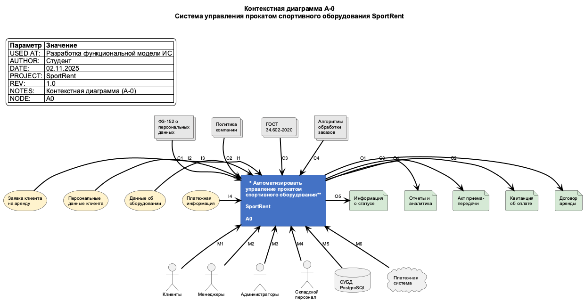

# Практическая работа № 4. Функциональное проектирование модели информационной системы с использованием методологии SADT

## Введение

Данная работа посвящена разработке функциональной модели информационной системы **SportRent** — системы управления прокатом спортивного оборудования. Система предназначена для автоматизации процессов аренды спортивного инвентаря, обеспечения прозрачности учета оборудования, упрощения взаимодействия между клиентами и администрацией, а также повышения эффективности управления ресурсами.

SportRent представляет собой комплексную информационную систему, охватывающую все аспекты бизнес-процессов проката спортивного оборудования: от онлайн-бронирования и оформления заказов до складского учета, обработки платежей и формирования аналитических отчетов.

Для моделирования функциональной структуры системы применяется методология SADT (Structured Analysis and Design Technique) с использованием нотации IDEF0, которая позволяет наглядно представить процессы, информационные потоки и ресурсы, участвующие в работе системы.

## Цель создания информационной системы

**Цель создания ИС SportRent:** Автоматизировать управление прокатом спортивного оборудования для повышения эффективности бизнес-процессов, улучшения качества обслуживания клиентов и обеспечения прозрачного контроля над состоянием и доступностью оборудования.

**Обоснование соответствия определению ИС:**

Система SportRent полностью соответствует определению информационной системы, поскольку представляет собой совокупность организационных и технических средств, предназначенных для:

1. **Сбора информации** — регистрация заявок клиентов, данных об оборудовании, платежной информации
2. **Хранения информации** — организация базы данных клиентов, каталога оборудования, истории заказов
3. **Обработки информации** — формирование договоров, расчет стоимости аренды, контроль сроков
4. **Передачи информации** — взаимодействие между различными модулями системы и пользователями
5. **Представления информации** — генерация отчетов, вывод статистики, уведомления пользователей

Система использует современные информационные технологии и обеспечивает поддержку принятия управленческих решений на основе актуальных данных.

## Краткое описание информационной системы

### Функциональные возможности системы SportRent

Система SportRent обеспечивает комплексную автоматизацию всех бизнес-процессов проката спортивного оборудования и включает следующие основные функциональные возможности:

**1. Управление каталогом оборудования**
- Ведение полного каталога спортивного инвентаря с характеристиками, фотографиями и ценами
- Категоризация оборудования (велосипеды, лыжи, сноуборды, туристическое снаряжение и др.)
- Управление ценообразованием и тарифными планами
- Контроль технического состояния оборудования

**2. Бронирование и заказы**
- Онлайн-бронирование оборудования с выбором даты и времени
- Проверка доступности инвентаря в реальном времени
- Формирование и обработка заказов
- Управление очередью бронирований и резервирований

**3. Обработка платежей**
- Интеграция с платежными системами для онлайн-оплаты
- Расчет стоимости аренды с учетом длительности и тарифов
- Формирование и печать квитанций об оплате
- Учет депозитов и залоговых платежей

**4. Управление клиентами**
- Регистрация и аутентификация пользователей
- Управление профилями клиентов
- История аренды и статистика использования
- Программа лояльности и скидки для постоянных клиентов

**5. Складской учет**
- Отслеживание местонахождения и статуса каждой единицы оборудования
- Учет выдачи и возврата инвентаря
- Контроль технического состояния и необходимости обслуживания
- Планирование графика технического обслуживания

**6. Операции с базой данных**
- Надежное хранение всех данных системы
- Обеспечение целостности и консистентности информации
- Резервное копирование и восстановление данных
- Оптимизация запросов для быстрого доступа к информации

**7. Отчетность и аналитика**
- Формирование отчетов о загрузке оборудования
- Финансовая отчетность и анализ доходов
- Статистика популярности различных категорий инвентаря
- Прогнозирование спроса и планирование закупок

**8. Системное администрирование**
- Управление пользователями и правами доступа
- Настройка параметров системы
- Мониторинг работоспособности и производительности
- Управление безопасностью и аудит действий пользователей

### Архитектурные особенности

Система построена на модульной архитектуре с использованием:
- **Паттерн архитектуры:** Модульная структура с 8 независимыми, но интегрированными модулями
- **API:** RESTful API для взаимодействия клиент-сервер с обменом данными в формате JSON
- **База данных:** Реляционная СУБД с нормализованной схемой данных
- **Протокол связи:** HTTPS/TLS для безопасной передачи данных

### Показатели качества

Система разработана с учетом следующих требований к качеству:
- **Доступность:** 99.5% в рабочее время
- **Время отклика:** максимум 5 секунд для операций бронирования
- **Производительность API:** 100 запросов в минуту с временем отклика менее 2 секунд
- **Одновременные пользователи:** поддержка 100+ пользователей без деградации производительности
- **Безопасность:** шифрование данных HTTPS/TLS, защита от SQL-инъекций и XSS-атак

## Способ создания информационной системы

Для разработки информационной системы SportRent выбран **метод последовательных приближений (итеративная модель)**.

### Обоснование выбора методологии

Метод последовательных приближений предполагает пошаговую разработку системы с постепенным уточнением требований и улучшением функциональности. Этот подход оптимален для создания ИС SportRent по следующим причинам:

1. **Гибкость требований** — возможность корректировки функциональности на основе обратной связи от пользователей
2. **Снижение рисков** — раннее выявление проблем и их устранение на начальных итерациях
3. **Поэтапная реализация** — возможность ввода в эксплуатацию отдельных модулей по мере готовности
4. **Адаптация к изменениям** — быстрое реагирование на изменения бизнес-требований

### Связь с методологией SADT и нотацией IDEF0

Методология SADT используется на этапе анализа и проектирования для:
- **Декомпозиции системы** — разбиение сложной системы на управляемые функциональные блоки
- **Визуализации процессов** — наглядное представление входов, выходов, управления и механизмов
- **Выявления взаимосвязей** — определение информационных потоков между модулями
- **Документирования требований** — формализация функциональных требований к системе

Нотация IDEF0 обеспечивает стандартизированный способ представления функциональной модели, что упрощает коммуникацию между всеми участниками проекта и позволяет однозначно интерпретировать требования к системе.

### Этапы разработки

В соответствии с методом последовательных приближений, разработка системы включает следующие этапы:

1. **Исследование и технико-экономическое обоснование** — анализ предметной области и оценка целесообразности
2. **Сбор и анализ требований** — формирование технических требований и документации
3. **Эскизное проектирование** — выбор архитектурных решений и технологий
4. **Техническое проектирование** — детальная разработка диаграмм, схем БД и прототипов интерфейса
5. **Разработка** — поэтапная реализация модулей системы
6. **Интеграционное тестирование** — проверка взаимодействия всех компонентов
7. **Опытная эксплуатация** — тестирование в условиях, приближенных к реальным
8. **Промышленное внедрение** — полное развертывание системы и приемка

## Средства создания информационной системы

Для разработки и функционирования информационной системы SportRent используется следующий технологический стек:

### Frontend (клиентская часть)

- **HTML5** — разметка структуры веб-страниц
- **CSS3** — стилизация и адаптивный дизайн интерфейса
- **JavaScript фреймворки:**
  - **React** / **Vue.js** / **Angular** — для создания динамичного, отзывчивого пользовательского интерфейса
  - Выбор конкретного фреймворка определяется на этапе технического проектирования

### Backend (серверная часть)

Серверная логика может быть реализована на одном из следующих языков:
- **Python** (Django / Flask / FastAPI) — высокая скорость разработки, богатая экосистема
- **Node.js** (Express.js) — асинхронная обработка, единый язык с frontend
- **Java** (Spring Boot) — масштабируемость, надежность для enterprise-решений
- **C#** (ASP.NET Core) — высокая производительность, интеграция с Microsoft-технологиями

### База данных

- **PostgreSQL** (рекомендуется) — мощная открытая СУБД с поддержкой ACID и расширенными возможностями
- **MySQL** (альтернатива) — популярная реляционная СУБД с хорошей производительностью

**Особенности проектирования БД:**
- Нормализованная схема данных (3NF)
- Индексация для оптимизации запросов
- Механизмы транзакций для обеспечения целостности данных

### Веб-сервер

- **Nginx 1.18+** (рекомендуется) — высокопроизводительный HTTP-сервер и обратный прокси
- **Apache 2.4+** (альтернатива) — универсальный веб-сервер с богатой функциональностью

### Инструменты моделирования

- **Ramus Educational** — CASE-средство для создания диаграмм IDEF0 в соответствии с РД IDEF0-2000
- **PlantUML** — инструмент для создания UML-диаграмм из текстового описания

### Дополнительные технологии

- **RESTful API** — архитектурный стиль для взаимодействия клиента и сервера
- **JSON** — формат обмена данными
- **JWT (JSON Web Tokens)** — механизм аутентификации и авторизации
- **HTTPS/TLS** — протокол безопасной передачи данных
- **Git** — система контроля версий для управления исходным кодом

### Интеграции

- **Платежные системы** — интеграция с платежными шлюзами (Stripe, PayPal, ЮKassa)
- **Системы уведомлений** — email-рассылка, SMS-уведомления

## Проектирование контекстной диаграммы функциональной модели информационной системы

### Описание контекстной диаграммы A-0

Контекстная диаграмма A-0 представляет систему SportRent на самом верхнем уровне абстракции как единый функциональный блок, взаимодействующий с внешним окружением.

**Рисунок 1.** Контекстная диаграмма A-0 системы управления прокатом спортивного оборудования SportRent

### Функциональный блок A0

**Название:** Автоматизировать управление прокатом спортивного оборудования

**Номер:** A0

**Описание:** Центральный функциональный блок представляет всю информационную систему SportRent как единое целое. Он отражает главную цель системы — автоматизацию всех процессов, связанных с прокатом спортивного оборудования, от момента получения заявки клиента до формирования отчетов и аналитики.

Блок выполняет следующие основные функции:
- Прием и обработка заявок клиентов на аренду
- Управление каталогом оборудования и контроль доступности
- Обработка платежей и финансовых операций
- Формирование договорной и отчетной документации
- Учет движения оборудования на складе
- Предоставление информации о статусе заказов

### Элементы управления (Control)

Элементы управления определяют правила, регламенты и алгоритмы, которым должна следовать система при выполнении своих функций.

#### C1: ФЗ-152 о персональных данных

**Описание:** Федеральный закон Российской Федерации № 152-ФЗ «О персональных данных» регулирует обработку персональных данных клиентов.

**Обоснование выбора:** Система обрабатывает персональные данные клиентов (ФИО, контактные данные, паспортные данные), поэтому обязана соответствовать требованиям законодательства о защите персональных данных. Это включает получение согласия на обработку данных, обеспечение их безопасности и предоставление пользователям прав на доступ и удаление своих данных.

#### C2: Политика компании

**Описание:** Внутренние правила и политики компании SportRent, определяющие бизнес-процессы, тарифы, условия аренды, программы лояльности.

**Обоснование выбора:** Политика компании определяет уникальные бизнес-правила, отличающие SportRent от конкурентов: размер залога, правила возврата оборудования, условия отмены бронирования, скидки для постоянных клиентов. Эти правила должны быть заложены в логику работы системы.

#### C3: ГОСТ 34.602-2020

**Описание:** Государственный стандарт «Информационные технологии. Комплекс стандартов на автоматизированные системы. Техническое задание на создание автоматизированной системы».

**Обоснование выбора:** Стандарт определяет требования к техническому заданию и разработке автоматизированных систем, обеспечивая единообразие подходов к проектированию, документированию и внедрению ИС. Соблюдение ГОСТ гарантирует качество разработки и возможность сертификации системы.

#### C4: Алгоритмы обработки заказов и платежей

**Описание:** Бизнес-логика системы, определяющая последовательность действий при обработке заявок, расчете стоимости, проведении платежей, формировании документов.

**Обоснование выбора:** Алгоритмы обработки являются ключевым элементом управления, обеспечивающим корректное функционирование системы. Они определяют:
- Логику проверки доступности оборудования
- Расчет стоимости аренды с учетом тарифов и скидок
- Процесс оформления и подтверждения заказа
- Механизм проведения платежей и возврата средств
- Правила формирования договоров и актов

### Входящие потоки (Input)

Входящие потоки представляют собой информацию, которая поступает в систему извне и подлежит обработке.

#### I1: Заявка клиента на аренду

**Описание:** Запрос клиента на бронирование конкретного вида оборудования на определенный период времени.

**Обоснование выбора:** Заявка является основным входом, инициирующим работу системы. Она содержит информацию о желаемом оборудовании, датах аренды, дополнительных услугах. Обработка заявки запускает весь цикл бизнес-процессов системы.

**Содержание:**
- Вид запрашиваемого оборудования
- Дата и время начала аренды
- Продолжительность аренды
- Дополнительные услуги (доставка, инструктаж и т.д.)

#### I2: Персональные данные клиента

**Описание:** Личная информация клиента, необходимая для идентификации, регистрации и оформления договора аренды.

**Обоснование выбора:** Персональные данные необходимы для:
- Создания учетной записи клиента
- Оформления юридически значимых документов (договор аренды)
- Связи с клиентом (уведомления, напоминания)
- Предоставления персонализированных услуг

**Содержание:**
- ФИО клиента
- Контактные данные (телефон, email)
- Паспортные данные (для оформления договора)
- Адрес проживания

#### I3: Данные об оборудовании

**Описание:** Информация о спортивном инвентаре, имеющемся в наличии, его характеристиках, состоянии и местонахождении.

**Обоснование выбора:** Данные об оборудовании являются основой каталога системы и необходимы для:
- Отображения доступного инвентаря клиентам
- Проверки технического состояния
- Планирования обслуживания
- Учета движения на складе

**Содержание:**
- Наименование и категория оборудования
- Технические характеристики
- Текущее состояние (доступно, в аренде, на обслуживании)
- Местонахождение на складе
- История использования и обслуживания

#### I4: Платежная информация

**Описание:** Данные о платежах клиентов, включая информацию о способе оплаты, сумме, статусе транзакции.

**Обоснование выбора:** Платежная информация критически важна для:
- Проведения финансовых транзакций
- Подтверждения оплаты услуг
- Формирования финансовой отчетности
- Обеспечения безопасности платежей

**Содержание:**
- Способ оплаты (наличные, карта, онлайн-платеж)
- Сумма платежа
- Статус транзакции (успешно, отклонено, в обработке)
- Идентификатор транзакции

### Исходящие потоки (Output)

Исходящие потоки представляют собой результаты работы системы, которые передаются пользователям или внешним системам.

#### O1: Договор аренды

**Описание:** Официальный документ, фиксирующий условия аренды спортивного оборудования между компанией SportRent и клиентом.

**Обоснование выбора:** Договор является юридически значимым документом, который:
- Определяет права и обязанности сторон
- Устанавливает условия аренды и стоимость услуг
- Регулирует ответственность за ущерб или утрату оборудования
- Служит основанием для разрешения спорных ситуаций

**Содержание:**
- Реквизиты сторон договора
- Перечень арендуемого оборудования
- Срок аренды и стоимость услуг
- Условия залога
- Ответственность сторон

#### O2: Квитанция об оплате

**Описание:** Документ, подтверждающий факт оплаты услуг аренды клиентом.

**Обоснование выбора:** Квитанция необходима для:
- Подтверждения совершения платежа
- Ведения финансового учета
- Предоставления клиенту доказательства оплаты
- Налоговой отчетности

**Содержание:**
- Дата и время платежа
- Сумма оплаты
- Способ оплаты
- Наименование услуги
- Реквизиты получателя

#### O3: Акт приема-передачи оборудования

**Описание:** Документ, фиксирующий состояние оборудования при выдаче клиенту и при его возврате.

**Обоснование выбора:** Акт приема-передачи служит для:
- Документирования состояния оборудования до и после аренды
- Фиксации комплектности инвентаря
- Разрешения споров о повреждениях или утрате
- Определения необходимости удержания залога

**Содержание:**
- Перечень передаваемого оборудования
- Описание технического состояния
- Комплектность
- Подписи сторон
- Дата и время выдачи/возврата

#### O4: Отчеты и аналитика

**Описание:** Аналитические отчеты, содержащие статистику по работе системы, финансовым показателям, загрузке оборудования.

**Обоснование выбора:** Отчеты необходимы для:
- Анализа эффективности бизнес-процессов
- Принятия управленческих решений
- Планирования закупок нового оборудования
- Оценки финансовых результатов

**Содержание:**
- Статистика аренды (популярное оборудование, сезонность)
- Финансовые показатели (выручка, средний чек)
- Загрузка оборудования (коэффициент использования)
- Отчеты по клиентам (активность, лояльность)

#### O5: Информация о статусе заказа

**Описание:** Актуальная информация о текущем состоянии заказа клиента (оформлен, подтвержден, готов к выдаче, выдан, завершен).

**Обоснование выбора:** Информация о статусе позволяет:
- Держать клиента в курсе обработки его заказа
- Снизить количество запросов в службу поддержки
- Повысить прозрачность процессов
- Улучшить клиентский опыт

**Содержание:**
- Текущий статус заказа
- История изменений статуса
- Ожидаемое время выполнения
- Уведомления о важных событиях

### Механизмы (Mechanism)

Механизмы представляют собой ресурсы (люди, системы, оборудование), которые обеспечивают выполнение функций системы.

#### M1: Клиенты

**Описание:** Конечные пользователи системы — физические или юридические лица, арендующие спортивное оборудование.

**Обоснование выбора:** Клиенты являются основными пользователями системы, которые:
- Инициируют процесс аренды через создание заявок
- Взаимодействуют с веб-интерфейсом для бронирования
- Осуществляют оплату услуг
- Получают и возвращают оборудование

**Роль в системе:**
- Регистрация в системе
- Поиск и выбор оборудования
- Оформление бронирования
- Онлайн-оплата
- Просмотр истории аренды

#### M2: Менеджеры

**Описание:** Бизнес-операторы, отвечающие за управление каталогом, ценообразование, обработку заказов и бизнес-аналитику.

**Обоснование выбора:** Менеджеры обеспечивают:
- Актуальность каталога оборудования
- Гибкое управление ценами и акциями
- Обработку нестандартных заказов
- Анализ бизнес-показателей

**Роль в системе:**
- Управление каталогом и ценами
- Обработка заказов
- Работа с клиентами
- Формирование отчетов
- Планирование закупок

#### M3: Администраторы

**Описание:** Системные администраторы с полным доступом к настройкам системы, управлению пользователями, безопасностью и техническому обслуживанию.

**Обоснование выбора:** Администраторы необходимы для:
- Обеспечения бесперебойной работы системы
- Управления безопасностью и правами доступа
- Настройки интеграций с внешними системами
- Мониторинга производительности

**Роль в системе:**
- Управление пользователями и ролями
- Настройка системных параметров
- Мониторинг безопасности
- Резервное копирование
- Интеграция с внешними сервисами

#### M4: Складской персонал

**Описание:** Сотрудники, отвечающие за физические операции с оборудованием: выдачу клиентам, прием возвратов, проверку состояния, складской учет.

**Обоснование выбора:** Складской персонал обеспечивает:
- Физическую выдачу оборудования клиентам
- Контроль состояния инвентаря при возврате
- Ведение складского учета
- Подготовку оборудования к аренде

**Роль в системе:**
- Выдача оборудования по заказам
- Прием возвратов и проверка состояния
- Обновление статуса оборудования в системе
- Организация складского хранения
- Передача оборудования на техническое обслуживание

#### M5: СУБД (PostgreSQL/MySQL)

**Описание:** Система управления базами данных, обеспечивающая надежное хранение, быстрый доступ и целостность всех данных системы.

**Обоснование выбора:** СУБД является критически важным компонентом, который:
- Обеспечивает персистентность всех данных системы
- Гарантирует ACID-свойства транзакций
- Поддерживает сложные запросы и аналитику
- Обеспечивает масштабируемость и производительность

**Роль в системе:**
- Хранение данных о клиентах, оборудовании, заказах
- Выполнение транзакций
- Обеспечение целостности данных
- Оптимизация запросов
- Резервное копирование

#### M6: Платежная система

**Описание:** Внешний сервис обработки платежей (Stripe, PayPal, ЮKassa), интегрированный с системой SportRent для проведения финансовых транзакций.

**Обоснование выбора:** Платежная система необходима для:
- Безопасной обработки платежей клиентов
- Поддержки различных способов оплаты
- Соответствия стандартам безопасности (PCI DSS)
- Защиты финансовых данных

**Роль в системе:**
- Обработка онлайн-платежей
- Проверка платежных данных
- Проведение возвратов
- Формирование платежных квитанций
- Обеспечение безопасности транзакций

## Глоссарий

**A-0 (контекстная диаграмма)** — диаграмма верхнего уровня в нотации IDEF0, представляющая систему как единый функциональный блок с внешним окружением.

**ACID** — набор свойств транзакций в СУБД: Atomicity (атомарность), Consistency (согласованность), Isolation (изолированность), Durability (долговечность).

**API (Application Programming Interface)** — интерфейс программирования приложений, набор методов для взаимодействия между различными программными компонентами.

**HTTPS/TLS** — протокол безопасной передачи данных через интернет с использованием шифрования.

**IDEF0 (Integration Definition for Function Modeling)** — методология функционального моделирования, стандарт для создания функциональных моделей систем.

**JSON (JavaScript Object Notation)** — текстовый формат обмена данными, основанный на JavaScript.

**PCI DSS (Payment Card Industry Data Security Standard)** — стандарт безопасности данных индустрии платежных карт.

**RESTful API** — архитектурный стиль для создания веб-сервисов, основанный на протоколе HTTP и принципах REST.

**SADT (Structured Analysis and Design Technique)** — методология структурного анализа и проектирования систем.

**СУБД** — система управления базами данных, программное обеспечение для создания, управления и доступа к базам данных.

**Акт приема-передачи** — документ, фиксирующий факт передачи оборудования от одной стороны другой с описанием состояния и комплектности.

**Аутентификация** — процесс проверки подлинности пользователя, обычно с использованием логина и пароля.

**Бронирование** — предварительный заказ оборудования на определенный период времени.

**Декомпозиция** — процесс разбиения сложной системы на более простые составные части для упрощения анализа и проектирования.

**Залог** — денежная сумма, вносимая клиентом в качестве гарантии сохранности арендуемого оборудования.

**Инвентарь** — совокупность товарно-материальных ценностей (в данном случае — спортивного оборудования).

**Информационная система (ИС)** — совокупность технических и программных средств, персонала и процедур, предназначенных для сбора, хранения, обработки и передачи информации.

**Квитанция** — документ, подтверждающий факт получения денежных средств.

**Модуль** — функционально завершенная часть программной системы, выполняющая определенную задачу.

**Нормализация БД** — процесс организации данных в базе данных для уменьшения избыточности и улучшения целостности.

**Платежный шлюз** — сервис, обеспечивающий безопасную передачу платежной информации между клиентом, продавцом и банком.

**Складской учет** — система контроля и документирования движения товарно-материальных ценностей на складе.

**Стейкхолдер** — заинтересованная сторона, лицо или организация, которые могут влиять на проект или подвергаться его влиянию.

**Функциональный блок** — элемент диаграммы IDEF0, представляющий функцию или процесс системы.

## Вывод

В ходе выполнения практической работы была разработана контекстная диаграмма A-0 функциональной модели информационной системы **SportRent** в нотации IDEF0 с использованием методологии SADT.

Созданная диаграмма наглядно представляет систему управления прокатом спортивного оборудования как единый функциональный блок с четко определенными:
- **Входными потоками** — заявки клиентов, персональные данные, информация об оборудовании и платежах
- **Выходными потоками** — договоры, квитанции, акты, отчеты и информация о статусе заказов
- **Элементами управления** — законодательство, политики компании, стандарты и алгоритмы обработки
- **Механизмами** — пользователи различных ролей, СУБД и платежные системы

Разработанная модель соответствует требованиям руководящего документа РД IDEF0-2000 и может служить основой для дальнейшей декомпозиции системы на более детальные уровни представления.

Применение методологии SADT и нотации IDEF0 позволило:
1. Формализовать требования к информационной системе SportRent
2. Выявить все основные информационные потоки и ресурсы
3. Определить границы системы и её взаимодействие с внешним окружением
4. Создать основу для дальнейшего проектирования и разработки системы

Полученная контекстная диаграмма может быть использована в качестве отправной точки для детальной декомпозиции функций системы на последующих уровнях моделирования, что позволит более подробно описать внутренние процессы каждого модуля системы SportRent.
