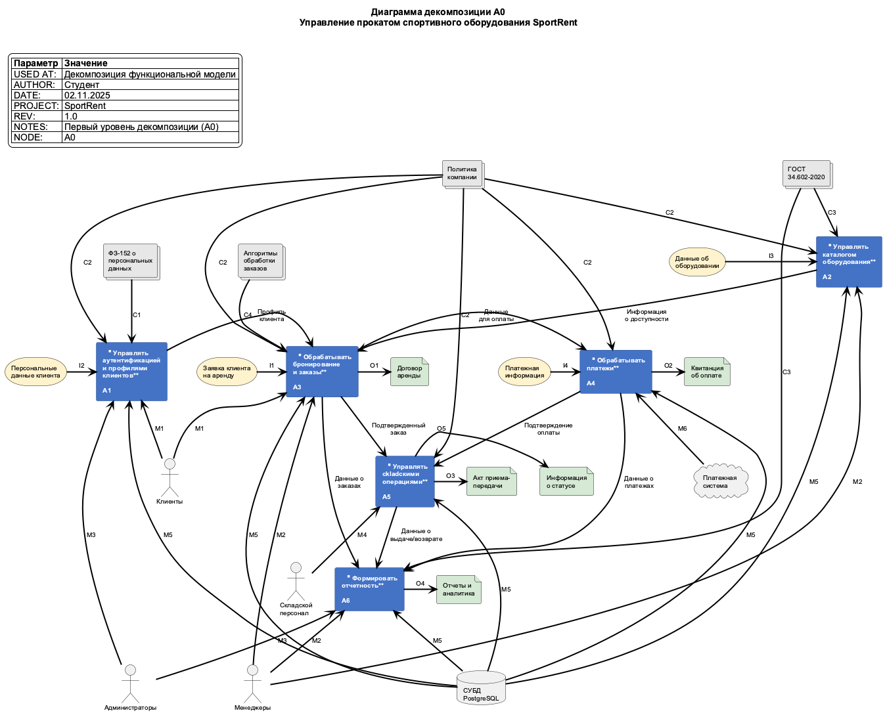
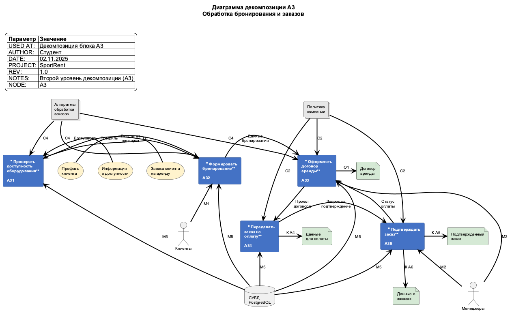

# Практическая работа № 4. Проектирование функциональной модели информационной системы в нотации IDEF0

**Тема:** Декомпозиция функциональной модели информационной системы SportRent

**Выполнил:** Студент
**Дата:** 02.11.2025

---

## Цель работы

Целью данной практической работы является продолжение проектирования функциональной модели информационной системы SportRent путем моделирования как минимум двух уровней декомпозиции в нотации IDEF0 и составление текстового описания проектируемых модулей на уровнях декомпозиции в соответствии с РД IDEF0-2000 и ГОСТ 7.32-2017.

## Задачи работы

1. На основе контекстной диаграммы A-0, созданной в Lab 3, выполнить декомпозицию первого уровня (A0)
2. Выбрать наиболее значимый функциональный блок и выполнить его декомпозицию на втором уровне
3. Составить детальное описание всех функциональных блоков и потоков данных
4. Сформулировать выводы о проделанной работе

---

## Теоретическая часть

### Методология IDEF0

IDEF0 (Integration Definition for Function Modeling) — методология функционального моделирования, предназначенная для описания бизнес-процессов и функциональных систем. IDEF0 является подвидом методологии SADT (Structured Analysis and Design Technique).

### Основные принципы IDEF0

**Принцип декомпозиции:** Любой функциональный блок может быть детализирован путем разбиения на несколько подфункций, которые в совокупности реализуют функцию родительского блока.

**Иерархическая структура:** Модель IDEF0 имеет древовидную структуру, где каждый блок может иметь одну родительскую и несколько дочерних диаграмм.

**Ограничение сложности:** На одной диаграмме рекомендуется размещать от 3 до 6 функциональных блоков для обеспечения читаемости.

### Нотация IDEF0

Каждый функциональный блок в IDEF0 имеет четыре типа интерфейсов:

- **Входы (Input)** — данные или объекты, которые преобразуются или используются функцией (стрелки слева)
- **Управление (Control)** — правила, стандарты, регламенты, управляющие выполнением функции (стрелки сверху)
- **Выходы (Output)** — результаты выполнения функции (стрелки справа)
- **Механизмы (Mechanism)** — ресурсы, необходимые для выполнения функции: люди, системы, оборудование (стрелки снизу)

### Система нумерации

- **A-0** — контекстная диаграмма, представляющая систему как единый блок
- **A0** — первый уровень декомпозиции контекстной диаграммы
- **A1, A2, A3...** — функциональные блоки на уровне A0
- **A31, A32, A33...** — функциональные блоки при декомпозиции блока A3

### Туннелирование стрелок

Туннелирование — механизм сокрытия стрелок на определенных уровнях иерархии:
- **Круглые скобки ()** — намеренное туннелирование
- **Квадратные скобки []** — ошибка моделирования, требующая исправления

В учебных работах туннелирование рекомендуется избегать для сохранения полноты модели.

---

## Практическая часть

### Исходные данные

В качестве исходных данных используется контекстная диаграмма A-0 системы SportRent, созданная в рамках лабораторной работы 3. Контекстная диаграмма представляет систему как единый функциональный блок "Автоматизировать управление прокатом спортивного оборудования" со следующими элементами:

**Входы (I1-I4):**
- I1: Заявка клиента на аренду
- I2: Персональные данные клиента
- I3: Данные об оборудовании
- I4: Платежная информация

**Управление (C1-C4):**
- C1: ФЗ-152 о персональных данных
- C2: Политика компании
- C3: ГОСТ 34.602-2020
- C4: Алгоритмы обработки заказов и платежей

**Выходы (O1-O5):**
- O1: Договор аренды
- O2: Квитанция об оплате
- O3: Акт приема-передачи оборудования
- O4: Отчеты и аналитика
- O5: Информация о статусе заказа

**Механизмы (M1-M6):**
- M1: Клиенты
- M2: Менеджеры
- M3: Администраторы
- M4: Складской персонал
- M5: СУБД (PostgreSQL/MySQL)
- M6: Платежная система

### Декомпозиция уровня A0

На основе анализа функциональности системы SportRent были выделены шесть основных функциональных блоков первого уровня декомпозиции:

#### A1: Управлять аутентификацией и профилями клиентов

**Назначение:** Регистрация новых пользователей, аутентификация в системе, управление профилями клиентов и их персональными данными.

**Входы:**
- I2: Персональные данные клиента

**Управление:**
- C1: ФЗ-152 о персональных данных — обеспечивает соблюдение требований по защите персональных данных
- C2: Политика компании — определяет правила регистрации и управления учетными записями

**Выходы:**
- Профиль клиента → A3 (для использования при оформлении заказов)

**Механизмы:**
- M1: Клиенты — инициируют регистрацию и обновление профилей
- M3: Администраторы — управляют правами доступа и модерируют учетные записи
- M5: СУБД PostgreSQL — хранит данные пользователей

**Описание процесса:** Клиент предоставляет персональные данные через веб-интерфейс. Система проверяет корректность данных, создает учетную запись в соответствии с требованиями ФЗ-152 и политикой компании. После успешной регистрации создается профиль клиента, который используется при последующих операциях.

---

#### A2: Управлять каталогом оборудования

**Назначение:** Ведение каталога спортивного оборудования, управление характеристиками, ценами, фотографиями и актуальностью информации.

**Входы:**
- I3: Данные об оборудовании (характеристики, фото, цены)

**Управление:**
- C2: Политика компании — определяет правила ценообразования и категоризации
- C3: ГОСТ 34.602-2020 — обеспечивает стандартизацию описания оборудования

**Выходы:**
- Информация о доступности → A3 (актуальные данные о наличии оборудования)

**Механизмы:**
- M2: Менеджеры — добавляют, редактируют и удаляют позиции каталога
- M5: СУБД PostgreSQL — хранит данные каталога

**Описание процесса:** Менеджеры вносят в систему информацию о спортивном оборудовании: название, характеристики, стоимость аренды, фотографии. Система обрабатывает и структурирует данные согласно установленным стандартам. Каталог постоянно актуализируется, предоставляя информацию о доступности оборудования для блока обработки заказов.

---

#### A3: Обрабатывать бронирование и заказы

**Назначение:** Прием заявок от клиентов, проверка доступности оборудования, формирование бронирований и заказов на аренду.

**Входы:**
- I1: Заявка клиента на аренду
- Профиль клиента (от A1)
- Информация о доступности (от A2)

**Управление:**
- C2: Политика компании — правила бронирования, сроки удержания брони
- C4: Алгоритмы обработки заказов — логика обработки заявок и формирования заказов

**Выходы:**
- O1: Договор аренды (внешний документ для клиента)
- Данные для оплаты → A4 (информация для проведения платежа)
- Подтвержденный заказ → A5 (заказ, готовый к выдаче)
- Данные о заказах → A6 (для формирования отчетности)

**Механизмы:**
- M1: Клиенты — создают заявки на аренду
- M2: Менеджеры — обрабатывают заказы и формируют договоры
- M5: СУБД PostgreSQL — хранит данные о заказах

**Описание процесса:** Клиент выбирает оборудование и создает заявку на аренду, указывая период. Система проверяет доступность, формирует бронирование и создает договор аренды. Менеджер проверяет заказ и передает его на оплату. После подтверждения оплаты заказ передается на склад для выдачи.

**Важность блока:** Данный блок является ключевым в системе SportRent, так как реализует основной бизнес-процесс — оформление аренды. Поэтому он был выбран для детальной декомпозиции на втором уровне.

---

#### A4: Обрабатывать платежи

**Назначение:** Проведение финансовых операций, обработка платежей клиентов, взаимодействие с платежными системами.

**Входы:**
- I4: Платежная информация (данные карты, способ оплаты)
- Данные для оплаты (от A3) — сумма, назначение платежа, реквизиты заказа

**Управление:**
- C2: Политика компании — правила проведения платежей, возвратов

**Выходы:**
- O2: Квитанция об оплате (чек для клиента)
- Подтверждение оплаты → A5 (сигнал о successful payment)
- Данные о платежах → A6 (финансовая информация для отчетности)

**Механизмы:**
- M5: СУБД PostgreSQL — хранит транзакции
- M6: Платежная система — обрабатывает платежи

**Описание процесса:** После формирования заказа система инициирует платежную транзакцию. Клиент вводит платежные данные, которые передаются в защищенную платежную систему. После успешной оплаты формируется квитанция, а информация о платеже сохраняется в базе данных и передается в складскую систему для разрешения выдачи оборудования.

---

#### A5: Управлять складскими операциями

**Назначение:** Выдача оборудования клиентам, прием возвратов, контроль состояния оборудования, управление складским учетом.

**Входы:**
- Подтвержденный заказ (от A3) — информация о том, что выдать
- Подтверждение оплаты (от A4) — разрешение на выдачу

**Управление:**
- C2: Политика компании — правила выдачи и приема оборудования

**Выходы:**
- O3: Акт приема-передачи оборудования (документ о выдаче/возврате)
- O5: Информация о статусе заказа (текущий статус: выдано, в прокате, возвращено)
- Данные о выдаче/возврате → A6 (складская статистика)

**Механизмы:**
- M4: Складской персонал — выдает и принимает оборудование
- M5: СУБД PostgreSQL — учет движения товаров

**Описание процесса:** Складской работник получает подтвержденный и оплаченный заказ. Он находит оборудование на складе, проверяет его состояние, оформляет акт приема-передачи и выдает клиенту. При возврате проверяется состояние оборудования, фиксируются повреждения (если есть), оформляется возврат и обновляется статус доступности в каталоге.

---

#### A6: Формировать отчетность

**Назначение:** Создание аналитических отчетов и статистики по работе системы: продажи, популярное оборудование, финансовые показатели.

**Входы:**
- Данные о заказах (от A3) — информация о количестве и типах заказов
- Данные о платежах (от A4) — финансовая информация
- Данные о выдаче/возврате (от A5) — складская статистика

**Управление:**
- C3: ГОСТ 34.602-2020 — стандарты оформления документации

**Выходы:**
- O4: Отчеты и аналитика (документы для менеджмента)

**Механизмы:**
- M2: Менеджеры — формируют и анализируют отчеты
- M3: Администраторы — настраивают параметры отчетности
- M5: СУБД PostgreSQL — источник данных для отчетов

**Описание процесса:** Система агрегирует данные из различных модулей, формирует аналитические срезы и создает отчеты в требуемых форматах. Менеджеры и администраторы могут запрашивать отчеты за различные периоды, по разным категориям оборудования, анализировать финансовые показатели и эффективность работы системы.

---

### Диаграмма декомпозиции A0

*Рисунок 1 — Первый уровень декомпозиции A0 системы SportRent*

---

### Декомпозиция блока A3 (второй уровень)

Блок A3 "Обрабатывать бронирование и заказы" был выбран для детальной декомпозиции как наиболее критичный для бизнес-логики системы. Он декомпозирован на пять функциональных блоков:

#### A31: Проверять доступность оборудования

**Назначение:** Проверка наличия запрошенного оборудования в указанные клиентом сроки, выявление конфликтов бронирования.

**Входы:**
- I1: Заявка клиента на аренду (от внешнего источника)
- Информация о доступности (от A2 родительского уровня)

**Управление:**
- C4: Алгоритмы обработки заказов — логика проверки доступности с учетом существующих бронирований

**Выходы:**
- Результат проверки → A32 (статус: доступно/недоступно, альтернативные варианты)

**Механизмы:**
- M5: СУБД PostgreSQL — запросы к базе данных о занятости оборудования

**Описание процесса:** Система получает заявку клиента с указанием желаемого оборудования и периода аренды. Выполняется запрос к базе данных для проверки доступности оборудования в указанные даты. Алгоритм учитывает существующие бронирования, техническое обслуживание, ремонт. В случае недоступности система предлагает альтернативные варианты или другие даты.

---

#### A32: Формировать бронирование

**Назначение:** Создание предварительного бронирования оборудования за клиентом на указанный период.

**Входы:**
- Профиль клиента (от A1 родительского уровня) — данные клиента для бронирования
- Результат проверки (от A31) — подтверждение доступности

**Управление:**
- C4: Алгоритмы обработки заказов — правила резервирования, время удержания брони

**Выходы:**
- Данные бронирования → A33 (информация о забронированном оборудовании)

**Механизмы:**
- M1: Клиенты — подтверждают бронирование
- M5: СУБД PostgreSQL — сохраняет бронь

**Описание процесса:** После подтверждения доступности система создает запись бронирования, связывая клиента с оборудованием на указанный период. Бронирование имеет ограниченное время жизни (например, 30 минут), в течение которого клиент должен завершить оформление заказа. Статус оборудования изменяется на "забронировано".

---

#### A33: Оформлять договор аренды

**Назначение:** Формирование официального договора аренды между компанией и клиентом на основе созданного бронирования.

**Входы:**
- Данные бронирования (от A32) — информация о забронированном оборудовании
- Статус оплаты (от A35) — обратная связь для финализации договора

**Управление:**
- C2: Политика компании — шаблоны договоров, условия аренды
- C4: Алгоритмы обработки заказов — бизнес-логика формирования договоров

**Выходы:**
- O1: Договор аренды (к клиенту) — официальный документ
- Проект договора → A34 — промежуточная версия для платежной системы

**Механизмы:**
- M2: Менеджеры — проверяют и утверждают договоры (при необходимости)
- M5: СУБД PostgreSQL — хранит договоры

**Описание процесса:** Система автоматически генерирует договор аренды на основе шаблона, подставляя данные клиента, информацию об оборудовании, сроки, стоимость. Менеджер (или автоматическая система) проверяет корректность данных. После формирования проект договора передается для инициации оплаты.

---

#### A34: Передавать заказ на оплату

**Назначение:** Подготовка платежных данных и инициация процесса оплаты через платежную систему.

**Входы:**
- Проект договора (от A33) — информация для формирования счета

**Управление:**
- C2: Политика компании — способы оплаты, валюта, комиссии

**Выходы:**
- Данные для оплаты → A4 (к блоку обработки платежей родительского уровня)
- Запрос на подтверждение → A35 — триггер для финального подтверждения

**Механизмы:**
- M5: СУБД PostgreSQL — фиксирует платежные транзакции

**Описание процесса:** На основе договора формируется платежное требование с указанием суммы, назначения платежа, реквизитов. Данные передаются в блок обработки платежей (A4), который взаимодействует с внешней платежной системой. Создается запись о платежной транзакции в базе данных.

---

#### A35: Подтверждать заказ

**Назначение:** Финальное подтверждение заказа после успешной оплаты и передача его на выполнение.

**Входы:**
- Запрос на подтверждение (от A34) — триггер для проверки статуса

**Управление:**
- C2: Политика компании — условия активации заказа

**Выходы:**
- Подтвержденный заказ → A5 (к блоку складских операций родительского уровня)
- Данные о заказах → A6 (к блоку отчетности родительского уровня)
- Статус оплаты → A33 (обратная связь для обновления договора)

**Механизмы:**
- M2: Менеджеры — контролируют процесс подтверждения
- M5: СУБД PostgreSQL — обновляет статус заказа

**Описание процесса:** После получения подтверждения оплаты от блока A4 система активирует заказ, изменяя его статус на "подтвержден". Информация о подтвержденном заказе передается на склад (A5) для подготовки к выдаче, а также в систему отчетности (A6). Обратная связь к блоку A33 обновляет статус договора.

---

### Диаграмма декомпозиции A3

*Рисунок 2 — Второй уровень декомпозиции блока A3 "Обрабатывать бронирование и заказы"*

---

## Глоссарий

**IDEF0** — методология функционального моделирования для описания бизнес-процессов

**SADT** — методология структурного анализа и проектирования

**Декомпозиция** — разбиение сложной функции на несколько более простых подфункций

**Контекстная диаграмма** — диаграмма верхнего уровня, представляющая систему как единый блок

**Функциональный блок** — элемент диаграммы IDEF0, представляющий определенную функцию или процесс

**Туннелирование** — механизм сокрытия стрелок на определенных уровнях иерархии модели

**Интерфейсные дуги** — стрелки на диаграмме IDEF0, представляющие входы, управление, выходы, механизмы

**СУБД** — система управления базами данных

---

## Выводы

В ходе выполнения лабораторной работы № 4 была проведена декомпозиция функциональной модели информационной системы SportRent на два уровня в нотации IDEF0.

**Основные результаты работы:**

1. **Создана диаграмма первого уровня декомпозиции (A0)**, включающая 6 функциональных блоков:
   - A1: Управлять аутентификацией и профилями клиентов
   - A2: Управлять каталогом оборудования
   - A3: Обрабатывать бронирование и заказы
   - A4: Обрабатывать платежи
   - A5: Управлять складскими операциями
   - A6: Формировать отчетность

2. **Выполнена детальная декомпозиция блока A3** (второй уровень), выбранного как наиболее критичного для бизнес-логики системы. Блок разбит на 5 подфункций, описывающих полный цикл обработки заказа от проверки доступности до финального подтверждения.

3. **Определены все интерфейсные связи** между функциональными блоками, внешними входами, выходами, управляющими потоками и механизмами в соответствии с методологией IDEF0.

4. **Составлены детальные текстовые описания** всех функциональных блоков и потоков данных, что обеспечивает полное понимание функциональности каждого элемента модели.

**Практическая значимость:**

Созданная иерархическая модель IDEF0 позволяет:
- Четко понимать функциональную структуру системы SportRent
- Видеть взаимосвязи между различными модулями системы
- Идентифицировать все входные данные, результаты, управляющие параметры и необходимые ресурсы для каждой функции
- Использовать модель как основу для дальнейшего проектирования (разработки архитектуры ПО, распределения задач между разработчиками)
- Обеспечить единое понимание системы всеми участниками проекта

**Особенности реализации:**

- Туннелирование стрелок не использовалось для обеспечения полноты и ясности модели
- Количество блоков на каждом уровне соответствует рекомендациям IDEF0 (3-6 блоков)
- Все стрелки корректно связаны между уровнями иерархии
- Модель соответствует требованиям РД IDEF0-2000

Полученная функциональная модель является основой для следующих этапов проектирования информационной системы SportRent, включая разработку архитектуры, проектирование базы данных и создание технической документации.

---

## Список использованных источников

1. РД IDEF0-2000. Методология функционального моделирования IDEF0. Руководящий документ. — М.: ИПК Издательство стандартов, 2000.

2. ГОСТ 34.602-2020. Информационные технологии. Комплекс стандартов на автоматизированные системы. Техническое задание на создание автоматизированной системы.

3. ГОСТ 7.32-2017. Межгосударственный стандарт. Система стандартов по информации, библиотечному и издательскому делу. Отчет о научно-исследовательской работе. Структура и правила оформления.

4. Лобанов А.А., Лобанова Ю.С., Абраш Е.Н., Братусь Н.В. Проектирование информационных систем. Методическое пособие. — Межрегиональный центр инновационных технологий в образовании, 2024.

5. ISO/IEC 25010:2011. Systems and software engineering — Systems and software Quality Requirements and Evaluation (SQuaRE).
