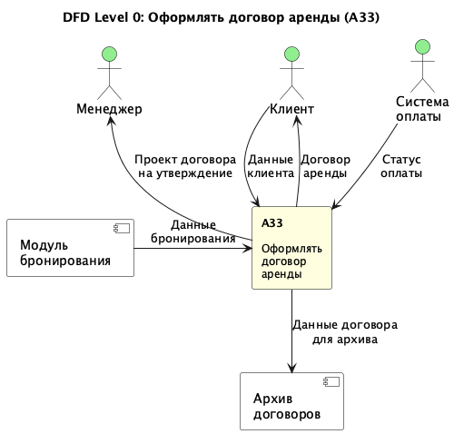
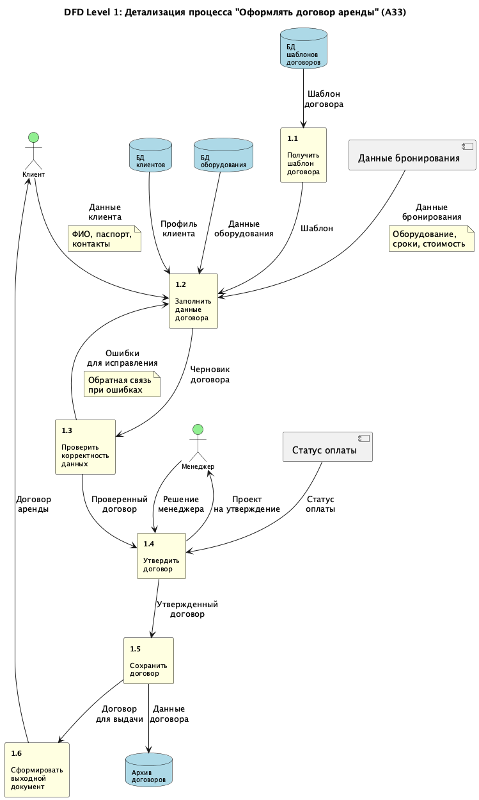

# Практическая работа № 6. Проектирование модели потоков данных в нотации DFD

**Выполнил:** Грибков Александр
**Тема проекта:** SportRent - Система управления арендой спортивного оборудования

---

## Цель работы

Целью данной практической работы является продолжение создания описания проектируемой информационной системы SportRent, которое заключается в выборе наиболее значимого функционального блока нижнего уровня декомпозиции из предыдущей практической работы и проектировании его декомпозиции в нотации DFD (диаграмма потоков данных), а также подготовка к выполнению диаграммы сущность-связь проектирования баз данных ИС.

---

## Теоретическая часть

### Диаграммы потоков данных (DFD)

**DFD (Data Flow Diagram)** - это графическая нотация для описания потоков данных в информационной системе. Диаграммы потоков данных показывают, как данные перемещаются между процессами, хранилищами данных и внешними сущностями.

### Нотация Гейна-Сарсона

В данной работе используется синтаксис DFD по Гейну-Сарсону, который включает следующие основные элементы:

| Элемент | Обозначение | Описание |
|---------|-------------|----------|
| **Процесс** | Прямоугольник с закругленными углами | Функциональный блок, преобразующий входные данные в выходные. Обозначается номером и названием. |
| **Поток данных** | Стрелка | Показывает направление движения данных между элементами. Может быть двунаправленным. |
| **Хранилище данных** | Прямоугольник с открытой левой стороной | Представляет базы данных, файлы, таблицы, где данные хранятся постоянно или временно. |
| **Внешняя сущность** | Прямоугольник | Объекты, находящиеся вне границ системы, но взаимодействующие с ней (пользователи, внешние системы). |

### Правила построения DFD

1. **У каждого процесса должен быть минимум один входящий и один выходящий поток данных**
2. Процессы активно взаимодействуют друг с другом либо напрямую, либо через хранилища данных
3. Стрелки (потоки данных) равнозначны и могут присоединяться к любой стороне процессов
4. На одном уровне декомпозиции рекомендуется размещать от 3 до 7 процессов
5. Внешние сущности показывают, кто получает или передает информацию в систему

### Уровни декомпозиции DFD

- **Level 0 (Контекстная диаграмма)** - показывает систему или процесс как единое целое с внешними взаимодействиями
- **Level 1** - детализация процесса Level 0 на подпроцессы с показом внутренних потоков данных
- **Level 2 и далее** - дальнейшая детализация отдельных процессов при необходимости

---

## Практическая часть

### Выбор функционального блока для декомпозиции

В предыдущей лабораторной работе № 5 была создана IDEF0-диаграмма системы SportRent с двумя уровнями декомпозиции:

**Уровень A0** включал 6 основных функциональных блоков:
- A1: Управлять аутентификацией и профилями клиентов
- A2: Управлять каталогом оборудования
- A3: Обрабатывать бронирование и заказы
- A4: Обрабатывать платежи
- A5: Управлять складскими операциями
- A6: Формировать отчетность

**Уровень A3** (декомпозиция блока "Обрабатывать бронирование и заказы") включал 5 подпроцессов:
- A31: Проверять доступность оборудования
- A32: Формировать бронирование
- **A33: Оформлять договор аренды** ← выбран для DFD-декомпозиции
- A34: Передавать заказ на оплату
- A35: Подтверждать заказ

### Обоснование выбора блока A33

Блок **A33 "Оформлять договор аренды"** выбран для декомпозиции в нотации DFD по следующим причинам:

1. **Сложность процесса** - оформление договора включает множество этапов: получение шаблона, заполнение данных, проверку, утверждение, сохранение
2. **Множественные потоки данных** - процесс работает с данными клиентов, оборудования, бронирований, платежей
3. **Активное взаимодействие с хранилищами** - требуется обращение к базам данных шаблонов, клиентов, оборудования, архиву договоров
4. **Наличие внешних сущностей** - в процессе участвуют клиенты, менеджеры, система оплаты
5. **Обратные связи** - при обнаружении ошибок требуется возврат на этап исправления данных
6. **Критичность для бизнеса** - договор аренды является основным юридическим документом, регламентирующим отношения между системой и клиентом

### DFD Level 0: Контекстная диаграмма

**Описание контекстной диаграммы:**

Контекстная диаграмма Level 0 показывает процесс "Оформлять договор аренды" (A33) как единое целое с его внешними взаимодействиями.

**Входящие потоки данных:**
1. **Данные клиента** (от Клиента) - ФИО, паспортные данные, контактная информация
2. **Данные бронирования** (от модуля бронирования) - информация об оборудовании, сроках аренды, стоимости
3. **Статус оплаты** (от Системы оплаты) - подтверждение успешной оплаты или авансового платежа

**Исходящие потоки данных:**
1. **Проект договора на утверждение** (к Менеджеру) - сформированный договор для проверки и утверждения
2. **Договор аренды** (к Клиенту) - окончательный подписанный договор
3. **Данные договора для архива** (к Архиву договоров) - сохранение информации о договоре в системе

**Внешние сущности:**
- **Клиент** - физическое или юридическое лицо, арендующее оборудование
- **Менеджер** - сотрудник, утверждающий договоры аренды
- **Система оплаты** - внешний модуль обработки платежей
- **Модуль бронирования** - система, формирующая предварительные бронирования
- **Архив договоров** - хранилище всех заключенных договоров

### DFD Level 1: Детализация процесса

**Описание диаграммы Level 1:**

Диаграмма Level 1 детализирует процесс "Оформлять договор аренды" на шесть взаимосвязанных подпроцессов.

#### Подпроцесс 1.1: Получить шаблон договора

**Назначение:** Получение актуального шаблона договора аренды из базы данных.

**Входящие потоки:**
- Запрос на получение шаблона (от процесса или автоматически при инициализации)

**Исходящие потоки:**
- Шаблон договора → Процесс 1.2

**Хранилища данных:**
- БД шаблонов договоров (чтение)

**Описание работы:**
Система обращается к базе данных шаблонов и извлекает актуальный шаблон договора аренды, соответствующий типу оборудования и условиям аренды. Шаблон содержит структуру документа, юридические формулировки, поля для заполнения.

#### Подпроцесс 1.2: Заполнить данные договора

**Назначение:** Автоматическое заполнение шаблона договора данными о клиенте, оборудовании и условиях аренды.

**Входящие потоки:**
- Шаблон договора ← Процесс 1.1
- Данные клиента ← Внешняя сущность "Клиент"
- Профиль клиента ← БД клиентов
- Данные бронирования ← Внешний источник
- Данные оборудования ← БД оборудования

**Исходящие потоки:**
- Черновик договора → Процесс 1.3

**Хранилища данных:**
- БД клиентов (чтение)
- БД оборудования (чтение)

**Описание работы:**
На основе полученного шаблона система заполняет все необходимые поля:
- Информация о клиенте (ФИО, паспортные данные, адрес, контакты)
- Информация об оборудовании (наименование, серийный номер, техническое состояние)
- Условия аренды (срок, стоимость, условия возврата, штрафы)
- Дата и номер договора
- Дополнительные условия (страховка, залог)

#### Подпроцесс 1.3: Проверить корректность данных

**Назначение:** Автоматическая и ручная проверка корректности заполненного договора.

**Входящие потоки:**
- Черновик договора ← Процесс 1.2

**Исходящие потоки:**
- Проверенный договор → Процесс 1.4 (если проверка пройдена)
- Ошибки для исправления → Процесс 1.2 (если обнаружены ошибки)

**Описание работы:**
Система выполняет валидацию данных:
- Проверка заполненности всех обязательных полей
- Проверка корректности паспортных данных
- Проверка соответствия сроков аренды доступности оборудования
- Проверка правильности расчета стоимости
- Проверка юридической корректности документа

При обнаружении ошибок система отправляет информацию об ошибках обратно в Процесс 1.2 для исправления (обратная связь).

#### Подпроцесс 1.4: Утвердить договор

**Назначение:** Утверждение договора менеджером и учет статуса оплаты.

**Входящие потоки:**
- Проверенный договор ← Процесс 1.3
- Статус оплаты ← Внешняя сущность "Система оплаты"
- Решение менеджера ← Внешняя сущность "Менеджер"

**Исходящие потоки:**
- Проект на утверждение → Внешняя сущность "Менеджер"
- Утвержденный договор → Процесс 1.5

**Описание работы:**
После успешной проверки договор направляется менеджеру для финального утверждения. Менеджер проверяет:
- Соответствие условий договора политике компании
- Особые условия для данного клиента (скидки, льготы)
- Наличие подтверждения оплаты или внесения залога

После утверждения менеджером договор получает статус "Утвержден" и передается на сохранение.

#### Подпроцесс 1.5: Сохранить договор

**Назначение:** Сохранение утвержденного договора в архиве и фиксация в системе.

**Входящие потоки:**
- Утвержденный договор ← Процесс 1.4

**Исходящие потоки:**
- Данные договора → Хранилище "Архив договоров"
- Договор для выдачи → Процесс 1.6

**Хранилища данных:**
- Архив договоров (запись)

**Описание работы:**
Система сохраняет договор в электронном архиве:
- Присвоение уникального номера договора
- Сохранение в формате PDF с электронной подписью
- Индексация для быстрого поиска
- Создание записи в журнале договоров
- Связывание с профилем клиента и записью о бронировании

#### Подпроцесс 1.6: Сформировать выходной документ

**Назначение:** Формирование финального документа для выдачи клиенту.

**Входящие потоки:**
- Договор для выдачи ← Процесс 1.5

**Исходящие потоки:**
- Договор аренды → Внешняя сущность "Клиент"

**Описание работы:**
Система формирует финальную версию договора для клиента:
- Генерация PDF-документа с водяными знаками
- Добавление QR-кода для проверки подлинности
- Формирование печатной версии
- Отправка электронной копии на email клиента
- Подготовка к выдаче бумажной версии в пункте аренды

### Описание хранилищ данных

1. **БД шаблонов договоров**
   - Содержит актуальные шаблоны договоров различных типов
   - Включает юридические формулировки, структуру документа
   - Регулярно обновляется юридическим отделом

2. **БД клиентов**
   - Хранит профили клиентов с персональными данными
   - Содержит историю взаимодействия с системой
   - Используется для автозаполнения данных

3. **БД оборудования**
   - Каталог всего доступного оборудования
   - Технические характеристики, стоимость, состояние
   - Статус доступности для аренды

4. **Архив договоров**
   - Централизованное хранилище всех заключенных договоров
   - Используется для отчетности, аудита, разрешения споров
   - Обеспечивает юридическую защиту компании

### Описание внешних сущностей

1. **Клиент**
   - Физическое или юридическое лицо, арендующее оборудование
   - Предоставляет персональные данные
   - Получает договор для подписания

2. **Менеджер**
   - Сотрудник компании, ответственный за утверждение договоров
   - Проверяет корректность условий
   - Принимает финальное решение об утверждении

3. **Система оплаты**
   - Внешний модуль обработки платежей
   - Предоставляет информацию о статусе оплаты
   - Интегрируется с банковскими системами

---

## Глоссарий

**DFD (Data Flow Diagram)** - диаграмма потоков данных, графическая нотация для описания движения данных в информационной системе.

**Нотация Гейна-Сарсона** - один из двух основных синтаксисов DFD, использующий прямоугольники с закругленными углами для процессов.

**Процесс** - функциональный блок, преобразующий входные данные в выходные.

**Поток данных** - передача информации между элементами диаграммы, изображается стрелкой.

**Хранилище данных** - место постоянного или временного хранения данных (база данных, файл, таблица).

**Внешняя сущность** - объект, находящийся за пределами моделируемой системы, но взаимодействующий с ней.

**Декомпозиция** - разбиение сложного процесса на более простые составные части.

**Level 0** - контекстная диаграмма, показывающая систему как единое целое.

**Level 1** - первый уровень детализации, показывающий внутренние процессы системы.

**Обратная связь** - возврат данных к предыдущему процессу для исправления или повторной обработки.

---

## Выводы

В ходе выполнения практической работы № 6 была создана двухуровневая модель потоков данных в нотации DFD для процесса "Оформлять договор аренды" системы SportRent.

**Основные результаты работы:**

1. **Выбран наиболее подходящий блок для декомпозиции** - процесс A33 "Оформлять договор аренды" из IDEF0-модели, разработанной в предыдущей лабораторной работе.

2. **Разработана контекстная диаграмма (Level 0)**, показывающая процесс оформления договора как единое целое с определением всех внешних взаимодействий, входящих и исходящих потоков данных.

3. **Создана детализированная диаграмма (Level 1)**, декомпозирующая процесс на 6 взаимосвязанных подпроцессов:
   - Получение шаблона договора
   - Заполнение данных договора
   - Проверка корректности данных
   - Утверждение договора менеджером
   - Сохранение в архив
   - Формирование выходного документа

4. **Идентифицированы все ключевые элементы DFD:**
   - 6 процессов (подпроцессы Level 1)
   - 4 хранилища данных (БД шаблонов, БД клиентов, БД оборудования, Архив)
   - 3 внешние сущности (Клиент, Менеджер, Система оплаты)
   - Множественные потоки данных между элементами
   - Обратная связь для исправления ошибок

5. **Применена нотация Гейна-Сарсона**, соответствующая требованиям методологии DFD и рекомендациям методических материалов.

**Практическая значимость:**

Разработанная DFD-модель:
- Детально описывает движение данных в процессе оформления договора аренды
- Выявляет все точки взаимодействия с базами данных и внешними системами
- Показывает последовательность обработки информации
- Помогает идентифицировать потенциальные узкие места и точки контроля
- Служит основой для проектирования базы данных (следующая лабораторная работа)
- Используется для разработки технического задания на программирование

**Отличия DFD от IDEF0:**

В ходе работы стало очевидным различие между нотациями IDEF0 и DFD:
- IDEF0 фокусируется на функциях и управлении (вход, выход, управление, механизм)
- DFD акцентирует внимание на потоках данных и их преобразовании
- DFD явно показывает хранилища данных, что критично для проектирования БД
- DFD удобнее для описания информационных систем с активной работой с базами данных

**Направления дальнейшей работы:**

1. На основе разработанных DFD-диаграмм в следующей лабораторной работе будет спроектирована ER-диаграмма (Entity-Relationship) базы данных системы SportRent.

2. Требуется рассмотреть возможность дальнейшей детализации подпроцесса 1.2 "Заполнить данные договора" на Level 2 для более подробного описания логики заполнения различных разделов договора.

3. Рекомендуется провести валидацию разработанных диаграмм с бизнес-аналитиками и юридическим отделом для уточнения последовательности процессов и требований к данным.

---

## TODO

⚠️ **ВАЖНО:** Данные диаграммы созданы в PlantUML для удобства версионного контроля.

**Необходимо переработать диаграммы в программе Ramus Educational:**
- Создать проект в Ramus Educational
- Перенести обе диаграммы (Level 0 и Level 1) в нотацию DFD Гейна-Сарсона
- Настроить классификаторы для внешних сущностей и хранилищ данных
- Экспортировать диаграммы в высоком разрешении
- Заменить PNG-файлы в директории diagrams/

**Преимущества Ramus Educational:**
- Полная поддержка нотации DFD по Гейну-Сарсону
- Автоматическая проверка корректности диаграмм
- Встроенная система классификаторов для DFD-объектов
- Соответствие требованиям методических материалов

---

**Дата выполнения:** 2 ноября 2025 г.
**Статус:** Черновик отчета готов, требуется финализация в формате Pandoc и конвертация в DOCX
