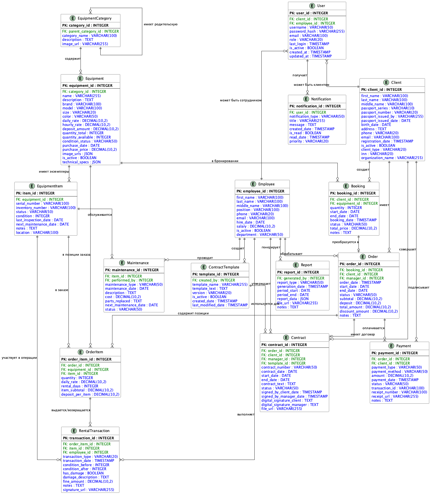

# Практическая работа № 7. Проектирование структуры данных информационной системы и создание ER-диаграммы

## Цель работы

Создание модели «сущность-связь» в нотации ERD для информационной системы SportRent (система управления прокатом спортивного оборудования).

## 1. План разработки модели базы данных

### 1.1. Этапы проектирования БД

1. **Анализ предметной области** (выполнено в Lab 1-5)
   - Изучение функциональных требований
   - Анализ бизнес-процессов системы
   - Выявление основных участников и их ролей

2. **Анализ функциональной модели** (на основе IDEF0 из Lab 3-4)
   - Изучение контекстной диаграммы A0
   - Анализ декомпозиции функций
   - Выявление входных и выходных данных

3. **Анализ потоков данных** (на основе DFD из Lab 5)
   - Изучение диаграмм потоков данных Level 0 и Level 1
   - Определение хранилищ данных
   - Анализ процессов обработки информации

4. **Выявление сущностей и атрибутов**
   - Определение основных информационных объектов
   - Выделение атрибутов каждой сущности
   - Определение первичных ключей

5. **Установление связей между сущностями**
   - Определение типов связей (1:1, 1:N, M:N)
   - Разрешение связей многие-ко-многим
   - Установление внешних ключей

6. **Построение концептуальной ER-диаграммы**
   - Создание визуального представления модели
   - Документирование всех сущностей и связей

7. **Нормализация структуры БД**
   - Проверка соответствия 1НФ, 2НФ, 3НФ
   - Устранение избыточности данных

8. **Проверка полноты и корректности**
   - Создание типовых SQL-запросов
   - Тестирование модели на реальных сценариях

## 2. Анализ предметной области

### 2.1. Описание системы SportRent

**SportRent** — автоматизированная информационная система управления прокатом спортивного оборудования. Система предназначена для:

- Автоматизации процессов бронирования и аренды
- Ведения каталога спортивного оборудования
- Управления взаимоотношениями с клиентами
- Обработки платежей и формирования договоров
- Учета складских операций
- Формирования отчетности и аналитики

### 2.2. Основные роли пользователей

Из анализа IDEF0-диаграмм (Lab 3-4) выявлены следующие роли:

1. **Клиент (Client)** — конечный пользователь системы, арендующий оборудование
2. **Менеджер (Manager)** — сотрудник, обрабатывающий заказы и утверждающий договоры
3. **Администратор (Administrator)** — системный администратор с полным доступом
4. **Складской персонал (Warehouse Staff)** — сотрудники, выполняющие выдачу и прием оборудования

### 2.3. Основные бизнес-процессы

Из декомпозиции IDEF0 (Lab 4) выделены следующие модули:

- **A1**: Управление аутентификацией и профилями клиентов
- **A2**: Управление каталогом оборудования
- **A3**: Обработка бронирования и заказов
- **A4**: Обработка платежей
- **A5**: Управление складскими операциями
- **A6**: Формирование отчетности

### 2.4. Хранилища данных

Из анализа DFD-диаграмм (Lab 5) выявлены следующие хранилища:

- **БД клиентов (ClientDB)** — персональные данные, история аренды
- **БД оборудования (EquipmentDB)** — каталог, характеристики, доступность
- **БД шаблонов договоров (TemplateDB)** — юридические шаблоны
- **Архив договоров (Archive)** — подписанные договоры с метаданными
- **База знаний (Knowledge Base)** — инструкции, справочная информация

## 3. Выявление сущностей базы данных

### 3.1. Процесс выявления сущностей

Для определения сущностей использовался метод анализа существительных из:
- Описания предметной области
- Функциональной модели IDEF0
- Диаграмм потоков данных DFD
- Хранилищ данных (Data Stores)

### 3.2. Список выявленных сущностей

#### Группа 1: Пользователи и участники системы

1. **Client (Клиент)** — физические и юридические лица, арендующие оборудование
2. **User (Пользователь)** — учетные записи для аутентификации в системе
3. **Employee (Сотрудник)** — персонал компании (менеджеры, администраторы, складские работники)

#### Группа 2: Оборудование и каталог

4. **EquipmentCategory (Категория оборудования)** — иерархическая классификация
5. **Equipment (Оборудование)** — типы оборудования в каталоге
6. **EquipmentItem (Единица оборудования)** — конкретные экземпляры с серийными номерами

#### Группа 3: Бронирование и заказы

7. **Booking (Бронирование)** — предварительные резервации оборудования
8. **Order (Заказ)** — подтвержденные заказы на аренду
9. **OrderItem (Позиция заказа)** — конкретные единицы оборудования в заказе

#### Группа 4: Договоры

10. **ContractTemplate (Шаблон договора)** — юридические шаблоны для генерации договоров
11. **Contract (Договор)** — юридические договоры аренды

#### Группа 5: Финансы

12. **Payment (Платеж)** — информация о платежах и транзакциях

#### Группа 6: Складские операции

13. **RentalTransaction (Выдача/Возврат)** — операции выдачи и приема оборудования
14. **Maintenance (Техническое обслуживание)** — ремонт и профилактика оборудования

#### Группа 7: Система и отчетность

15. **Report (Отчет)** — сохраненные отчеты и аналитика
16. **Notification (Уведомление)** — системные уведомления для пользователей

## 4. Описание сущностей и их атрибутов

### 4.1. Client (Клиент)

**Назначение:** Хранение информации о клиентах системы — как физических, так и юридических лиц.

**Атрибуты:**

| Атрибут | Тип данных | Описание |
|---------|------------|----------|
| client_id | INTEGER | **PK**. Уникальный идентификатор клиента |
| first_name | VARCHAR(100) | Имя |
| last_name | VARCHAR(100) | Фамилия |
| middle_name | VARCHAR(100) | Отчество |
| passport_series | VARCHAR(10) | Серия паспорта |
| passport_number | VARCHAR(20) | Номер паспорта |
| passport_issued_by | VARCHAR(255) | Кем выдан паспорт |
| passport_issued_date | DATE | Дата выдачи паспорта |
| birth_date | DATE | Дата рождения |
| address | TEXT | Адрес регистрации |
| phone | VARCHAR(20) | Телефон (уникальный) |
| email | VARCHAR(100) | Email (уникальный) |
| registration_date | TIMESTAMP | Дата регистрации в системе |
| is_active | BOOLEAN | Активность учетной записи |
| client_type | VARCHAR(20) | Тип: Individual / Organization |
| inn | VARCHAR(20) | ИНН (для юр. лиц) |
| organization_name | VARCHAR(255) | Название организации |

**Источник:** Модуль A1 (IDEF0), БД клиентов (DFD)

---

### 4.2. User (Пользователь)

**Назначение:** Учетные записи для аутентификации и авторизации в системе.

**Атрибуты:**

| Атрибут | Тип данных | Описание |
|---------|------------|----------|
| user_id | INTEGER | **PK**. Уникальный идентификатор пользователя |
| client_id | INTEGER | **FK → Client**. Связь с клиентом (nullable) |
| employee_id | INTEGER | **FK → Employee**. Связь с сотрудником (nullable) |
| username | VARCHAR(50) | Логин (уникальный) |
| password_hash | VARCHAR(255) | Хеш пароля (bcrypt/argon2) |
| email | VARCHAR(100) | Email для входа |
| role | VARCHAR(20) | Роль: Client / Manager / Admin / Warehouse |
| last_login | TIMESTAMP | Дата и время последнего входа |
| is_active | BOOLEAN | Активность учетной записи |
| created_at | TIMESTAMP | Дата создания |
| updated_at | TIMESTAMP | Дата последнего обновления |

**Источник:** Модуль A1 (IDEF0)

**Примечание:** Один пользователь может быть либо клиентом, либо сотрудником. Один из FK (client_id или employee_id) должен быть NULL.

---

### 4.3. Employee (Сотрудник)

**Назначение:** Информация о сотрудниках компании.

**Атрибуты:**

| Атрибут | Тип данных | Описание |
|---------|------------|----------|
| employee_id | INTEGER | **PK**. Уникальный идентификатор |
| first_name | VARCHAR(100) | Имя |
| last_name | VARCHAR(100) | Фамилия |
| middle_name | VARCHAR(100) | Отчество |
| position | VARCHAR(100) | Должность |
| phone | VARCHAR(20) | Телефон |
| email | VARCHAR(100) | Email |
| hire_date | DATE | Дата приема на работу |
| salary | DECIMAL(10,2) | Зарплата |
| is_active | BOOLEAN | Активность (работает/уволен) |
| department | VARCHAR(50) | Отдел: Manager / Warehouse / Admin |

**Источник:** Механизмы M2, M3, M4 (IDEF0)

---

### 4.4. EquipmentCategory (Категория оборудования)

**Назначение:** Иерархическая классификация спортивного оборудования.

**Атрибуты:**

| Атрибут | Тип данных | Описание |
|---------|------------|----------|
| category_id | INTEGER | **PK**. Уникальный идентификатор категории |
| parent_category_id | INTEGER | **FK → EquipmentCategory**. Родительская категория |
| category_name | VARCHAR(100) | Название категории |
| description | TEXT | Описание категории |
| image_url | VARCHAR(255) | Ссылка на изображение категории |

**Примеры категорий:**
- Велосипеды → Горные велосипеды, Шоссейные велосипеды
- Лыжи и сноуборды → Горные лыжи, Беговые лыжи, Сноуборды
- Водный спорт → Каяки, SUP-борды

**Источник:** Модуль A2 (IDEF0)

---

### 4.5. Equipment (Оборудование)

**Назначение:** Каталог типов спортивного оборудования, доступного для аренды.

**Атрибуты:**

| Атрибут | Тип данных | Описание |
|---------|------------|----------|
| equipment_id | INTEGER | **PK**. Уникальный идентификатор |
| category_id | INTEGER | **FK → EquipmentCategory**. Категория |
| name | VARCHAR(255) | Название оборудования |
| description | TEXT | Подробное описание |
| brand | VARCHAR(100) | Бренд/Производитель |
| model | VARCHAR(100) | Модель |
| size | VARCHAR(20) | Размер (S/M/L или числовой) |
| color | VARCHAR(50) | Цвет |
| daily_rate | DECIMAL(10,2) | Стоимость аренды за день (руб.) |
| hourly_rate | DECIMAL(10,2) | Стоимость аренды за час (руб.) |
| deposit_amount | DECIMAL(10,2) | Сумма залога (руб.) |
| quantity_total | INTEGER | Общее количество единиц |
| quantity_available | INTEGER | Доступное количество |
| condition_status | VARCHAR(50) | Состояние: New / Good / Fair / Repair |
| purchase_date | DATE | Дата закупки |
| purchase_price | DECIMAL(10,2) | Цена закупки |
| image_urls | JSON | Массив ссылок на фотографии |
| is_active | BOOLEAN | В каталоге / снято с продажи |
| technical_specs | JSON | Технические характеристики (гибкая структура) |

**Источник:** Модуль A2 (IDEF0), БД оборудования (DFD)

---

### 4.6. EquipmentItem (Единица оборудования)

**Назначение:** Конкретные экземпляры оборудования с уникальными идентификаторами для складского учета.

**Атрибуты:**

| Атрибут | Тип данных | Описание |
|---------|------------|----------|
| item_id | INTEGER | **PK**. Уникальный идентификатор единицы |
| equipment_id | INTEGER | **FK → Equipment**. Тип оборудования |
| serial_number | VARCHAR(100) | Серийный номер (уникальный) |
| inventory_number | VARCHAR(100) | Инвентарный номер |
| status | VARCHAR(50) | Available / Rented / Maintenance / Broken / Lost |
| condition | INTEGER | Оценка состояния от 1 до 10 |
| last_inspection_date | DATE | Дата последней проверки |
| next_maintenance_date | DATE | Дата следующего ТО |
| notes | TEXT | Примечания |
| location | VARCHAR(100) | Местоположение на складе |

**Источник:** Модуль A5 (IDEF0), складской учет

---

### 4.7. Booking (Бронирование)

**Назначение:** Предварительные резервации оборудования клиентами.

**Атрибуты:**

| Атрибут | Тип данных | Описание |
|---------|------------|----------|
| booking_id | INTEGER | **PK**. Уникальный идентификатор бронирования |
| client_id | INTEGER | **FK → Client**. Клиент |
| equipment_id | INTEGER | **FK → Equipment**. Тип оборудования |
| quantity | INTEGER | Количество единиц |
| start_date | DATE | Дата начала аренды |
| end_date | DATE | Дата окончания аренды |
| booking_date | TIMESTAMP | Дата создания бронирования |
| status | VARCHAR(50) | Pending / Confirmed / Cancelled / Converted |
| total_price | DECIMAL(10,2) | Предварительная стоимость |
| notes | TEXT | Комментарий клиента |

**Бизнес-правило:** end_date > start_date, quantity <= equipment.quantity_available

**Источник:** Модуль A3, подпроцессы A31-A32 (IDEF0)

---

### 4.8. Order (Заказ)

**Назначение:** Подтвержденные заказы на аренду оборудования.

**Атрибуты:**

| Атрибут | Тип данных | Описание |
|---------|------------|----------|
| order_id | INTEGER | **PK**. Уникальный идентификатор заказа |
| booking_id | INTEGER | **FK → Booking**. Связь с бронированием (nullable) |
| client_id | INTEGER | **FK → Client**. Клиент |
| manager_id | INTEGER | **FK → Employee**. Менеджер |
| order_date | TIMESTAMP | Дата создания заказа |
| start_date | DATE | Фактическая дата начала |
| end_date | DATE | Фактическая дата окончания |
| status | VARCHAR(50) | Created / Contract_Signed / Active / Completed / Cancelled |
| subtotal | DECIMAL(10,2) | Сумма за аренду |
| deposit | DECIMAL(10,2) | Сумма залога |
| total_amount | DECIMAL(10,2) | Итого к оплате |
| discount_amount | DECIMAL(10,2) | Сумма скидки |
| notes | TEXT | Примечания менеджера |

**Бизнес-правило:** total_amount = subtotal + deposit - discount_amount

**Источник:** Модуль A3, подпроцессы A33-A35 (IDEF0), DFD Level 0

---

### 4.9. OrderItem (Позиция заказа)

**Назначение:** Детализация заказа с указанием конкретных единиц оборудования.

**Атрибуты:**

| Атрибут | Тип данных | Описание |
|---------|------------|----------|
| order_item_id | INTEGER | **PK**. Уникальный идентификатор |
| order_id | INTEGER | **FK → Order**. Заказ |
| equipment_id | INTEGER | **FK → Equipment**. Тип оборудования |
| item_id | INTEGER | **FK → EquipmentItem**. Конкретная единица |
| quantity | INTEGER | Количество (обычно 1) |
| daily_rate | DECIMAL(10,2) | Ставка на момент заказа |
| rental_days | INTEGER | Количество дней аренды |
| item_subtotal | DECIMAL(10,2) | Стоимость позиции |
| deposit_per_item | DECIMAL(10,2) | Залог за единицу |

**Бизнес-правило:** item_subtotal = daily_rate × rental_days × quantity

**Источник:** Модуль A3, A5 (IDEF0)

**Примечание:** Таблица разрешает связь многие-ко-многим между Order и EquipmentItem.

---

### 4.10. ContractTemplate (Шаблон договора)

**Назначение:** Юридические шаблоны для автоматической генерации договоров аренды.

**Атрибуты:**

| Атрибут | Тип данных | Описание |
|---------|------------|----------|
| template_id | INTEGER | **PK**. Уникальный идентификатор |
| created_by | INTEGER | **FK → Employee**. Кто создал шаблон |
| template_name | VARCHAR(255) | Название шаблона |
| template_text | TEXT | Текст с переменными {client_name}, {equipment} |
| version | VARCHAR(20) | Версия шаблона (1.0, 2.0, ...) |
| is_active | BOOLEAN | Используется / архивный |
| created_date | TIMESTAMP | Дата создания |
| last_modified_date | TIMESTAMP | Дата последнего изменения |

**Источник:** БД шаблонов договоров (DFD, процесс 1.1)

---

### 4.11. Contract (Договор)

**Назначение:** Юридические договоры аренды между клиентом и компанией.

**Атрибуты:**

| Атрибут | Тип данных | Описание |
|---------|------------|----------|
| contract_id | INTEGER | **PK**. Уникальный идентификатор договора |
| order_id | INTEGER | **FK → Order**. Связанный заказ |
| client_id | INTEGER | **FK → Client**. Клиент |
| manager_id | INTEGER | **FK → Employee**. Менеджер, утвердивший договор |
| template_id | INTEGER | **FK → ContractTemplate**. Использованный шаблон |
| contract_number | VARCHAR(50) | Номер договора (уникальный) |
| contract_date | DATE | Дата заключения |
| start_date | DATE | Дата начала действия |
| end_date | DATE | Дата окончания действия |
| contract_text | TEXT | Полный текст договора |
| status | VARCHAR(50) | Draft / Pending / Approved / Signed / Cancelled |
| signed_by_client_date | TIMESTAMP | Дата подписания клиентом |
| signed_by_manager_date | TIMESTAMP | Дата подписания менеджером |
| digital_signature_client | TEXT | ЭЦП клиента |
| digital_signature_manager | TEXT | ЭЦП менеджера |
| file_url | VARCHAR(255) | Ссылка на PDF-файл |

**Источник:** Процесс A33 (IDEF0), DFD Level 1 (процессы 1.1-1.6), Архив договоров

---

### 4.12. Payment (Платеж)

**Назначение:** Информация о платежах и финансовых транзакциях.

**Атрибуты:**

| Атрибут | Тип данных | Описание |
|---------|------------|----------|
| payment_id | INTEGER | **PK**. Уникальный идентификатор платежа |
| order_id | INTEGER | **FK → Order**. Связанный заказ |
| client_id | INTEGER | **FK → Client**. Клиент |
| payment_type | VARCHAR(50) | Rental / Deposit / Fine / Refund |
| payment_method | VARCHAR(50) | Card / Cash / Online / Bank_Transfer |
| amount | DECIMAL(10,2) | Сумма платежа |
| payment_date | TIMESTAMP | Дата и время платежа |
| status | VARCHAR(50) | Pending / Completed / Failed / Refunded |
| transaction_id | VARCHAR(100) | ID транзакции платежной системы |
| receipt_number | VARCHAR(100) | Номер квитанции |
| receipt_url | VARCHAR(255) | Ссылка на квитанцию (PDF) |
| notes | TEXT | Примечания |

**Источник:** Модуль A4 (IDEF0), платежная система (M6)

---

### 4.13. RentalTransaction (Выдача/Возврат)

**Назначение:** Учет операций выдачи оборудования клиентам и приема при возврате.

**Атрибуты:**

| Атрибут | Тип данных | Описание |
|---------|------------|----------|
| transaction_id | INTEGER | **PK**. Уникальный идентификатор |
| order_item_id | INTEGER | **FK → OrderItem**. Позиция заказа |
| item_id | INTEGER | **FK → EquipmentItem**. Единица оборудования |
| employee_id | INTEGER | **FK → Employee**. Сотрудник склада |
| transaction_type | VARCHAR(20) | Issue (выдача) / Return (возврат) |
| transaction_date | TIMESTAMP | Дата и время операции |
| condition_before | INTEGER | Состояние до (1-10) |
| condition_after | INTEGER | Состояние после (1-10) |
| has_damage | BOOLEAN | Наличие повреждений |
| damage_description | TEXT | Описание повреждений |
| fine_amount | DECIMAL(10,2) | Сумма штрафа за повреждения |
| notes | TEXT | Примечания |
| signature_url | VARCHAR(255) | Ссылка на подпись клиента |

**Источник:** Модуль A5 (IDEF0), акты приема-передачи

---

### 4.14. Maintenance (Техническое обслуживание)

**Назначение:** История технического обслуживания и ремонта оборудования.

**Атрибуты:**

| Атрибут | Тип данных | Описание |
|---------|------------|----------|
| maintenance_id | INTEGER | **PK**. Уникальный идентификатор |
| item_id | INTEGER | **FK → EquipmentItem**. Единица оборудования |
| performed_by | INTEGER | **FK → Employee**. Кто выполнил |
| maintenance_type | VARCHAR(50) | Routine / Repair / Inspection / Cleaning |
| maintenance_date | DATE | Дата обслуживания |
| description | TEXT | Описание выполненных работ |
| cost | DECIMAL(10,2) | Стоимость обслуживания/ремонта |
| parts_replaced | TEXT | Замененные детали и запчасти |
| next_maintenance_date | DATE | Дата следующего планового ТО |
| status | VARCHAR(50) | Scheduled / In_Progress / Completed / Cancelled |

**Источник:** Модуль A5 (IDEF0), складские операции

---

### 4.15. Report (Отчет)

**Назначение:** Сохраненные отчеты и аналитические данные системы.

**Атрибуты:**

| Атрибут | Тип данных | Описание |
|---------|------------|----------|
| report_id | INTEGER | **PK**. Уникальный идентификатор отчета |
| generated_by | INTEGER | **FK → Employee**. Кто сгенерировал |
| report_type | VARCHAR(50) | Sales / Equipment_Usage / Client_Activity / Financial / Inventory |
| generation_date | TIMESTAMP | Дата генерации |
| period_start | DATE | Начало отчетного периода |
| period_end | DATE | Конец отчетного периода |
| report_data | JSON | Данные отчета в структурированном виде |
| file_url | VARCHAR(255) | Ссылка на файл (PDF/Excel) |
| notes | TEXT | Примечания |

**Источник:** Модуль A6 (IDEF0)

---

### 4.16. Notification (Уведомление)

**Назначение:** Системные уведомления для пользователей системы.

**Атрибуты:**

| Атрибут | Тип данных | Описание |
|---------|------------|----------|
| notification_id | INTEGER | **PK**. Уникальный идентификатор |
| user_id | INTEGER | **FK → User**. Получатель уведомления |
| notification_type | VARCHAR(50) | Booking_Confirmation / Payment_Reminder / Return_Reminder / Maintenance_Alert |
| title | VARCHAR(255) | Заголовок уведомления |
| message | TEXT | Текст сообщения |
| created_date | TIMESTAMP | Дата создания |
| is_read | BOOLEAN | Прочитано / не прочитано |
| read_date | TIMESTAMP | Дата прочтения |
| priority | VARCHAR(20) | Low / Normal / High / Urgent |

**Источник:** Различные модули системы

## 5. Описание связей между сущностями

### 5.1. Связи типа "один-ко-многим" (1:N)

| Родительская сущность | Дочерняя сущность | Описание связи | Кардинальность |
|----------------------|-------------------|----------------|----------------|
| Client | Booking | Один клиент создает много бронирований | 1:N |
| Client | Order | Один клиент имеет много заказов | 1:N |
| Client | Contract | Один клиент подписывает много договоров | 1:N |
| Client | Payment | Один клиент совершает много платежей | 1:N |
| Employee | Order | Один менеджер обрабатывает много заказов | 1:N |
| Employee | Contract | Один менеджер утверждает много договоров | 1:N |
| Employee | RentalTransaction | Один сотрудник выполняет много операций | 1:N |
| Employee | Maintenance | Один сотрудник проводит много ТО | 1:N |
| Employee | Report | Один сотрудник генерирует много отчетов | 1:N |
| Employee | ContractTemplate | Один сотрудник создает много шаблонов | 1:N |
| EquipmentCategory | Equipment | Одна категория содержит много типов оборудования | 1:N |
| Equipment | EquipmentItem | Один тип имеет много экземпляров | 1:N |
| Equipment | Booking | Один тип в многих бронированиях | 1:N |
| Equipment | OrderItem | Один тип в многих позициях заказов | 1:N |
| EquipmentItem | OrderItem | Одна единица в многих заказах (последовательно) | 1:N |
| EquipmentItem | RentalTransaction | Одна единица в многих операциях выдачи/возврата | 1:N |
| EquipmentItem | Maintenance | Одна единица имеет много записей ТО | 1:N |
| Order | OrderItem | Один заказ содержит много позиций | 1:N |
| Order | Payment | Один заказ имеет много платежей | 1:N |
| OrderItem | RentalTransaction | Одна позиция в многих операциях | 1:N |
| ContractTemplate | Contract | Один шаблон используется для многих договоров | 1:N |
| User | Notification | Один пользователь получает много уведомлений | 1:N |

### 5.2. Связи типа "один-к-одному" (1:1)

| Сущность 1 | Сущность 2 | Описание связи | Опциональность |
|-----------|-----------|----------------|----------------|
| User | Client | Учетная запись может принадлежать клиенту | Optional (0..1:1) |
| User | Employee | Учетная запись может принадлежать сотруднику | Optional (0..1:1) |
| Booking | Order | Бронирование может быть преобразовано в заказ | Optional (1:0..1) |
| Order | Contract | Заказ может иметь один договор | Optional (1:0..1) |

**Примечание:** У User либо заполнен client_id, либо employee_id (взаимоисключающие FK).

### 5.3. Рекурсивные связи

| Сущность | Описание связи | Тип |
|----------|----------------|-----|
| EquipmentCategory → EquipmentCategory | Иерархия категорий (parent_category_id) | 1:N |

**Пример:** "Велосипеды" → "Горные велосипеды", "Шоссейные велосипеды"

### 5.4. Связи типа "многие-ко-многим" (M:N)

Все связи многие-ко-многим разрешены через промежуточные таблицы:

| Сущность 1 | Сущность 2 | Промежуточная таблица | Дополнительные атрибуты |
|-----------|-----------|----------------------|------------------------|
| Order | EquipmentItem | OrderItem | quantity, daily_rate, rental_days, subtotal |

**Семантика:** Один заказ может содержать много единиц оборудования, одна единица оборудования может участвовать в разных заказах (в разное время).

## 6. ER-диаграмма



### 6.1. Условные обозначения

- **PK (Primary Key)** — первичный ключ, уникальный идентификатор записи
- **FK (Foreign Key)** — внешний ключ, ссылка на другую таблицу
- **||--o{** — связь "один-ко-многим" (обязательная с одной стороны)
- **}o--||** — связь "многие-к-одному"
- **||--o|** — связь "один-к-одному" (опциональная)
- **}o--||** — связь "опционально многие-к-одному"

### 6.2. Цветовая схема

- Синий цвет — обычные атрибуты (столбцы)
- Жирный шрифт — первичные ключи (PK)
- Зеленый цвет — внешние ключи (FK)

## 7. Проверка корректности с помощью SQL-запросов

### 7.1. Создание таблиц (DDL)

```sql
-- Создание таблицы Client
CREATE TABLE Client (
    client_id SERIAL PRIMARY KEY,
    first_name VARCHAR(100) NOT NULL,
    last_name VARCHAR(100) NOT NULL,
    middle_name VARCHAR(100),
    passport_series VARCHAR(10),
    passport_number VARCHAR(20),
    passport_issued_by VARCHAR(255),
    passport_issued_date DATE,
    birth_date DATE,
    address TEXT,
    phone VARCHAR(20) UNIQUE NOT NULL,
    email VARCHAR(100) UNIQUE NOT NULL,
    registration_date TIMESTAMP DEFAULT CURRENT_TIMESTAMP,
    is_active BOOLEAN DEFAULT TRUE,
    client_type VARCHAR(20) DEFAULT 'Individual',
    inn VARCHAR(20),
    organization_name VARCHAR(255),
    CONSTRAINT check_client_type CHECK (client_type IN ('Individual', 'Organization'))
);

-- Создание таблицы Employee
CREATE TABLE Employee (
    employee_id SERIAL PRIMARY KEY,
    first_name VARCHAR(100) NOT NULL,
    last_name VARCHAR(100) NOT NULL,
    middle_name VARCHAR(100),
    position VARCHAR(100),
    phone VARCHAR(20),
    email VARCHAR(100) UNIQUE,
    hire_date DATE,
    salary DECIMAL(10,2),
    is_active BOOLEAN DEFAULT TRUE,
    department VARCHAR(50),
    CONSTRAINT check_department CHECK (department IN ('Manager', 'Warehouse', 'Admin'))
);

-- Создание таблицы User
CREATE TABLE "User" (
    user_id SERIAL PRIMARY KEY,
    client_id INTEGER REFERENCES Client(client_id) ON DELETE SET NULL,
    employee_id INTEGER REFERENCES Employee(employee_id) ON DELETE SET NULL,
    username VARCHAR(50) UNIQUE NOT NULL,
    password_hash VARCHAR(255) NOT NULL,
    email VARCHAR(100) UNIQUE NOT NULL,
    role VARCHAR(20) NOT NULL,
    last_login TIMESTAMP,
    is_active BOOLEAN DEFAULT TRUE,
    created_at TIMESTAMP DEFAULT CURRENT_TIMESTAMP,
    updated_at TIMESTAMP DEFAULT CURRENT_TIMESTAMP,
    CONSTRAINT check_role CHECK (role IN ('Client', 'Manager', 'Admin', 'Warehouse')),
    CONSTRAINT check_user_type CHECK (
        (client_id IS NOT NULL AND employee_id IS NULL) OR
        (client_id IS NULL AND employee_id IS NOT NULL)
    )
);

-- Создание таблицы EquipmentCategory
CREATE TABLE EquipmentCategory (
    category_id SERIAL PRIMARY KEY,
    parent_category_id INTEGER REFERENCES EquipmentCategory(category_id) ON DELETE SET NULL,
    category_name VARCHAR(100) NOT NULL,
    description TEXT,
    image_url VARCHAR(255)
);

-- Создание таблицы Equipment
CREATE TABLE Equipment (
    equipment_id SERIAL PRIMARY KEY,
    category_id INTEGER NOT NULL REFERENCES EquipmentCategory(category_id) ON DELETE CASCADE,
    name VARCHAR(255) NOT NULL,
    description TEXT,
    brand VARCHAR(100),
    model VARCHAR(100),
    size VARCHAR(20),
    color VARCHAR(50),
    daily_rate DECIMAL(10,2) NOT NULL,
    hourly_rate DECIMAL(10,2),
    deposit_amount DECIMAL(10,2) NOT NULL DEFAULT 0,
    quantity_total INTEGER NOT NULL DEFAULT 0,
    quantity_available INTEGER NOT NULL DEFAULT 0,
    condition_status VARCHAR(50) DEFAULT 'Good',
    purchase_date DATE,
    purchase_price DECIMAL(10,2),
    image_urls JSON,
    is_active BOOLEAN DEFAULT TRUE,
    technical_specs JSON,
    CONSTRAINT check_quantity CHECK (quantity_available >= 0 AND quantity_available <= quantity_total),
    CONSTRAINT check_condition CHECK (condition_status IN ('New', 'Good', 'Fair', 'Repair'))
);

-- Создание таблицы EquipmentItem
CREATE TABLE EquipmentItem (
    item_id SERIAL PRIMARY KEY,
    equipment_id INTEGER NOT NULL REFERENCES Equipment(equipment_id) ON DELETE CASCADE,
    serial_number VARCHAR(100) UNIQUE NOT NULL,
    inventory_number VARCHAR(100),
    status VARCHAR(50) DEFAULT 'Available',
    condition INTEGER CHECK (condition >= 1 AND condition <= 10),
    last_inspection_date DATE,
    next_maintenance_date DATE,
    notes TEXT,
    location VARCHAR(100),
    CONSTRAINT check_item_status CHECK (status IN ('Available', 'Rented', 'Maintenance', 'Broken', 'Lost'))
);

-- Остальные таблицы создаются аналогично...
```

### 7.2. Примеры типовых запросов (SELECT)

#### Запрос 1: Получить список всех доступных велосипедов

```sql
SELECT
    e.equipment_id,
    e.name,
    e.brand,
    e.model,
    e.size,
    e.daily_rate,
    e.quantity_available,
    c.category_name
FROM Equipment e
INNER JOIN EquipmentCategory c ON e.category_id = c.category_id
WHERE c.category_name LIKE '%Велосипед%'
  AND e.is_active = TRUE
  AND e.quantity_available > 0
ORDER BY e.daily_rate ASC;
```

**Цель:** Проверить связь Equipment ↔ EquipmentCategory и фильтрацию по доступности.

---

#### Запрос 2: Получить информацию о клиенте и его активных заказах

```sql
SELECT
    c.client_id,
    c.first_name,
    c.last_name,
    c.phone,
    o.order_id,
    o.order_date,
    o.start_date,
    o.end_date,
    o.total_amount,
    o.status
FROM Client c
INNER JOIN "Order" o ON c.client_id = o.client_id
WHERE c.email = 'ivanov@example.com'
  AND o.status IN ('Active', 'Contract_Signed')
ORDER BY o.start_date DESC;
```

**Цель:** Проверить связь Client ↔ Order.

---

#### Запрос 3: Получить детали заказа с информацией об оборудовании

```sql
SELECT
    o.order_id,
    o.order_date,
    c.first_name || ' ' || c.last_name AS client_name,
    e.name AS equipment_name,
    ei.serial_number,
    oi.quantity,
    oi.daily_rate,
    oi.rental_days,
    oi.item_subtotal
FROM "Order" o
INNER JOIN Client c ON o.client_id = c.client_id
INNER JOIN OrderItem oi ON o.order_id = oi.order_id
INNER JOIN Equipment e ON oi.equipment_id = e.equipment_id
INNER JOIN EquipmentItem ei ON oi.item_id = ei.item_id
WHERE o.order_id = 12345;
```

**Цель:** Проверить цепочку связей Order → OrderItem → Equipment и EquipmentItem.

---

#### Запрос 4: Найти все единицы оборудования, требующие технического обслуживания

```sql
SELECT
    ei.item_id,
    ei.serial_number,
    e.name,
    e.brand,
    e.model,
    ei.status,
    ei.next_maintenance_date
FROM EquipmentItem ei
INNER JOIN Equipment e ON ei.equipment_id = e.equipment_id
WHERE ei.next_maintenance_date <= CURRENT_DATE + INTERVAL '7 days'
  AND ei.status NOT IN ('Broken', 'Lost')
ORDER BY ei.next_maintenance_date ASC;
```

**Цель:** Проверить связь EquipmentItem ↔ Equipment и работу с датами.

---

#### Запрос 5: Получить историю платежей клиента

```sql
SELECT
    p.payment_id,
    p.payment_date,
    p.payment_type,
    p.payment_method,
    p.amount,
    p.status,
    o.order_id,
    o.order_date
FROM Payment p
INNER JOIN "Order" o ON p.order_id = o.order_id
INNER JOIN Client c ON p.client_id = c.client_id
WHERE c.client_id = 101
ORDER BY p.payment_date DESC;
```

**Цель:** Проверить связь Payment → Order → Client.

---

#### Запрос 6: Получить информацию о договоре с деталями заказа

```sql
SELECT
    ct.contract_id,
    ct.contract_number,
    ct.contract_date,
    ct.status AS contract_status,
    c.first_name || ' ' || c.last_name AS client_name,
    e.first_name || ' ' || e.last_name AS manager_name,
    o.order_id,
    o.total_amount,
    tmp.template_name
FROM Contract ct
INNER JOIN Client c ON ct.client_id = c.client_id
INNER JOIN Employee e ON ct.manager_id = e.employee_id
INNER JOIN "Order" o ON ct.order_id = o.order_id
INNER JOIN ContractTemplate tmp ON ct.template_id = tmp.template_id
WHERE ct.contract_id = 5001;
```

**Цель:** Проверить связь Contract ↔ Client, Employee, Order, ContractTemplate.

---

#### Запрос 7: Получить статистику использования оборудования

```sql
SELECT
    e.equipment_id,
    e.name,
    e.brand,
    e.model,
    COUNT(DISTINCT o.order_id) AS total_orders,
    SUM(oi.quantity) AS total_rentals,
    SUM(oi.item_subtotal) AS total_revenue
FROM Equipment e
LEFT JOIN OrderItem oi ON e.equipment_id = oi.equipment_id
LEFT JOIN "Order" o ON oi.order_id = o.order_id
WHERE o.status IN ('Completed', 'Active')
GROUP BY e.equipment_id, e.name, e.brand, e.model
ORDER BY total_revenue DESC
LIMIT 10;
```

**Цель:** Проверить агрегацию данных и связь Equipment → OrderItem → Order.

---

#### Запрос 8: Найти все просроченные возвраты оборудования

```sql
SELECT
    o.order_id,
    c.first_name || ' ' || c.last_name AS client_name,
    c.phone,
    e.name AS equipment_name,
    o.end_date AS expected_return_date,
    CURRENT_DATE - o.end_date AS days_overdue
FROM "Order" o
INNER JOIN Client c ON o.client_id = c.client_id
INNER JOIN OrderItem oi ON o.order_id = oi.order_id
INNER JOIN Equipment e ON oi.equipment_id = e.equipment_id
WHERE o.status = 'Active'
  AND o.end_date < CURRENT_DATE
ORDER BY days_overdue DESC;
```

**Цель:** Проверить логику бизнес-процессов и вычисления дат.

---

### 7.3. Примеры запросов на добавление данных (INSERT)

#### Пример 1: Добавление нового клиента

```sql
INSERT INTO Client (
    first_name, last_name, middle_name,
    passport_series, passport_number,
    phone, email, birth_date, address, client_type
) VALUES (
    'Иван', 'Иванов', 'Иванович',
    '1234', '567890',
    '+79001234567', 'ivanov@example.com',
    '1990-05-15', 'г. Москва, ул. Ленина, д. 10', 'Individual'
);
```

#### Пример 2: Создание бронирования

```sql
INSERT INTO Booking (
    client_id, equipment_id, quantity,
    start_date, end_date, total_price, status
) VALUES (
    101, 25, 1,
    '2025-12-15', '2025-12-20',
    2500.00, 'Pending'
);
```

#### Пример 3: Создание заказа из бронирования

```sql
INSERT INTO "Order" (
    booking_id, client_id, manager_id,
    start_date, end_date,
    subtotal, deposit, total_amount, status
) VALUES (
    5001, 101, 10,
    '2025-12-15', '2025-12-20',
    2500.00, 1000.00, 3500.00, 'Created'
);
```

### 7.4. Примеры запросов на обновление (UPDATE)

#### Пример 1: Обновление статуса заказа после подписания договора

```sql
UPDATE "Order"
SET status = 'Contract_Signed',
    updated_at = CURRENT_TIMESTAMP
WHERE order_id = 12345 AND status = 'Created';
```

#### Пример 2: Уменьшение доступного количества при создании заказа

```sql
UPDATE Equipment
SET quantity_available = quantity_available - 1
WHERE equipment_id = 25 AND quantity_available > 0;
```

#### Пример 3: Изменение статуса единицы оборудования при выдаче

```sql
UPDATE EquipmentItem
SET status = 'Rented'
WHERE item_id = 1001 AND status = 'Available';
```

### 7.5. Примеры сложных аналитических запросов

#### Запрос 9: Получить топ-5 самых активных клиентов

```sql
SELECT
    c.client_id,
    c.first_name || ' ' || c.last_name AS client_name,
    c.email,
    COUNT(o.order_id) AS total_orders,
    SUM(o.total_amount) AS total_spent,
    MAX(o.order_date) AS last_order_date
FROM Client c
INNER JOIN "Order" o ON c.client_id = o.client_id
WHERE o.status != 'Cancelled'
GROUP BY c.client_id, c.first_name, c.last_name, c.email
ORDER BY total_spent DESC
LIMIT 5;
```

#### Запрос 10: Получить загруженность оборудования по месяцам

```sql
SELECT
    DATE_TRUNC('month', o.start_date) AS rental_month,
    e.name AS equipment_name,
    COUNT(oi.order_item_id) AS rental_count,
    SUM(oi.item_subtotal) AS revenue
FROM "Order" o
INNER JOIN OrderItem oi ON o.order_id = oi.order_id
INNER JOIN Equipment e ON oi.equipment_id = e.equipment_id
WHERE o.status IN ('Completed', 'Active')
  AND o.start_date >= '2025-01-01'
GROUP BY rental_month, e.equipment_id, e.name
ORDER BY rental_month DESC, revenue DESC;
```

## 8. Нормализация базы данных

### 8.1. Первая нормальная форма (1НФ)

**Требования:**
- Все атрибуты атомарны (не содержат множественных значений)
- Отсутствуют повторяющиеся группы

**Проверка:**
✅ Все таблицы соответствуют 1НФ.
❗ Исключения: атрибуты `image_urls`, `technical_specs`, `report_data` используют тип JSON для хранения гибких структур данных (допустимо в современных СУБД PostgreSQL/MySQL).

### 8.2. Вторая нормальная форма (2НФ)

**Требования:**
- Соответствие 1НФ
- Все неключевые атрибуты полностью функционально зависят от первичного ключа

**Проверка:**
✅ Во всех таблицах используются суррогатные первичные ключи (SERIAL), все атрибуты зависят от полного ключа.
✅ Нет частичных зависимостей от составных ключей.

### 8.3. Третья нормальная форма (3НФ)

**Требования:**
- Соответствие 2НФ
- Отсутствие транзитивных зависимостей

**Проверка:**
✅ Транзитивные зависимости устранены за счет декомпозиции:
- Информация о типе оборудования (Equipment) отделена от конкретных единиц (EquipmentItem)
- Шаблоны договоров (ContractTemplate) отделены от самих договоров (Contract)
- Клиенты (Client) отделены от пользователей (User)

✅ Атрибут `total_amount` в таблице Order вычисляется как `subtotal + deposit - discount_amount`, но хранится для исторической точности (цены могут меняться).

### 8.4. Возможные денормализации

Для повышения производительности допускаются следующие денормализации:

1. **Equipment.quantity_available** — дублирует подсчет из EquipmentItem, но ускоряет проверку доступности
2. **OrderItem.daily_rate** — копирует ставку из Equipment на момент заказа (историческая точность)
3. **Order.total_amount** — вычисляемое поле, но хранится для аудита

## 9. Глоссарий терминов

| Термин | Определение |
|--------|-------------|
| **База данных (БД)** | Структурированный набор взаимосвязанных данных, организованный в соответствии с выбранной моделью данных |
| **Модель данных** | Концептуальное представление структуры данных и связей между ними |
| **ER-диаграмма** | Entity-Relationship Diagram — графическое представление модели «сущность-связь» |
| **Сущность (Entity)** | Объект реального или абстрактного мира, информация о котором хранится в БД |
| **Атрибут (Attribute)** | Характеристика или свойство сущности |
| **Связь (Relationship)** | Ассоциация между двумя или более сущностями |
| **Первичный ключ (PK)** | Уникальный идентификатор записи в таблице |
| **Внешний ключ (FK)** | Атрибут, ссылающийся на первичный ключ другой таблицы |
| **Кардинальность** | Количество экземпляров одной сущности, связанных с экземпляром другой |
| **Нормализация** | Процесс организации данных для уменьшения избыточности |
| **1НФ (Первая нормальная форма)** | Атомарность атрибутов, отсутствие повторяющихся групп |
| **2НФ (Вторая нормальная форма)** | Соответствие 1НФ + полная функциональная зависимость от первичного ключа |
| **3НФ (Третья нормальная форма)** | Соответствие 2НФ + отсутствие транзитивных зависимостей |
| **Суррогатный ключ** | Искусственный идентификатор, не несущий бизнес-смысла |
| **Опциональность** | Обязательность или необязательность связи (0..1, 1, N) |

## 10. Ответы на контрольные вопросы

### 1. Что такое база данных информационной системы? Дайте определение.

**Ответ:** База данных (БД) информационной системы — это организованная совокупность структурированных данных, хранящихся в электронном виде и предназначенных для многократного использования множеством приложений и пользователей. БД является важнейшим компонентом ИС, обеспечивающим хранение, управление и доступ к информации, необходимой для функционирования системы.

---

### 2. Что такое модель данных? Дайте определение.

**Ответ:** Модель данных — это концептуальное представление данных (в частности, сущностей и связей между ними) в проектируемой БД, выраженное графически (в виде диаграмм) и/или описательно (текстовое представление). Модель данных создается для того, чтобы разработчик понимал концепцию организации хранения и обработки данных.

---

### 3. Что такое «сущность» в рамках ERD-моделирования?

**Ответ:** Сущность (Entity) в рамках ERD-моделирования — это объект реального или абстрактного мира, информация о котором подлежит хранению в базе данных. Сущность представляет собой класс однотипных объектов, обладающих общими характеристиками. Например: Клиент, Оборудование, Заказ, Договор. На ER-диаграмме сущности изображаются прямоугольниками и именуются в единственном числе, именительном падеже.

---

### 4. Что такое «связь» в рамках ERD-моделирования?

**Ответ:** Связь (Relationship) в рамках ERD-моделирования — это определенная ассоциация (соответствие, взаимозависимость) между двумя или более сущностями. Связь описывает, каким образом сущности взаимодействуют друг с другом. Связи могут быть различных типов: один-к-одному (1:1), один-ко-многим (1:N), многие-ко-многим (M:N). Связи необходимы для поиска взаимосвязей и обеспечения целостности данных в БД.

---

### 5. Какую роль играет ER-диаграмма в проекте информационной системы?

**Ответ:** ER-диаграмма играет ключевую роль в проекте информационной системы:
- **Визуализация структуры данных** — наглядное представление всех сущностей и их связей
- **Документирование** — служит технической документацией для разработчиков и заказчика
- **Основа для проектирования БД** — используется для генерации SQL-скриптов создания таблиц
- **Средство коммуникации** — обеспечивает единое понимание структуры данных всеми участниками проекта
- **Инструмент анализа** — помогает выявить избыточность, противоречия и упущения в модели данных
- **Контроль целостности** — определяет правила поддержания согласованности данных

---

### 6. Какую задачу надо решить в процессе выполнения работы?

**Ответ:** В процессе выполнения лабораторной работы необходимо решить задачу **анализа модели потоков данных (DFD) и формирования на её основе концептуальной ER-диаграммы** для информационной системы SportRent. Задача включает:
- Анализ предметной области и выявление сущностей
- Определение атрибутов каждой сущности
- Установление связей между сущностями
- Построение концептуальной ER-диаграммы
- Проверку корректности модели с помощью SQL-запросов

---

### 7. В каком аспекте рассматривается БД информационной системы в рамках данной работы?

**Ответ:** В рамках данной работы БД рассматривается как **составная часть проектируемой информационной системы**, обеспечивающая хранение и управление данными, необходимыми для функционирования всех модулей системы. БД анализируется с точки зрения:
- Соответствия функциональным требованиям (IDEF0)
- Обеспечения потоков данных между процессами (DFD)
- Поддержки бизнес-процессов системы
- Соблюдения требований нормализации и целостности данных

---

### 8. Каким образом определяются сущности в процессе создания ER-диаграммы?

**Ответ:** Сущности определяются следующими методами:
1. **Анализ существительных** — выделение всех существительных из описания предметной области и бизнес-процессов
2. **Анализ хранилищ данных** — изучение Data Stores на DFD-диаграммах
3. **Анализ функциональной модели** — выявление объектов из входных/выходных данных на IDEF0-диаграммах
4. **Анализ документов** — изучение документов предметной области (договоры, накладные, отчеты)
5. **Интервью с заказчиком** — выявление ключевых информационных объектов в беседе со специалистами
6. **Группировка по характерным признакам** — объединение объектов с общими характеристиками в одну сущность

---

### 9. Кто из авторов предложил наиболее часто используемую нотацию ERD-моделирования?

**Ответ:** Наиболее часто используемую нотацию ERD-моделирования предложил **Гордон Эверест (Gordon Everest)**. Также широко используется нотация **Питера Чена (Peter Chen)**, который считается создателем концепции ER-моделирования. В методических указаниях упоминается нотация, предложенная Гордоном Эверестом, где сущности представляются прямоугольниками с именем внутри.

---

### 10. Что такое «экземпляр сущности»? Дайте определение.

**Ответ:** **Экземпляр сущности** (Entity Instance) — это конкретный представитель сущности, то есть одна конкретная запись в таблице базы данных. Если сущность — это шаблон или класс объектов, то экземпляр — это конкретный объект этого класса с определенными значениями атрибутов. Синонимы: **запись** (record), **кортеж** (tuple), **строка** (row).

**Пример:** Если "Клиент" — это сущность, то "Иванов Иван Иванович, телефон +79001234567" — это экземпляр сущности.

---

### 11. Каков принцип группировки объектов в общую сущность ERD?

**Ответ:** Принцип группировки объектов в общую сущность ERD основан на выделении **характерного признака или характеристики**, которые позволяют обособить данный набор объектов от других. Объекты группируются в сущность, если:
- Обладают **общим набором атрибутов** (свойств)
- Играют **одинаковую роль** в предметной области
- Участвуют в **аналогичных бизнес-процессах**
- Подчиняются **одним и тем же бизнес-правилам**

**Пример:** Все клиенты (и физические, и юридические лица) группируются в сущность "Client", так как имеют общие атрибуты (имя, контакты) и играют одинаковую роль (арендаторы оборудования).

---

### 12. Какие элементы входят в модель ERD?

**Ответ:** В модель ERD входят следующие основные элементы:
1. **Сущности (Entities)** — прямоугольники с названиями объектов
2. **Атрибуты (Attributes)** — характеристики сущностей (поля таблиц)
3. **Первичные ключи (Primary Keys, PK)** — уникальные идентификаторы записей
4. **Внешние ключи (Foreign Keys, FK)** — ссылки на другие таблицы
5. **Связи (Relationships)** — линии, соединяющие сущности
6. **Кардинальность связей** — обозначения типа связей (1:1, 1:N, M:N)
7. **Опциональность** — обязательность или необязательность связи
8. **Типы данных** — для каждого атрибута указывается тип (INTEGER, VARCHAR, DATE и т.д.)

---

### 13. Какие CASE-средства рекомендованы для разработки ER-диаграммы?

**Ответ:** В методических указаниях рекомендуются следующие CASE-средства:
1. **draw.io (diagrams.net)** — бесплатный онлайн-сервис https://app.diagrams.net/ с разделом "Entity Relation"
2. **dbdiagram.io** — удобный онлайн-инструмент для ER-диаграмм
3. **MySQL Workbench** — для проектирования БД MySQL
4. **pgModeler** — для проектирования БД PostgreSQL
5. **PlantUML** — для текстового описания ER-диаграмм (используется в данной работе)
6. **ERwin Data Modeler** — профессиональное CASE-средство
7. **Microsoft Visio** — универсальный инструмент для диаграмм

---

### 14. Какие типы связей доступны при создании ER-диаграммы?

**Ответ:** При создании ER-диаграммы доступны следующие типы связей:
1. **Один-к-одному (1:1)** — одна запись первой сущности связана с одной записью второй сущности
2. **Один-ко-многим (1:N)** — одна запись первой сущности связана с множеством записей второй сущности
3. **Многие-ко-многим (M:N)** — множество записей первой сущности связано с множеством записей второй сущности
4. **Рекурсивная связь** — сущность связана сама с собой (например, иерархия категорий)
5. **Опциональная связь** — связь может присутствовать или отсутствовать (0..1)
6. **Обязательная связь** — связь должна существовать обязательно (1 или N)

---

### 15. Назовите правила и приведите пример использования связей один-ко-многим ER-диаграммы?

**Ответ:**

**Правила связи один-ко-многим (1:N):**
- Одна запись родительской таблицы связана с несколькими записями дочерней таблицы
- В дочерней таблице создается внешний ключ (FK), ссылающийся на первичный ключ (PK) родительской таблицы
- Внешний ключ в дочерней таблице может повторяться
- При удалении записи из родительской таблицы необходимо определить поведение (CASCADE, SET NULL, RESTRICT)
- Это наиболее распространенный тип связи в реляционных БД

**Примеры из системы SportRent:**

1. **Client → Order** (Клиент → Заказ)
   - Один клиент может иметь много заказов
   - В таблице Order есть внешний ключ client_id
   - Семантика: "Один клиент размещает множество заказов"

2. **Equipment → EquipmentItem** (Оборудование → Единица оборудования)
   - Один тип оборудования имеет много экземпляров
   - В таблице EquipmentItem есть внешний ключ equipment_id
   - Семантика: "Один тип велосипеда представлен 10 конкретными велосипедами"

---

### 16. Назовите правила и приведите пример использования связей один-к-одному ER-диаграммы?

**Ответ:**

**Правила связи один-к-одному (1:1):**
- Одна запись первой таблицы связана только с одной записью второй таблицы
- Внешний ключ может находиться в любой из двух таблиц (обычно в той, где связь опциональна)
- Внешний ключ должен быть уникальным (UNIQUE constraint)
- Часто используется для разделения больших таблиц или выделения опциональных данных
- Может быть опциональной с одной или обеих сторон

**Примеры из системы SportRent:**

1. **Order → Contract** (Заказ → Договор)
   - Один заказ может иметь один договор (или не иметь вовсе)
   - В таблице Contract есть уникальный внешний ключ order_id
   - Семантика: "Для одного заказа формируется один юридический договор"
   - Опциональность: 1:0..1 (не все заказы требуют договора)

2. **User → Client** (Пользователь → Клиент)
   - Одна учетная запись может принадлежать одному клиенту
   - В таблице User есть опциональный внешний ключ client_id
   - Семантика: "Учетная запись может быть либо клиентом, либо сотрудником"
   - Опциональность: 0..1:1

---

### 17. Назовите правила и приведите пример использования связей многие-ко-многим ER-диаграммы?

**Ответ:**

**Правила связи многие-ко-многим (M:N):**
- Множеству записей первой таблицы соответствует множество записей второй таблицы
- **На практическом уровне не рекомендуется использовать напрямую**, так как могут возникнуть проблемы и ошибки
- Разрешается через создание **промежуточной таблицы** (association table, junction table)
- Промежуточная таблица содержит два внешних ключа (на обе родительские таблицы)
- Промежуточная таблица может содержать дополнительные атрибуты связи
- Создаются две связи типа 1:N вместо одной M:N

**Пример из системы SportRent:**

**Order ↔ EquipmentItem** (Заказ ↔ Единица оборудования)

**Проблема:**
- Один заказ может содержать много единиц оборудования
- Одна единица оборудования может участвовать в разных заказах (в разное время)
- Это связь многие-ко-многим

**Решение:** Создание промежуточной таблицы **OrderItem**

**Структура:**
```
Order (1) ----< OrderItem (N)
EquipmentItem (1) ----< OrderItem (N)
```

**Атрибуты промежуточной таблицы OrderItem:**
- order_item_id (PK) — первичный ключ
- order_id (FK → Order) — ссылка на заказ
- item_id (FK → EquipmentItem) — ссылка на единицу оборудования
- quantity — количество (дополнительный атрибут связи)
- daily_rate — ставка на момент заказа
- rental_days — количество дней аренды
- item_subtotal — стоимость позиции

**Семантика:** "Заказ №101 включает велосипед №5001 на 3 дня по цене 500 руб/день"

## 11. Выводы

В ходе выполнения лабораторной работы была разработана концептуальная модель базы данных информационной системы SportRent в виде ER-диаграммы.

### Основные результаты:

1. **Проведен комплексный анализ предметной области** на основе ранее созданных функциональных моделей IDEF0 (Lab 3-4) и диаграмм потоков данных DFD (Lab 5).

2. **Выявлено 16 основных сущностей**, сгруппированных в 7 функциональных блоков:
   - Пользователи и роли (Client, User, Employee)
   - Оборудование и каталог (EquipmentCategory, Equipment, EquipmentItem)
   - Бронирование и заказы (Booking, Order, OrderItem)
   - Договоры (ContractTemplate, Contract)
   - Финансы (Payment)
   - Складские операции (RentalTransaction, Maintenance)
   - Система (Report, Notification)

3. **Определено более 20 связей** различных типов между сущностями, включая связи один-к-одному, один-ко-многим и разрешенные многие-ко-многим через промежуточные таблицы.

4. **Создана ER-диаграмма** с полным описанием всех атрибутов, первичных и внешних ключей, что обеспечивает целостность и согласованность данных.

5. **Проверена корректность модели** с помощью 10 типовых SQL-запросов, демонстрирующих работоспособность модели для основных бизнес-сценариев.

6. **Выполнена нормализация структуры БД** до третьей нормальной формы (3НФ), что обеспечивает минимизацию избыточности данных и аномалий обновления.

7. **Модель соответствует требованиям** системы SportRent по автоматизации процессов аренды, управлению каталогом, обработке платежей и формированию отчетности.

### Практическая значимость:

Разработанная ER-диаграмма служит основой для:
- Физического проектирования базы данных
- Генерации SQL-скриптов создания таблиц
- Документирования структуры данных
- Разработки API и бизнес-логики приложения
- Обеспечения единого понимания модели данных всеми участниками проекта

Модель готова к использованию на следующих этапах разработки информационной системы SportRent.
