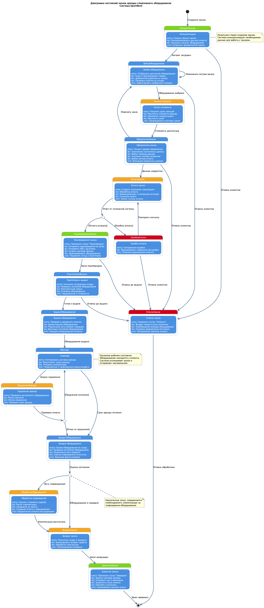

# Практическая работа № 8. Создание диаграммы состояний

**Тема проекта:** Система управления арендой спортивного оборудования SportRent

**Выполнил:** Грибков Александр

**Дата:** 2 ноября 2025 г.

## Цель работы

Создать диаграмму состояний проектируемой информационной системы для одного из ранее разработанных классов или прецедентов.

## Теоретическая часть

### Назначение диаграммы состояний

Диаграмма состояний (State Diagram) в языке UML предназначена для моделирования динамических аспектов системы и описания жизненного цикла объектов. Она позволяет отобразить все возможные состояния объекта, переходы между ними и события, которые инициируют эти переходы.

### Основные элементы диаграммы состояний

**1. Начальное состояние (Initial State)**
- Обозначается черным кругом
- Указывает на точку входа в жизненный цикл объекта
- Может быть только одно в диаграмме

**2. Конечное состояние (Final State)**
- Обозначается кругом с черной точкой внутри
- Указывает на завершение жизненного цикла объекта
- Может быть несколько конечных состояний

**3. Простое состояние (Simple State)**
- Прямоугольник с именем состояния
- Может содержать внутренние действия:
  - `entry/` – действие при входе в состояние
  - `do/` – действие во время нахождения в состоянии
  - `exit/` – действие при выходе из состояния

**4. Составное состояние (Composite State)**
- Состояние, которое содержит вложенные подсостояния
- Используется для декомпозиции сложного поведения

**5. Переход (Transition)**
- Стрелка, соединяющая состояния
- Показывает изменение состояния объекта
- Может иметь метку: `событие [условие] / действие`

**6. Точка выбора (Choice/Decision)**
- Обозначается ромбом
- Используется для ветвления потока выполнения
- Позволяет выбрать один из нескольких путей на основе условия

### Применение диаграмм состояний

Диаграммы состояний применяются для моделирования:
- Жизненного цикла объектов и сущностей
- Бизнес-процессов с четкими стадиями
- Поведения реактивных систем
- Протоколов взаимодействия
- Пользовательских интерфейсов

## Практическая часть

### Выбор объекта моделирования

Для создания диаграммы состояний в системе SportRent выбран объект **"Заказ аренды"** (Order). Это центральная сущность системы, которая проходит через множество состояний от момента создания до завершения аренды.

**Обоснование выбора:**
- Заказ имеет четко определенный жизненный цикл
- Процесс аренды включает множество состояний и переходов
- Модель отражает ключевую бизнес-логику системы
- Диаграмма будет полезна для понимания работы всей системы

### Описание жизненного цикла заказа

Жизненный цикл заказа аренды в системе SportRent включает следующие основные стадии:

**1. Создание и формирование заказа**
- Инициализация системы
- Выбор оборудования из каталога
- Расчет стоимости аренды

**2. Оформление и оплата**
- Заполнение данных о клиенте
- Выбор параметров аренды
- Обработка платежа

**3. Подтверждение и подготовка**
- Подтверждение заказа после успешной оплаты
- Подготовка оборудования на складе
- Уведомление клиента

**4. Выдача и аренда**
- Передача оборудования клиенту
- Активный период аренды
- Мониторинг сроков

**5. Возврат и завершение**
- Возврат оборудования
- Проверка состояния
- Возврат залога
- Закрытие заказа

**6. Исключительные ситуации**
- Отмена заказа на разных этапах
- Ошибки оплаты
- Обработка повреждений оборудования
- Продление аренды

### Подробное описание состояний

#### Инициализация

**Назначение:** Начальная стадия создания заказа в системе.

**Внутренние действия:**
- `entry/` – Создание объекта заказа в базе данных
- `do/` – Инициализация данных клиента, загрузка каталога оборудования
- `exit/` – Сохранение временного идентификатора заказа

**Переходы:**
- → Выбор оборудования (при успешной загрузке каталога)
- → Отмена заказа (при отказе клиента)

#### Выбор оборудования

**Назначение:** Формирование состава заказа путем выбора товаров из каталога.

**Внутренние действия:**
- `entry/` – Отображение списка доступного оборудования
- `do/` – Просмотр товаров, добавление/удаление позиций, проверка наличия на складе
- `exit/` – Фиксация выбранных позиций заказа

**Переходы:**
- → Выбор оборудования (циклический переход при изменении состава)
- → Расчет стоимости (когда клиент завершил выбор)
- → Отмена заказа (при отказе клиента)

#### Расчет стоимости

**Назначение:** Вычисление итоговой стоимости аренды с учетом всех условий.

**Внутренние действия:**
- `entry/` – Получение текущих цен на выбранные позиции
- `do/` – Расчет стоимости аренды, применение скидок и акций, расчет залога
- `exit/` – Формирование итоговой суммы к оплате

**Переходы:**
- → Оформление заказа (после расчета стоимости)

#### Оформление заказа

**Назначение:** Сбор необходимой информации для завершения заказа.

**Внутренние действия:**
- `entry/` – Открытие формы оформления заказа
- `do/` – Заполнение контактных данных, выбор периода и способа получения, выбор метода оплаты
- `exit/` – Валидация введенных данных

**Переходы:**
- → Выбор оборудования (если клиент хочет изменить состав заказа)
- → Оплата заказа (при корректности данных)
- → Отмена заказа (при отказе клиента)

#### Оплата заказа

**Назначение:** Обработка платежной транзакции.

**Внутренние действия:**
- `entry/` – Создание платежной транзакции
- `do/` – Обработка оплаты через платежную систему, списание залога
- `exit/` – Запись статуса платежа

**Переходы:**
- → Развилка (проверка результата оплаты)

#### Развилка оплаты (Choice)

**Назначение:** Точка принятия решения на основе результата платежа.

**Переходы:**
- → Подтверждение заказа [если оплата успешна]
- → Ошибка оплаты [если произошла ошибка]

#### Ошибка оплаты

**Назначение:** Обработка неудачной попытки оплаты.

**Внутренние действия:**
- `entry/` – Логирование информации об ошибке
- `do/` – Формирование сообщения для клиента
- `exit/` – Отправка уведомления об ошибке

**Переходы:**
- → Оплата заказа (повторная попытка)
- → Отмена заказа (отказ клиента от повтора)

#### Подтверждение заказа

**Назначение:** Фиксация успешного создания заказа.

**Внутренние действия:**
- `entry/` – Присвоение статуса "Подтвержден"
- `do/` – Отправка подтверждения по email и SMS, создание договора аренды, резервирование оборудования
- `exit/` – Уведомление склада о необходимости подготовки

**Переходы:**
- → Подготовка к выдаче (нормальный ход процесса)
- → Отмена заказа (отмена клиентом до выдачи)

#### Подготовка к выдаче

**Назначение:** Комплектация заказа на складе.

**Внутренние действия:**
- `entry/` – Назначение ответственного сотрудника склада
- `do/` – Проверка состояния оборудования, комплектация, упаковка
- `exit/` – Уведомление клиента о готовности заказа

**Переходы:**
- → Выдача оборудования (когда заказ готов)
- → Отмена заказа (отмена клиентом до выдачи)

#### Выдача оборудования

**Назначение:** Передача оборудования клиенту.

**Внутренние действия:**
- `entry/` – Проверка документов клиента
- `do/` – Демонстрация оборудования, подписание акта приема-передачи, фиксация состояния
- `exit/` – Физическая передача оборудования

**Переходы:**
- → В аренде (оборудование передано клиенту)

#### В аренде

**Назначение:** Основное рабочее состояние – оборудование у клиента.

**Внутренние действия:**
- `entry/` – Активация договора аренды
- `do/` – Мониторинг срока аренды, отправка напоминаний
- `exit/` – Уведомление о приближении срока возврата

**Переходы:**
- → Продление аренды (по запросу клиента)
- → Возврат оборудования (при истечении срока или досрочном возврате)

#### Продление аренды

**Назначение:** Обработка запроса на продление срока аренды.

**Внутренние действия:**
- `entry/` – Проверка доступности оборудования для продления
- `do/` – Расчет доплаты, обработка платежа за продление
- `exit/` – Обновление срока аренды в системе

**Переходы:**
- → Развилка продления (проверка оплаты)

#### Развилка продления (Choice)

**Назначение:** Определение результата попытки продления.

**Переходы:**
- → В аренде [если продление оплачено]
- → Возврат оборудования [при отказе от продления]

#### Возврат оборудования

**Назначение:** Прием оборудования обратно на склад.

**Внутренние действия:**
- `entry/` – Регистрация возврата в системе
- `do/` – Проверка состояния оборудования, подписание акта возврата, оценка повреждений
- `exit/` – Фиксация факта возврата

**Переходы:**
- → Развилка возврата (оценка состояния оборудования)

#### Развилка возврата (Choice)

**Назначение:** Определение наличия повреждений оборудования.

**Переходы:**
- → Возврат залога [если оборудование в порядке]
- → Обработка повреждений [если обнаружены повреждения]

#### Обработка повреждений

**Назначение:** Расчет компенсации за поврежденное оборудование.

**Внутренние действия:**
- `entry/` – Оценка стоимости ремонта или замены
- `do/` – Расчет суммы компенсации, удержание из залога, создание отчета
- `exit/` – Уведомление клиента об удержании

**Переходы:**
- → Возврат залога (после расчета компенсации)

#### Возврат залога

**Назначение:** Возврат залоговых средств клиенту.

**Внутренние действия:**
- `entry/` – Расчет суммы к возврату (с учетом возможных удержаний)
- `do/` – Инициирование возврата средств, обработка транзакции
- `exit/` – Подтверждение возврата

**Переходы:**
- → Закрытие заказа (залог обработан)

#### Закрытие заказа

**Назначение:** Финализация заказа и архивация данных.

**Внутренние действия:**
- `entry/` – Присвоение статуса "Завершен"
- `do/` – Закрытие договора, отправка чека и квитанций, запрос отзыва, обновление статистики
- `exit/` – Архивирование данных заказа

**Переходы:**
- → [Конечное состояние] (завершение жизненного цикла)

#### Отмена заказа

**Назначение:** Обработка отмены заказа на любом этапе до выдачи.

**Внутренние действия:**
- `entry/` – Присвоение статуса "Отменен"
- `do/` – Возврат средств (если оплата была произведена), освобождение резерва, отправка уведомления
- `exit/` – Логирование причины отмены

**Переходы:**
- → [Конечное состояние] (завершение жизненного цикла)

### Диаграмма состояний заказа аренды



*Рисунок 1 – Диаграмма состояний заказа аренды спортивного оборудования в системе SportRent*

### Анализ диаграммы

#### Ключевые особенности модели

**1. Множественность путей выполнения**

Диаграмма демонстрирует различные сценарии развития событий:
- Нормальный путь: от создания до успешного завершения аренды
- Путь с отменой: возможность отмены на ранних стадиях
- Путь с ошибками: обработка проблем с оплатой
- Путь с повреждениями: специальная обработка поврежденного оборудования
- Путь с продлением: возможность продления срока аренды

**2. Точки принятия решений (Choice Points)**

В модели используются три критические точки выбора:
- **Развилка оплаты**: определяет успешность платежа
- **Развилка продления**: проверяет оплату продления аренды
- **Развилка возврата**: оценивает состояние возвращенного оборудования

**3. Циклические переходы**

Некоторые состояния имеют циклические переходы:
- **Выбор оборудования → Выбор оборудования**: клиент может многократно изменять состав заказа
- **Ошибка оплаты → Оплата заказа**: возможность повторных попыток оплаты
- **Продление аренды → В аренде**: многократное продление периода аренды

**4. Состояния с расширенной функциональностью**

Многие состояния включают внутренние действия (entry/do/exit), что обеспечивает:
- Автоматическое выполнение операций при входе в состояние
- Фоновые процессы во время нахождения в состоянии
- Корректное завершение при выходе из состояния

**5. Обработка исключительных ситуаций**

Модель предусматривает обработку различных проблемных ситуаций:
- Ошибки оплаты
- Отмена заказа клиентом
- Повреждения оборудования
- Неудачные попытки продления

#### Преимущества представленной модели

1. **Полнота**: модель охватывает все основные сценарии работы с заказом
2. **Детализация**: каждое состояние имеет описание внутренних действий
3. **Гибкость**: предусмотрены различные пути развития событий
4. **Надежность**: учтены исключительные ситуации и способы их обработки
5. **Масштабируемость**: модель можно расширить дополнительными состояниями

#### Применение диаграммы в разработке

Созданная диаграмма состояний может быть использована для:

1. **Проектирования базы данных**: определение статусов заказа
2. **Разработки бизнес-логики**: реализация переходов между состояниями
3. **Проектирования API**: определение доступных операций для каждого состояния
4. **Тестирования**: создание тест-кейсов для всех возможных путей
5. **Документирования**: описание жизненного цикла заказа для разработчиков

### Связь с другими диаграммами проекта

Диаграмма состояний заказа аренды согласуется с ранее разработанными моделями:

**Связь с IDEF0 (Лабораторные работы 3-4)**
- Состояния диаграммы соответствуют функциональным блокам декомпозиции
- Переходы отражают последовательность выполнения операций
- Внутренние действия детализируют работу функциональных блоков

**Связь с DFD (Лабораторная работа 5)**
- Состояния коррелируют с процессами обработки данных
- Переходы соответствуют потокам данных между процессами
- Хранилища данных обновляются при смене состояний

**Связь с ER-диаграммой (Лабораторная работа 6)**
- Состояния отражают значения атрибута `status` в сущности `Order`
- Переходы инициируют создание связанных записей (Payment, Contract, RentalTransaction)
- Каждое состояние может сопровождаться изменением множества связанных сущностей

## Ответы на контрольные вопросы

### 1. Для чего в язык UML введена диаграмма состояний?

Диаграмма состояний введена в язык UML для моделирования динамических аспектов системы и описания поведения объектов во времени. Она позволяет:

- **Визуализировать жизненный цикл объектов**: показать все возможные состояния, через которые проходит объект от создания до уничтожения
- **Моделировать реактивное поведение**: описать, как объект реагирует на внешние события в зависимости от своего текущего состояния
- **Документировать бизнес-процессы**: представить последовательность состояний бизнес-сущностей (заказов, запросов, документов)
- **Проектировать конечные автоматы**: формализовать поведение систем, основанных на теории автоматов
- **Обеспечить основу для реализации**: предоставить спецификацию для разработчиков при программировании поведения объектов

### 2. Для каких целей используется диаграмма состояний UML?

Диаграмма состояний UML используется для следующих целей:

**Проектирование и разработка:**
- Спецификация поведения классов и объектов
- Проектирование пользовательских интерфейсов с различными экранами
- Разработка протоколов взаимодействия и коммуникации
- Проектирование систем управления и контроля

**Анализ требований:**
- Моделирование бизнес-процессов с четкими стадиями
- Определение возможных состояний бизнес-объектов
- Выявление всех сценариев использования системы

**Тестирование:**
- Создание тест-кейсов для проверки переходов между состояниями
- Обеспечение полноты покрытия всех путей выполнения
- Проверка корректности обработки событий

**Документирование:**
- Создание технической документации системы
- Описание жизненного цикла ключевых сущностей
- Коммуникация между разработчиками, аналитиками и заказчиками

### 3. Что выступает в качестве объекта моделирования диаграммы состояний UML?

В качестве объектов моделирования диаграммы состояний UML выступают:

**1. Экземпляры классов (объекты)**
- Конкретные объекты с изменяющимся поведением
- Пример: конкретный заказ, документ, транзакция

**2. Классы системы**
- Типы объектов с общим жизненным циклом
- Пример: класс Order, User, Payment

**3. Прецеденты (use cases)**
- Сценарии использования системы
- Пример: "Оформление заказа", "Обработка платежа"

**4. Подсистемы и модули**
- Крупные компоненты системы
- Пример: модуль аутентификации, платежная подсистема

**5. Вся система в целом**
- Система как единое целое с различными режимами работы
- Пример: состояния запуска, работы, остановки системы

**Важное ограничение:** Диаграмма состояний моделирует поведение только **одного** экземпляра выбранного объекта. Нельзя одновременно описывать поведение нескольких разных объектов на одной диаграмме.

### 4. Каким образом передается основная информация, заложенная в диаграмме состояний UML?

Основная информация в диаграмме состояний UML передается через следующие механизмы:

**1. Топологическая структура графа**
- Расположение и связи между элементами важнее их геометрии
- Последовательность и направление переходов показывают логику поведения
- Ветвления и слияния путей отражают альтернативные сценарии

**2. Состояния (вершины графа)**
- Имена состояний описывают ситуацию объекта
- Внутренние действия (entry/do/exit) определяют поведение в состоянии
- Вложенные состояния показывают иерархическую декомпозицию

**3. Переходы (дуги графа)**
- Стрелки показывают возможные изменения состояния
- Метки переходов содержат события, условия и действия
- Формат: `событие [условие] / действие`

**4. Специальные узлы**
- Начальное состояние указывает точку входа в жизненный цикл
- Конечное состояние показывает завершение существования объекта
- Точки выбора (choice) отображают условные ветвления

**5. Примечания и аннотации**
- Комментарии поясняют логику переходов
- Дополнительные пояснения к сложным состояниям
- Ссылки на другие диаграммы и документы

**Важно:** Размер и точное расположение элементов обычно не несут семантической нагрузки (кроме случаев вложенности). Главное – это структура связей и информация в метках.

### 5. Какие типы отношений чаще всего применяются в диаграмме состояний UML?

В диаграмме состояний UML чаще всего применяются следующие типы визуальных отношений:

**1. Соединение (Connection)**
- Представляется в виде направленных линий (стрелок)
- Соединяет одну двумерную форму (состояние) с другой
- Показывает возможность перехода из одного состояния в другое
- Пример: стрелка от состояния "Оплата" к состоянию "Подтверждение"

**2. Включение (Containment)**
- Представляется помещением одних форм внутрь других
- Используется для создания составных (композитных) состояний
- Показывает иерархическую структуру состояний
- Пример: подсостояния внутри сложного состояния

**3. Визуальное подкрепление (Visual Attachment)**
- Представляется размещением символов рядом друг с другом
- Используется для примечаний, комментариев и аннотаций
- Связывает пояснительный текст с элементами диаграммы
- Пример: примечание, прикрепленное пунктирной линией к состоянию

**Дополнительные типы отношений:**

**4. Ветвление (Fork/Join)**
- Разделение потока на параллельные ветви (fork)
- Синхронизация параллельных потоков (join)
- Используется для моделирования параллельного выполнения

**5. Развилка (Choice/Decision)**
- Выбор одного из нескольких путей на основе условия
- Представляется ромбом с несколькими исходящими переходами
- Каждый выход имеет условие выбора

### 6. Как можно представить диаграмму состояний UML в аналитическом виде?

Диаграмму состояний UML можно представить в аналитической (математической) форме следующими способами:

**1. Граф переходов состояний**

Формальное представление в виде ориентированного графа G = (S, T), где:
- S = {s₁, s₂, ..., sₙ} – множество состояний (вершины графа)
- T ⊆ S × E × S – множество переходов (дуги графа)
- E – множество событий, инициирующих переходы

Пример для системы SportRent:
- S = {Инициализация, ВыборОборудования, ОплатаЗаказа, ВАренде, ...}
- T = {(Инициализация, КаталогЗагружен, ВыборОборудования), ...}

**2. Таблица переходов состояний**

Матричное представление в виде таблицы:

| Текущее состояние | Событие | Условие | Действие | Новое состояние |
|-------------------|---------|---------|----------|-----------------|
| Оплата | ОтветПолучен | Успех | СоздатьДоговор | Подтверждение |
| Оплата | ОтветПолучен | Ошибка | ЛогОшибки | ОшибкаОплаты |

**3. Конечный автомат (State Machine)**

Формальное описание конечного автомата M = (S, E, δ, s₀, F), где:
- S – конечное множество состояний
- E – алфавит входных символов (события)
- δ: S × E → S – функция переходов
- s₀ ∈ S – начальное состояние
- F ⊆ S – множество конечных состояний

**4. Система уравнений состояний**

Описание поведения системы через систему логических уравнений:
```
S_новое = f(S_текущее, Событие, Условие)
Действие = g(S_текущее, Событие)
```

**5. Структурированное текстовое описание**

Псевдокод или формальное описание на языке спецификаций:
```
STATE Оплата:
  ENTRY: СоздатьТранзакцию()
  DO: ОбработкаПлатежа()
  ON Успех -> Подтверждение
  ON Ошибка -> ОшибкаОплаты
  EXIT: ЗаписатьСтатус()
```

**6. Матрица смежности**

Булева матрица размером n×n (где n – количество состояний), где элемент [i,j] = 1, если существует переход из состояния i в состояние j.

**Преимущества аналитического представления:**
- Формальная проверка корректности модели
- Автоматическая генерация кода
- Математический анализ свойств системы (достижимость, живость, безопасность)
- Верификация и валидация модели

## Заключение

В ходе выполнения лабораторной работы была создана диаграмма состояний для объекта "Заказ аренды" в системе управления арендой спортивного оборудования SportRent.

**Результаты работы:**

1. Изучены теоретические основы диаграмм состояний UML
2. Выбран ключевой объект системы для моделирования – заказ аренды
3. Разработана подробная диаграмма состояний, включающая:
   - 17 основных состояний
   - 3 точки выбора (choice points)
   - Множество переходов между состояниями
   - Описание внутренних действий (entry/do/exit)
4. Создана диаграмма в нотации PlantUML
5. Проведен детальный анализ жизненного цикла заказа
6. Даны ответы на контрольные вопросы

**Практическая значимость:**

Созданная диаграмма состояний является важным артефактом проектирования, который:
- Документирует полный жизненный цикл заказа
- Служит основой для проектирования базы данных (определение статусов)
- Используется при разработке бизнес-логики приложения
- Помогает при создании тестовых сценариев
- Обеспечивает общее понимание процесса аренды всеми участниками проекта

Диаграмма состояний интегрируется с ранее разработанными моделями системы (IDEF0, DFD, ER-диаграмма) и дополняет их описанием динамического поведения системы.

## Глоссарий

**Диаграмма состояний (State Diagram)** – диаграмма UML, показывающая изменение состояния одного объекта в ответ на внешние события.

**Состояние (State)** – ситуация в жизненном цикле объекта, в течение которой он удовлетворяет некоторому условию, выполняет определенную деятельность или ожидает событие.

**Переход (Transition)** – отношение между двумя состояниями, показывающее, что объект в первом состоянии выполнит определенные действия и перейдет во второе состояние при наступлении указанного события и выполнении условия.

**Событие (Event)** – спецификация существенного факта, который происходит во времени и пространстве и вызывает переход из одного состояния в другое.

**Действие (Action)** – атомарная операция, которая выполняется при срабатывании перехода или при нахождении в состоянии.

**Условие (Guard Condition)** – логическое выражение, которое должно быть истинным для того, чтобы переход был выполнен.

**Составное состояние (Composite State)** – состояние, которое содержит вложенную диаграмму состояний (подсостояния).

**Начальное состояние (Initial State)** – псевдосостояние, обозначающее начало жизненного цикла объекта или вход в составное состояние.

**Конечное состояние (Final State)** – специальное состояние, обозначающее завершение жизненного цикла объекта или выполнения составного состояния.

**Точка выбора (Choice Point)** – псевдосостояние, используемое для моделирования динамических условных ветвлений.

**entry/** – зарезервированное слово, обозначающее действие, которое выполняется при входе в состояние.

**do/** – зарезервированное слово, обозначающее продолжительную деятельность, выполняемую во время нахождения в состоянии.

**exit/** – зарезервированное слово, обозначающее действие, которое выполняется при выходе из состояния.

**Жизненный цикл (Lifecycle)** – последовательность состояний, через которые проходит объект в течение своего существования.

**Конечный автомат (Finite State Machine)** – математическая модель вычислений, используемая для проектирования компьютерных программ и последовательных логических схем.

**Развилка (Fork)** – псевдосостояние, используемое для разделения одного входящего перехода на несколько параллельных исходящих переходов.

**Соединение (Join)** – псевдосостояние, используемое для синхронизации нескольких параллельных входящих переходов в один исходящий переход.

## Список использованных источников

1. Методические указания к лабораторной работе № 8 "Создание диаграммы состояний"
2. Unified Modeling Language (UML) Specification, Version 2.5.1 – Object Management Group, 2017
3. Буч Г., Рамбо Дж., Джекобсон А. Язык UML. Руководство пользователя. – 2-е изд. – М.: ДМК Пресс, 2006
4. Леоненков А.В. Самоучитель UML. – СПб.: БХВ-Петербург, 2004
5. Фаулер М. UML. Основы. – 3-е изд. – СПб.: Символ-Плюс, 2004
6. Проектная документация системы SportRent (Лабораторные работы 1-6)
7. ГОСТ 34.602-2020. Информационные технологии. Комплекс стандартов на автоматизированные системы. Техническое задание на создание автоматизированной системы
8. PlantUML Documentation – https://plantuml.com/state-diagram
